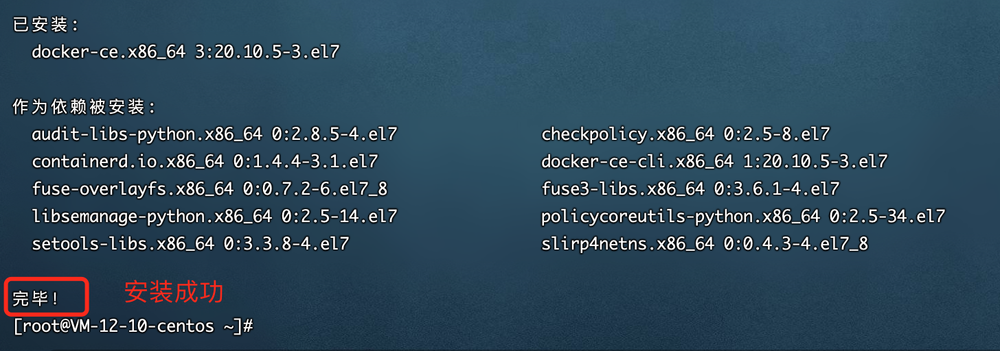

# 运维和部署

## Docker 安装

参考链接：https://cloud.tencent.com/developer/article/1151214

1、卸载 Docker

Docker 的旧版本被称为`docker`或`docker-engine`。 如果安装了这些，请卸载它们以及关联的依赖关系。

```shell
sudo yum remove docker \
                  docker-client \
                  docker-client-latest \
                  docker-common \
                  docker-latest \
                  docker-latest-logrotate \
                  docker-logrotate \
                  docker-selinux \
                  docker-engine-selinux \
                  docker-engine
```

2、存储库安装，安装必须的包

您可以根据需要以不同的方式安装 Docker CE：

- 大多数用户设置了 Docker 的存储库并从中安装，以方便安装和升级任务。 这是推荐的方法。
- 某些用户下载 RPM 软件包并手动安装并手动管理升级。 这在诸如在没有访问互联网的空隙系统上安装 Docker 的情况下是有用的。
- 在测试和开发环境中，一些用户选择使用自动化便利脚本来安装 Docker。

安装必须的包。yum-utils 提供了 yum-config-manager 实用程序，并且 device-mapper-persistent-data 和 lvm2 需要 devicemapper 存储驱动程序。

```she
sudo yum install -y yum-utils \
  device-mapper-persistent-data \
  lvm2
```



# 安装 mysql

https://www.runoob.com/docker/docker-install-mysql.html

```shell
# 首次启动
docker run -itd --name mysql-aquaman -p 3686:3306 -e MYSQL_ROOT_PASSWORD=gN3pK0eH0dE1 mysql:5.7docker
# 启动
docker run -itd --name mysql-aquaman -p 3686:3306 mysql:5.7
```

安装成功后，进入容器，配置。

```shell
# 进入容器
docker exec -it 容器ID /bin/bash
# 登录mysql
mysql -uroot -p
# 切换到mysql数据库
use mysql;
# 查看user表信息
select host,user from mysql.user;
# 创建用户
# 创建数据库
```

# 安装 Redis

https://cloud.tencent.com/developer/article/1562815

docker run -p 9376:6379 -v /data/redis:/data --name redis -d --restart=always redis:6.2 redis-server --appendonly yes --requirepass "8f77wMb6wHLepCs"

# 安装 Mongodb

https://cloud.tencent.com/developer/article/1630512

docker run -p 26178:27017 -v /data/mongo:/data/db --name mongodb -d mongo:4.4

docker cp mongodb:/etc/mongod.conf .

# 安装 Nacos

# 安装 Nginx

docker pull nginx:1.19

docker run -d --name nginx -p 80:80 nginx:1.19

挂载配置文件，创建了四个文件夹
mkdir -p /usr/dokcer_nginx_data/{conf,conf.d,html,log}

在/usr/dokcer_nginx_data/conf 创建配置文件 nginx.conf

```sh
# 更多官方文档，查看链接：http://nginx.org/en/docs/

# 全局模块
user nginx;
worker_processes auto;
error_log /var/log/nginx/error.log;
pid /run/nginx.pid;

# 动态加载模块
include /usr/share/nginx/modules/*.conf;

# events 模块
events {
    worker_connections 1024;
}

# http 模块
http {
    log_format  main  '$remote_addr - $remote_user [$time_local] "$request" '
                      '$status $body_bytes_sent "$http_referer" '
                      '"$http_user_agent" "$http_x_forwarded_for"';

    # 日志路径
    access_log  /var/log/nginx/access.log  main;

    sendfile            on;
    tcp_nopush          on;
    tcp_nodelay         on;
    keepalive_timeout   65;
    types_hash_max_size 2048;

    include             /etc/nginx/mime.types;
    default_type        application/octet-stream;

    # 上游服务器
    upstream blog_server{
        server 127.0.0.1:30001 weight=5;
    }

    server {
        listen       80 default_server;
        server_name  www.kujiajia.xyz;
        root         /usr/share/nginx/html;

        error_page 404 /404.html;
            location = /40x.html {
        }

        error_page 500 502 503 504 /50x.html;
            location = /50x.html {
        }

        location / {
            proxy_pass http://blog_server;
        }
    }
}
```

执行命令：

docker run --name nginx -d -p 80:80 \
 -v /usr/dokcer_nginx_data/conf/nginx.conf:/etc/nginx/nginx.conf \
 -v /usr/dokcer_nginx_data/log:/var/log/nginx \
 -v /usr/dokcer_nginx_data/html:/usr/share/nginx/html \
 nginx:1.19
