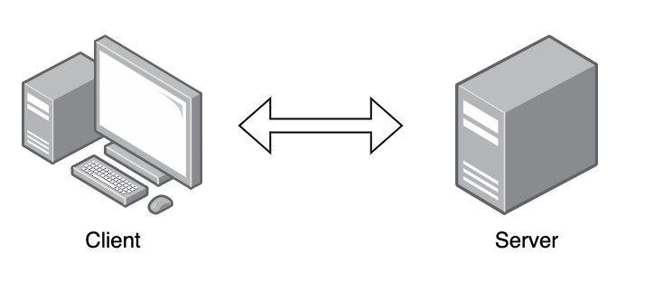
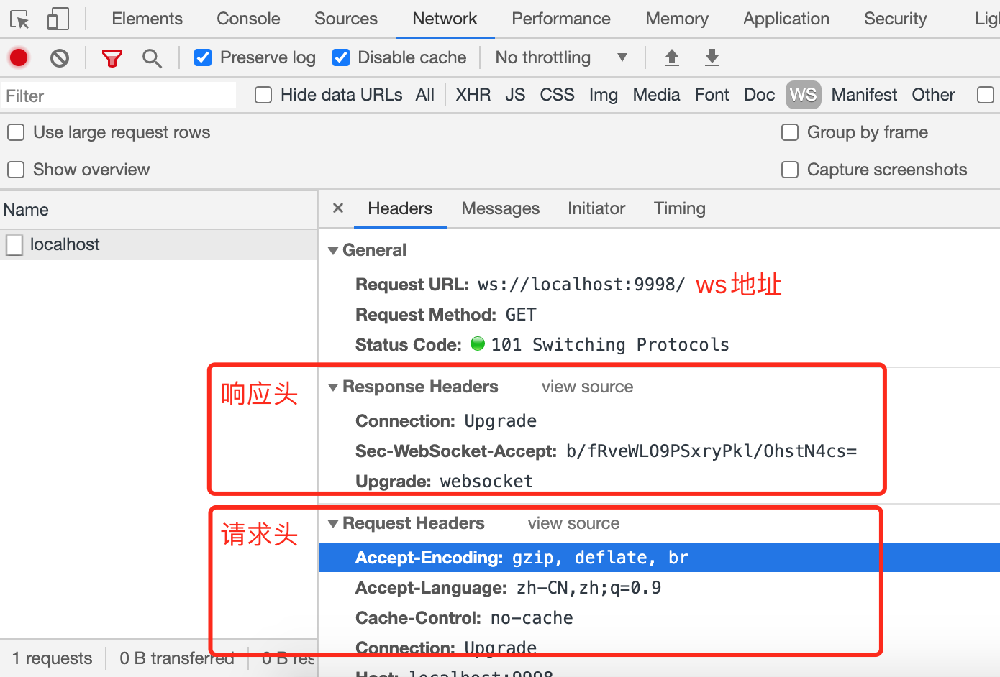
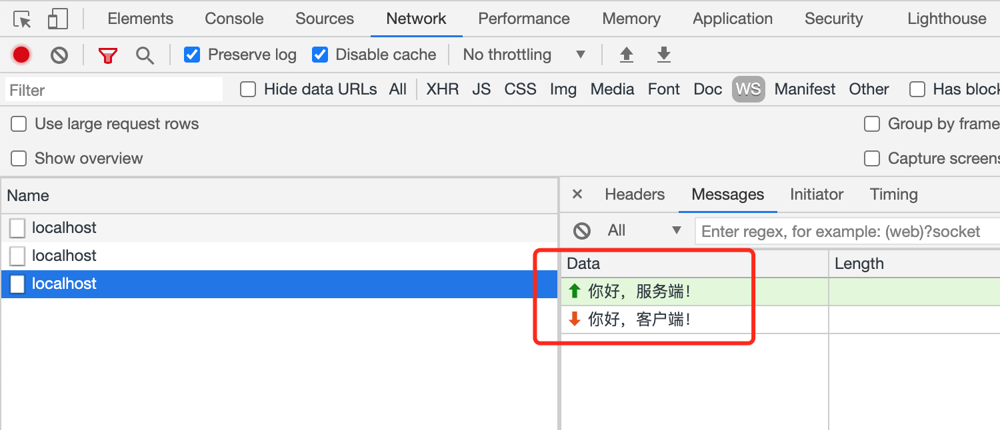

<h1 class="article-title no-number">HTML</h1>

# HTML5 新增内容

- 新语义化标签：header、footer、nav、section、aside、article、main、figure
- 新增 input 类型：color、url、email、date、week、time、number、range、search、tel
- 新增表单控件属性：placeholder/设置文本框默认提示文字、autofocus/自动获得焦点、autocomplete/联想关键词
- 存储：提供了 sessionStorage、localStorage 和本地离线存储（使用 manifest 配置文件）
- 多媒体：音频元素 audio、视频元素 vedio、source、embed
- 地理定位、canvas 画布、拖放 API、多线程编程的 webworker、websocket 协议

# Doctype

Doctype 声明在文档的最前面，告诉浏览器以哪种方式来渲染页面：

严格模式：排版和 JS 运作模式是以该浏览器支持的最高标准运行的
混杂模式：向后兼容，模拟老式浏览器，防止浏览器无法兼容页面

# HTTP

HTTP 是一个简单的请求-响应协议，它通常运行在 TCP 之上。它指定了客户端可能发送给服务器什么样的消息以及得到什么样的响应。

**HTTP 是一个基于 TCP/IP 通信协议来传递数据（HTML 文件, 图片文件, 查询结果等）。**



## 特点

- **支持 C/S 模式**。
- **简单快速**：HTTP 协议简单，请求只需要 Method 和 URI，程序规模小，通信速度快。
- **灵活**：允许传输任意类型的数据。正在传输的类型由`Content-Type`加以标记。
- **无连接**：无连接的含义是限制每次连接只处理一个请求。服务器处理完请求后，客户端应答后，即断开连接。如果需要长连接，通过`Connection: Keep-Alive`实现。
- **无状态**：无状态指对事务处理没有记忆能力。

## URI & URL

### URI

URI，是 uniform resource identifier，统一资源标识符，用来唯一的标识一个资源。

HTTP 使用统一资源标识符（Uniform Resource Identifiers, URI）来传输数据和建立连接。

Web 上可用的每种资源如 HTML 文档、图像、视频片段、程序等都是一个来 URI 来定位的。

### URL

URL 是一种特殊类型的 URI，包含了用于查找某个资源的足够的信息。

## 请求 & 响应

### Request 请求

客户端发送一个 HTTP 请求到服务器的请求消息包括以下格式：**请求状态行**、**请求头部**、**空行**、**请求正文**四个部分组成。

### Response 响应

当你向对方发送请求后，对方会回应你浏览器的请求，返回两个部分：**响应状态行**、**消息报头**，**响应正文**三部分。

## HTTP 状态码

HTTP 状态码由三个十进制数字组成，第一个十进制数字定义了状态码的类型，后两个数字没有分类的作用。HTTP 状态码共分为 5 种类型：

| 分类  | 描述                                           |
| ----- | ---------------------------------------------- |
| 1\*\* | 信息，服务器收到请求，需要请求者继续执行操作   |
| 2\*\* | 成功，操作被成功接收并处理                     |
| 3\*\* | 重定向，需要进一步的操作以完成请求             |
| 4\*\* | 客户端错误，请求包含语法错误或无法完成请求     |
| 5\*\* | 服务器错误，服务器在处理请求的过程中发生了错误 |

## 手撸实现 Ajax 功能

我们常用的 Ajax 就是通过 **XMLHttpRequest** 对象实现的，这个对象有很多的属性和事件，在使用之前，我们需要先将它实例化。

1. 创建一个服务端。

   ```js
   const http = require('http');

   // http server 例子
   const server = http.createServer((req, res) => {
     res.setHeader('Access-Control-Allow-Origin', '*');
     res.end('Hello Client!');
   });

   // 监听端口
   server.listen(3008, () => {
     console.log(`* 🚀 http://127.0.0.1:3008/ 服务启动成功!`);
   });
   ```

2. 创建 HTML 文件，并用浏览器运行。

   ```html
   <!DOCTYPE html>
   <html>
     <head>
       <meta charset="utf-8" />
       <script type="text/javascript">
         function HTTPTest() {
           if ('XMLHttpRequest' in window) {
             alert('您的浏览器支持 XMLHttpRequest!');
             // 创建ajax对象并实例化
             var xhr = new XMLHttpRequest();
             // 设置请求方式和请求地址
             xhr.open('POST', 'http://127.0.0.1:3008');
             // readystate是xhr对象中的属性，用来获取ajax状态码 0 1 2 3 4
             xhr.onreadystatechange = function () {
               // 判断ajax状态码
               // status获取http状态码。200表示ok
               if (xhr.readyState === 4 && xhr.status === 200) {
                 // xhr.responseText表示请求返回的数据内容
                 console.log(xhr.responseText);
               }
             };
             // 发送
             xhr.send('Hello Server!');
           } else {
             // 浏览器不支持 XMLHttpRequest
             alert('您的浏览器不支持 XMLHttpRequest!');
           }
         }
       </script>
     </head>
     <body>
       <div id="sse">
         <a href="javascript:HTTPTest()">运行 HTTP</a>
       </div>
     </body>
   </html>
   ```

# WebSocket

WebSocket 是 HTML5 中新增的协议，支持持久性连接，解决了 HTTP 协议通信只能由客户端发起的缺陷。**WebSocket 允许服务器端主动向客户端发送数据。**

## 特点

- 服务器可以主动向客户端发送信息，客户端也可以主动向服务器发送信息，实现了双向平等对话
- 建立在 TCP 协议之上，服务端的实现比较容易
- 与 HTTP 协议有着良好的兼容性。默认端口也是 80 和 443，握手阶段采用 HTTP 协议，因此不容易屏蔽，且能通过各种 HTTP 代理服务器
- 数据格式（帧）比较轻量，性能开销小，通信效率高
- 可以发送文本或二进制数据
- 无同源限制，客户端可以与任意服务器通信
- 协议标识符是 ws（加密则为 wss），服务器网址就是 URL

## 建立 WebSocket 连接

客户端通过 HTTP 请求与 WebSocket 服务端协商升级协议，协议升级完成后，后续的数据交换遵照 WebSocket 的协议。

1. 客户端申请协议升级，采用标准 HTTP 报文格式，且只支持 GET 方法

   请求首部：

   Connection: Upgrade 表示要升级协议

   Upgrade: websocket 表示要升级到 websocket 协议

   Sec-WebSocket-Version 表示 websocket 版本

   Sec-WebSocket-Key 与后续服务端响应首部 Sec-WebSocket-Accept 配套，提供基本的防护，如恶意的连接或无意的连接

2. 服务端响应协议升级，返回如下内容，状态代码 101 表示协议切换。至此完成协议升级，后续的数据交互都按照新协议来

   Connection: Upgrade

   Upgrade: websocket

   Sec-WebSocket-Accept 根据 Sec-WebSocket-Key 计算

**如下是 Chrome 浏览器请求 Websocket 连接的请求和响应信息。**



## 手撸实现 WebSocket

1. 后端实现一个 WebSocket 服务。

   ```js
   const WebSocket = require('ws');
   //创建一个WebSocketServer的实例
   const host = 'localhost';
   const port = 9998;
   const wss = new WebSocket.Server(
     {
       host,
       port,
     },
     () => {
       console.log(`* 🚀 ws://${host}:${port} 服务启动成功!`);
     }
   );

   wss.on('connection', (clientSock) => {
     // 监听心跳
     clientSock.on('pong', () => {
       clientSock.isAlive = true;
     });
     // 接收到数据
     clientSock.on('message', (message) => {
       console.log(`received: ${message}`);
       clientSock.send('Hi Client');
     });
     // 通信发生错误
     clientSock.on('error', (err) => {
       console.log(`连接失败, ${err.message}`);
     });
     // 客户端连接关闭时触发
     clientSock.on('close', () => {
       console.log(`Bye.`);
     });
   });
   ```

2. 打开 Chrome 控制台，创建 WebSocket 对象，并 send 数据。

   ```js
   // 检查浏览器是否支持 WebSocket
   'WebSocket' in window;
   // 创建 WebSocket 对象
   const ws = new WebSocket('ws://localhost:9998');
   // 发送数据
   ws.send('你好，服务端！');
   // 关闭
   ws.close();
   ```

3. 打开浏览器的控制台，可以查看 Network，可以看到发送和收到的消息。

   
