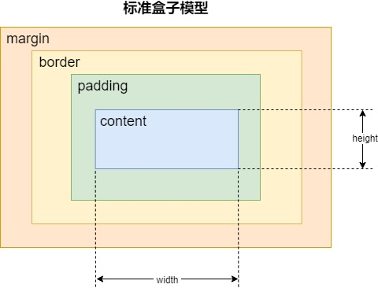
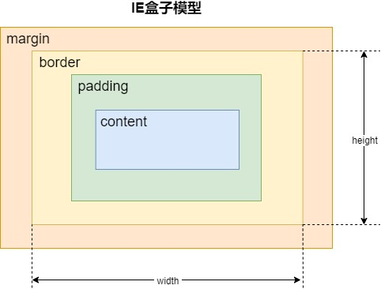

<h1 class="article-title no-number">CSS</h1>

> o(╥﹏╥)o
>
> CSS 我只是会使用，还没有深入的理解内部原理。
>
> **后面系统学习后，还会来继续更新的。**

# 盒子模型

## 标准盒子模型

width=content 盒子宽度=width+padding+border

## IE 盒子模型

width=content+padding+border 盒子宽度=width

# CSS 选择器

id 选择器、类选择器、标签选择器、伪类选择器、伪元素选择器、通用选择器（\*）

内联样式>id 选择器>类选择器>标签选择器

带有!important 标记的样式属性优先级最高

# 文档流

## 普通流

- 普通流中，盒子一个接着一个排列
- 块级格式化上下文里，盒子竖着排列；行内格式化上下文中，盒子横着排列
- 当 position 为 static 或 relative，并且 float 为 none 时会触发普通流
- position：static，盒的位置是常规流布局里的位置
- position：relative，盒偏移位置由 top、bottom、left、right 属性定义。即使有偏移，仍然保留原有位置，其他常规流不能占用这个位置

## 定位流

- 盒从常规流中被移除，不影响常规流的布局
- 当 position 为 fixed 或 absolute 时为绝对定位元素
- position：absolute，元素定位将相对于上级元素中最近的一个 relative、fixed、absolute，如果没有则相对于 body

## 浮动流

- 左浮动元素尽量靠左靠上，右浮动同理
- 除非设置 clear，否则普通流环绕在其周围
- 浮动元素不影响块级元素的布局，但会影响行内元素的布局，让其围绕在自己周围，撑大父级元素，从而间接影响块级元素布局
- 浮动元素最高点不超过当前行的最高点和其前面的浮动元素的最高点；不超过它的包含块，除非元素本身已经比包含块更宽
- 行内元素只出现在左浮动元素的右边或右浮动元素的左边

# 页面布局方式

| 方式                            | 布局特点                                                                                                                                   | 设计方法                                                                                                                                      | 缺点                                                                                         |
| ------------------------------- | ------------------------------------------------------------------------------------------------------------------------------------------ | --------------------------------------------------------------------------------------------------------------------------------------------- | -------------------------------------------------------------------------------------------- |
| 静态布局（Static Layout）       | 无论浏览器尺寸具体多少，网页布局始终按照最初写代码时的布局来实现                                                                           | 居中布局，所有样式使用绝对宽度和高度 px；屏幕宽高调整时通过滚动条来浏览被遮掩部分                                                             | 不能根据用户的屏幕尺寸做出不同表现                                                           |
| 流式布局（Liquid Layout）       | 屏幕分辨率变化时，页面内元素的大小会变化而布局不变；屏幕太大或太小都会导致元素无法正常显示                                                 | 使用%定义宽度，px 定义高度，配合 max-width/min-width 控制尺寸流动范围以免过大或过小影响阅读                                                   | 如果屏幕尺寸跨度太大，那么在相对其原始设计而言过小或过大的屏幕上不能正常显示                 |
| 自适应布局（Adaptive Layout）   | 屏幕分辨率变化时，页面内元素的位置会变化而大小不会变化                                                                                     | 创建多个静态布局，每个静态布局对应一个屏幕分辨率范围，屏幕分辨率改变时，切换不同的静态布局（通过@media 媒体查询给不同尺寸的设备切换不同样式） | 需要需要为不同的设备开发不同的页面，增加开发成本；当需求改变时可能会改动多套代码，流程繁琐。 |
| 响应式布局（Responsive Layout） | 每个屏幕分辨率下会有一个布局样式，即屏幕分辨率变化时，元素位置和大小都会变                                                                 | @media 媒体查询+流式布局                                                                                                                      | 媒体查询是有限的，只能适应主流媒体的宽高                                                     |
| 弹性布局（rem/em 布局）         | 包裹文字的各元素的尺寸采用 rem/em 做单位（em 相对其父元素，rem 始终相对 html 大小，即页面根元素），页面主要划分区域的尺寸仍使用百分数或 px | 一般使用 rem，根据屏幕大小来控制 html 元素的 font-size，即可自动改变所有用 rem 定义尺寸的元素的大小                                           | 只做到了宽度自适应，无法满足一些对高度或者元素间距要求较高的设计                             |

# CSS3 新增内容

- CSS3 边框：border-radius、box-shadow、border-image
- CSS3 背景：background-size、background-origin（规定背景图片定位区域）
- CSS3 文字效果：text-shadow、word-wrap（对长单词进行拆分并换行）
- CSS3 2D 转换：transform: translate()、rotate()、scale()
- CSS3 3D 转换：transform: rotateX()、rotateY()
- CSS3 过渡：transition
- CSS3 动画：animation
- CSS3 用户界面：resize（是否可由用户调整元素尺寸）、box-sizing（定义盒模型）
