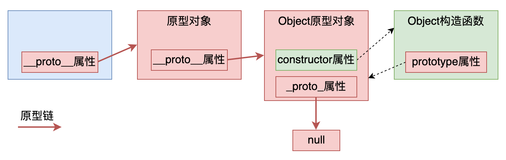
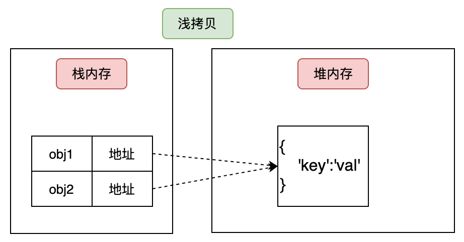
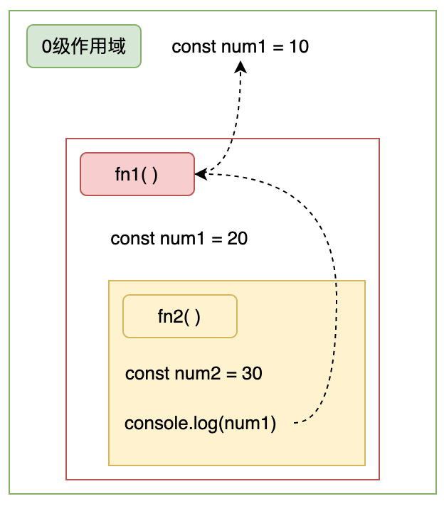
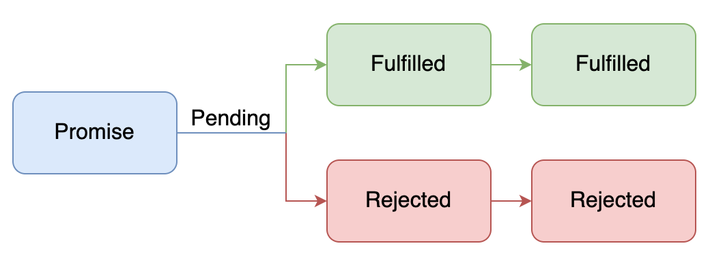

<h1 class="article-title no-number">JS进阶</h1>

# 类

## 类的定义

**类是用于创建对象的模板。**

每个类中包含了一个特殊的方法 **constructor()**，它是类的构造函数，这种方法用于创建和初始化一个由 **class** 创建的对象。

```js
class Person {
  constructor(name, age) {
    this.name = name; // this指该类的实例对象
    this.age = age;
  }
  speak() {
    // speak方法在类的原型对象上，供实例调用，
    // 通过Person实例调用speak时，speak中的this是Person实例
    // 通过call、bind等方法调用speak，this指向被改变
    console.log(`My name is ${this.name}, I am ${this.age} years old.`);
  }
}
const p1 = new Person('Tom', 18);
p1.speak();
```

## 类的继承

JavaScript 类继承使用 extends 关键字，`super()` 方法用于调用父类的构造函数。

```js
class Person {
  constructor(name, age) {
    this.name = name; // this指该类的实例对象
    this.age = age;
  }
  speak() {
    // speak方法在类的原型对象上，供实例调用
    // 通过Person实例调用speak时，speak中的this是Person实例
    // 通过call、bind等方法调用speak，this指向被改变
    console.log(`My name is ${this.name}, I am ${this.age} years old.`);
  }
}

class Student extends Person {
  constructor(name, age, school) {
    super(name, age); // 调用父类构造函数
    this.school = school;
  }
  study() {
    // study方法在类的原型对象上，供实例调用
    // 通过Student实例调用study时，study中的this是Student实例
    console.log(`I study in ${this.school}.`);
  }
}

const stu1 = new Student('Tom', 18, 'ECNU');

stu1.speak(); // My name is Tom, I am 18 years old.
stu1.study(); // I study in ECNU school.
```

## 总结

1. 类中的`constructor`不是必须，要对实例添加一些初始化操作，如添加指定属性时采用。
2. 如果 A 类继承了 B 类，且 A 类中些了构造器，那么 A 类构造器中，必须要用`super()`调用父类构造函数。
3. 类中所定义的方法，都在类的原型对象上，供实例调用。

# 面向对象编程

**什么是对象？万物皆对象。**

**在 JavaScript 中，所有数据类型都可以视为对象，当然也可以自定义对象。 自定义的对象数据类型就是面向对象中的类（ Class ）的概念。**

## 面向过程 & 面向对象

我们以一个示例来说明两者区别。

我们需要处理学生成绩，将学生的成绩打印出来。

首先，面向过程编程的方式是这样的。

```js
// 面向过程编程
// 1. 存储学生成绩信息
var std1 = { name: '张三', score: 98 };
var std2 = { name: '李四', score: 81 };
// 2. 输出学生成绩
function printScore(student) {
  console.log('姓名：' + student.name + '  ' + '成绩：' + student.score);
}
```

面向对象编程，考虑的不是程序执行流程，而是 Student 这个对象有哪些**属性**和**方法**。

```js
// 面向对象编程
// 1. 定义对象（类）
function Student(name, score) {
  this.name = name;
  this.score = score;
}
Student.prototype.printScore = function () {
  console.log('姓名：' + this.name + '  ' + '成绩：' + this.score);
};
// 2. 实例化对象
var std1 = new Student('张三', 98);
var std2 = new Student('李四', 81);
// 3. 输出学生成绩
std1.printScore(); // => 姓名：张三  成绩：98
std2.printScore(); // => 姓名：李四  成绩 81
```

## 如何创建对象

#### 字面量方式

我们可以直接通过 `new Object()` 创建。

```js
var person = new Object();
person.name = '张三';
person.age = 18;
person.sayName = function () {
  console.log(this.name);
};
```

每次创建通过 `new Object()` 比较麻烦，所以可以通过它的简写形式对象字面量来创建。

```js
var person = {
  name: '张三',
  age: 18,
  sayName: function () {
    console.log(this.name);
  },
};
```

上面的写法是没有问题的，但是假如我们要生成两个 `person` 实例对象呢？

```js
var person1 = {
  name: '张三',
  age: 18,
  sayName: function () {
    console.log(this.name);
  },
};
var person2 = {
  name: '李四',
  age: 16,
  sayName: function () {
    console.log(this.name);
  },
};
```

#### 工厂模式

```js
function createPerson(name, age) {
  return {
    name: name,
    age: age,
    sayName: function () {
      console.log(this.name);
    },
  };
}
var p1 = createPerson('张三', 18);
var p2 = createPerson('李四', 18);
```

这样封装比上边的方式好多了，通过工厂模式我们解决了创建多个相似对象代码冗余的问题， 但却没有解决对象识别的问题（即怎样知道一个对象的类型）。

# 构造函数创建对象

创建对象的最佳实践方案，则是利用**构造函数**。

**所谓的构造函数其实就是一个普通的函数前面加了 new 运算符，其实质也是一个函数，所以构造函数都有函数的 prototype 属性。**

**实例就是通过构造函数创建出来的对象。**

```js
function Person(name, age) {
  this.name = name;
  this.age = age;
  this.sayName = function () {
    console.log(this.name);
  };
}
var p1 = new Person('张三', 18);
p1.sayName(); // => 张三
var p2 = new Person('李四', 23);
p2.sayName(); // => 李四
```

#### 构造函数特点

- 没有显示的创建对象
- 直接将属性和方法赋给了 `this` 对象
- 没有 `return` 语句
- 函数名使用的是大写的 `Person`

#### 构造函数执行步骤

1. 使用 `new` 操作符创建一个新对象。

2. 将构造函数的作用域赋给新对象（因此 this 就指向了这个新对象）。

3. 执行构造函数中的代码。

4. 返回新对象。

```js
// 伪代码演示
function Person(name, age) {
  // 当使用 new 操作符调用 Person() 的时候，实际上这里会先创建一个对象
  // var instance = {}
  // 然后让内部的 this 指向 instance 对象
  // this = instance
  // 接下来所有针对 this 的操作实际上操作的就是 instance
  this.name = name;
  this.age = age;
  this.sayName = function () {
    console.log(this.name);
  }; // 在函数的结尾处会将 this 返回，也就是 instance // return this
}
```

#### 构造函数示例

```js
function Person(name, age) {
  this.name = name;
  this.age = age;
  this.sayName = function () {
    console.log(this.name);
  };
}
var p1 = new Person('张三', 18);
p1.sayName(); // => 张三
var p2 = new Person('李四', 23);
p2.sayName(); // => 李四

console.log(p1.constructor === Person); // 变量p1的构造器是Person，返回true
console.log(p2.constructor === Person); // 变量p2的构造器是Person，返回true
console.log(p1.constructor === p2.constructor); // 变量p1和p2的构造器相同

console.log(p1 instanceof Person); // 返回 true
console.log(p2 instanceof Person); // 返回 true
```

上边的代码，从表面看上好像没什么问题，但是实际上这样做，有一个很大的弊端。 **那就是对于每一个实例对象，`type` 和 `sayHello` 都是一模一样的内容， 每一次生成一个实例，都必须为重复的内容，多占用一些内存，如果实例对象很多，会造成极大的内存浪费。**

```js
function Person(name, age) {
  this.name = name;
  this.age = age;
  this.type = '学生';
  this.sayHello = function () {
    console.log('hello ' + this.name);
  };
}
var p1 = new Person('王五', 18);
var p2 = new Person('李四', 16);

console.log(p1.sayHello === p2.sayHello); // => false
```

有什么好的解决办法呢？**更好的解决方案就是 `prototype`**。

**Javascript 规定，每一个构造函数都有一个 `prototype` 属性，指向另一个对象。 这个对象的所有属性和方法，都会被构造函数的实例继承。**

这也就意味着，我们可以把所有对象实例需要共享的属性和方法直接定义在 `prototype` 对象上。

```js
function Person(name, age) {
  this.name = name;
  this.age = age;
}
console.log(Person.prototype); // 返回 { constructor:{...}, _proto_:{...} }
Person.prototype.type = '学生';
Person.prototype.sayName = function () {
  console.log(this.name);
};
var p1 = new Person('王五', 18);
var p2 = new Person('李四', 16);
console.log(p1.sayName === p2.sayName); // => true
```

这时所有实例的 **`type` 属性和 `sayName()` 方法**， 其实都是同一个内存地址，指向 `prototype` 对象，因此就提高了运行效率。

# 原型和原型链

## 原型

**原型的作用：数据共享、节省内存。**

所谓的构造函数其实就是一个普通的函数前面加了 new 运算符，其实质也是一个函数，所以构造函数都有函数的 prototype 属性。实例就是通过构造函数创建出来的对象。

**prototype 属性是一个指针，指向一个对象，这个对象就是原型对象。**

**至于是谁的原型对象，需要靠函数的 prototype 属性和实例的\_\_proto\_\_属性来确定。**

**原型对象上默认有一个属性 constructor,该属性也是一个指针，指向其相关联的构造函数。**

```js
function People() {
  this.type = '人';
}
People.prototype.showType = function () {
  console.log(this.type);
};
var person = new People(); //调用原型对象上面的方法
person.showType(); //最后结果弹框弹出人
People.prototype.constructor == People; //返回true
```


> [!note]
>
> - 构造函数的 prototype 是指针，指向的是原型对象。
>
> - 原型对象的 constructor 也是指针，指向的是构造函数。
>
> - 实例的\_proto\_指针也指向原型对象。

## 原型链

从实例开始，实例的`_proto_`指针指向原型对象，原型对象也存在`_proto_`指针指向上一层的原型对象。后面也以此类推，一直到 Object.prototype 这个原型为止，Object.prototype 为原型链的末尾点。

```js
function People() {
  this.name = 'Jane';
}
var person = new People();
```



> [!note]
>
> - person 实例的\_proto\_属性指向原型对象
>
> - 原型对象的\_proto\_指向上一层 Object 原型对象。
>
> - Object 原型对象的构造函数是 Object，为该原型链的末端。

## instanceof 的原理

instanceof 可以判断实例对象的\_proto\_属性是否与构造函数的 prototype 属性指向同一地址，是的话返回 true，否则 fasle。

```js
// 实例 instanceof 构造函数
person instanceof People;
```

## constructor 构造器

实例的\_proto\_属性找到原型对象，原型对象的 constructor 属性找到构造函数。

```js
person._proto_.constructor == People;
```

## 更简单的原型语法

```js
function Person(name, age) {
  this.name = name;
  this.age = age;
}
Person.prototype = {
  type: '学生',
  sayHello: function () {
    console.log('我叫' + this.name + '，我今年' + this.age + '岁了');
  },
};
```

在该示例中，我们将 `Person.prototype` 重置到了一个新的对象。 这样做的好处就是为 `Person.prototype` 添加成员简单了，但是也会带来一个问题，那就是原型对象丢失了 `constructor` 成员。

**所以，我们为了保持 `constructor` 的指向正确，建议的写法是**：

```js
function Person(name, age) {
  this.name = name;
  this.age = age;
}

Person.prototype = {
  constructor: Person, // => 手动将 constructor 指向正确的构造函数
  type: '学生',
  sayHello: function () {
    console.log('我叫' + this.name + '，我今年' + this.age + '岁了');
  },
};
```

## 原生对象的原型

```js
// 为内置对象添加原型方法
// 我们在系统的对象的原型中添加方法,相当于在改变源码
// 我希望字符串中有一个倒序字符串的方法
String.prototype.myReverse = function () {
  for (var i = this.length - 1; i >= 0; i--) {
    console.log(this[i]);
  }
};
var str = 'abcdefg';
str.myReverse();

// 为Array内置对象的原型对象中添加方法
Array.prototype.mySort = function () {
  for (var i = 0; i < this.length - 1; i++) {
    for (var j = 0; j < this.length - 1 - i; j++) {
      if (this[j] < this[j + 1]) {
        var temp = this[j];
        this[j] = this[j + 1];
        this[j + 1] = temp;
      } //end if
    } // end for
  } //end for
};
var arr = [100, 3, 56, 78, 23, 10];
arr.mySort();
console.log(arr);

String.prototype.sayHi = function () {
  console.log(this + '哈哈,我又变帅了');
};
// 字符串就有了打招呼的方法
var str2 = 'Truffle';
str2.sayHi();
```

# 继承

**继承是一种类(class)与类之间的关系，JS 中没有类，但是可以通过构造函数模拟类，然后通过原型来实现继承，继承是为了实现数据共享，JS 中的继承当然也是为了实现数据共享。**

## 原型继承

```js
function Person(name, age, sex, weight) {
  this.name = name;
  this.age = age;
  this.sex = sex;
  this.weight = weight;
}
Person.prototype.sayHi = function () {
  console.log('你好帅呀!!!');
};

function Student(score) {
  this.score = score;
}
// 希望 Person 中的数据可以共享给 Student ———— 继承
Student.prototype = new Person('小三', 18, '男', '58kg');

var stu1 = new Student('99');
console.log(stu1.name, stu1.age, stu1.sex, stu1.weight, stu1.score);
stu1.sayHi();

var stu2 = new Student('89');
console.log(stu2.name, stu2.age, stu2.sex, stu2.weight, stu2.score);
stu2.sayHi();

var stu3 = new Student('66');
console.log(stu3.name, stu3.age, stu3.sex, stu3.weight, stu3.score);
stu3.sayHi();
```

## 构造函数继承

在上边的讲解中，我们为了数据共享,改变了原型指向,做到了继承，即通过改变原型指向实现了继承。这导致了一个问题，因为我们改变原型指向的同时,直接初始化了属性，这样继承过来的属性的值都是一样的了。这是个问题，如果我们想要改变继承过来的值，只能重新调用对象的属性进行重新赋值，这又导致我们上边的初始化失去了意义。

**如何解决上边的问题呢？答案是借用构造函数实现继承。**
继承的时候,不改变原型的指向,直接调用父级的构造函数来为属性赋值，即把要继承的父级的构造函数拿过来,借用一下为属性赋值，这叫做借用构造函数。借用构造函数需要使用 call ()这个方法，我会在后边的文章中进行讲解，大家在这里先记住用法就行了。

```js
function Person(name, age, sex, weight) {
  this.name = name;
  this.age = age;
  this.sex = sex;
  this.weight = weight;
}
Person.prototype.sayHi = function () {
  console.log('你好帅呀!!!');
};

function Student(name, age, sex, weight, score) {
  // ☆☆☆ 借用构造函数 ☆☆☆
  Person.call(this, name, age, sex, weight);
  this.score = score;
}
var stu1 = new Student('小三', 16, '男', '50kg', '110');
console.log(stu1.name, stu1.age, stu1.sex, stu1.weight, stu1.score);

var stu2 = new Student('小红', 22, '女', '45kg', '88');
console.log(stu2.name, stu2.age, stu2.sex, stu2.weight, stu2.score);

var stu3 = new Student('小舞', 16, '女', '40kg', '100');
console.log(stu3.name, stu3.age, stu3.sex, stu3.weight, stu3.score);
```

**借用构造函数继承,解决了继承的时候属性重复的问题。但是这又导致一个问题即父类中的原型方法不能被继承。**

## 组合继承

原型继承和借用构造函数继承都存在各自的缺点，我们可以将这二者结合到一起，从而发挥二者之长。即在继承过程中，既可以保证每个实例都有它自己的属性，又能做到对一些属性和方法的复用。

这时组合继承应运而生，**组合继承=原型继承+构造函数继承**。

```js
function Person(name, age, sex) {
  this.name = name;
  this.age = age;
  this.sex = sex;
}
Person.prototype.sayHi = function () {
  console.log('你好帅呀!!!');
};

function Student(name, age, sex, score) {
  //借用构造函数:解决属性值重复的问题
  Person.call(this, name, age, sex);
  this.score = score;
}
//改变原型指向---原型继承解决原型方法不能被继承问题
Student.prototype = new Person(); //不传值
Student.prototype.eat = function () {
  console.log('吃吃吃!!!');
};
var stu = new Student('小三', 16, '男', '111分');
console.log(stu.name, stu.age, stu.sex, stu.score);
stu.sayHi();
stu.eat();
var stu2 = new Student('小舞', 15, '女', '1111分');
console.log(stu2.name, stu2.age, stu2.sex, stu2.score);
stu2.sayHi();
stu2.eat();
```

## 拷贝继承（for-in）

拷贝继承：把一个对象中的属性或者方法直接复制到另一个对象中。

```js
function Person() {}
Person.prototype.name = '小三';
Person.prototype.age = 18;
Person.prototype.sex = '男';
Person.prototype.height = 100;
Person.prototype.play = function () {
  console.log('玩的好开心呀!!!😃');
};
var obj = {};
// Person中有原型prototype,prototype就是一个对象,那么里面,name,age,sex,height,play都是该对象中的属性或者方法
// 新对象obj通过拷贝Person中原型prototype对象中的属性和方法继承Person中原型prototype对象的属性和方法
for (var key in Person.prototype) {
  obj[key] = Person.prototype[key];
}
console.dir(obj);
obj.play();
```

> [!note]
>
> 原型链是一种关系，是实例对象和原型对象之间的关系，这种关系是通过原型(\_proto\_)来联系的。
>
> 继承是类与类之间的关系，JS 不是面向对象的语言，没有类但可以通过函数模拟类，模拟面向对象中的继承。
>
> 模拟继承是为了实现数据共享，节省内存空间。
>
> JS 中的继承方式：
>
> - 原型继承：通过改变原型的指向实现继承。
> - 借用构造函数继承：主要解决属性重复的问题，会导致父类中的原型方法不能继承。
> - 组合继承：原型继承+借用构造函数继承，既能解决属性重复问题,又能解决方法不能被继承的问题。
> - 拷贝继承：把对象中需要共享的属性或方法,直接通过遍历的方式复制到另一个对象中。

# 函数

## 函数声明

#### 直接声明

```js
// 直接声明
function fn() {
  console.log('我是JS中的一等公民-函数!!!哈哈');
}
fn();
```

#### 变量声明

```js
// 变量声明
var fn = function () {
  console.log('我是JS中的一等公民-函数!!!哈哈');
};
fn();
```

#### Function 构造函数创建实例（❌）

```js
// Function构造函数创建实例
// new Function(arg1,arg2,arg3..,函数体);
var f1 = new Function('num1', 'num2', 'return num1+num2');
console.log(f1(10, 20));
console.log(f1.__proto__ == Function.prototype);
// 所以,函数实际上也是对象
console.dir(f1);
console.dir(Function);
```

## 函数调用

#### 普通函数

```js
// 普通函数
function f1() {
  console.log('我是普通函数');
}
f1();
```

#### 构造函数

```js
// 构造函数---通过new 来调用,创建对象
function F1() {
  console.log('我是构造函数');
}
var f = new F1();
```

#### 对象方法

```js
// 对象的方法
function Person() {
  this.play = function () {
    console.log('我是对象中的方法');
  };
}
var per = new Person();
per.play();
```

## this 指向

**函数的调用方式决定了 `this` 指向的不同**

| 调用方式          | 浏览器                                          | Node.js          |
| :---------------- | :---------------------------------------------- | :--------------- |
| 全局 this         | window                                          | {} 实际是 module |
| 函数中的 this     | undefined（严格模式）<br />window（非严格模式） | 全局 global      |
| 构造函数中的 this | 实例对象                                        | 实例对象         |
| 定时器函数        | window                                          | Timeout          |

```js
// 普通函数
function f1() {
  console.log(this); // window | 严格模式下undefined
}
f1();

// 构造函数
function Person() {
  console.log(this); // Person
  // 对象的方法
  this.sayHi = function () {
    console.log(this); // Person
  };
}

// 定时器中的this
setInterval(function () {
  console.log(this); // window
}, 1000);
```

## call 和 apply

**`call()`和`apply()`作为函数调用，可以改变 this 的指向。**

> [!note]
>
> call( 指定 this, [参数数组] )
>
> apply( 指定 this, 参数 1, 参数 2 ... )

```js
function Person(name, sex) {
  this.name = name;
  this.sex = sex;
}
//通过原型添加方法
Person.prototype.sayHi = function (x, y) {
  console.log('您好啊:' + this.name);
  return x + y;
};
var per = new Person('小丽', '男');
var r1 = per.sayHi(10, 20); // 构造函数的this，为实例per

function Student(name, age) {
  this.name = name;
  this.age = age;
}
var stu = new Student('小王', 18);
var r2 = per.sayHi.apply(stu, [10, 20]); // this指向stu
var r3 = per.sayHi.call(stu, 10, 20); // this指向stu

console.log(r1);
console.log(r2);
console.log(r3);
```

_如果想使用别的对象的方法，并且希望这个方法是当前对象的，就可以使用 apply 或者是 call 方法改变 this 的指向。_

## bind

`bind()`方法是绑定的意思，本质是创建一个新函数（成为”**绑定函数**“），参数可以在复制的时候传进去，也可以在复制之后调用的时候传入进去。

**`bind()`方法，是复制一份的时候，改变了 this 的指向。**

```js
function Person(name) {
  this.name = name;
}
Person.prototype.play = function () {
  console.log(this + '====>' + this.name);
};

function Student(name) {
  this.name = name;
}
var per = new Person('人');
var stu = new Student('学生');
per.play();
// 复制了一个新的play方法
var ff = per.play.bind(stu);
ff();
```

> [!note]
>
> 函数是对象，对象不一定是函数。
>
> 对象中有`_proto_`属性，函数中有 prototype 属性。
>
> apply，call，bind 方法是用来改变 this 指向的。
>
> apply 和 call 是调用方法的时候改变 this 指向。
>
> bind 方法是创建一个新的函数的时候改变 this 的指向。

# 内存

## 内存存储

JS 分为两种类型，基本类型和引用类型。

| 基本类型                                                                                                     | 引用类型                                                                                 |
| ------------------------------------------------------------------------------------------------------------ | ---------------------------------------------------------------------------------------- |
| ● 字符串 String<br />● 数字 Number<br />● 布尔 Boolean<br />● 对空 Null<br />● 未定义 Undefined<br />●Symbol | ● 对象 Object<br />● 数组 Array<br />● 函数 Function<br />● 日期 Date<br />● 正则 RegExp |

### 栈内存和堆内存

栈内存：存储基本类型的变量值和引用类型的变量值地址。

堆内存：存储引用类型的变量值。

```js
const num = 1;
const obj = {
  key: 'val',
};
num = 2; // TypeError: Assignment to constant variable.
obj.key = 'val1'; // 赋值成功
```


num 和 null_val 两个变量都是基本类型，所以，直接在栈内存中存储值。

obj 是引用类型，在栈内存中存储地址，堆内存中存储值。

> [!note]
>
> null 虽然是 object 类型，但是仍然存储在栈内存中。
>
> obj 虽然是 const 定义，但是其存储的是指针地址，这个地址不可以改变，但是地址对应的堆内存中的数据，是可以改变的。所以 obj.key 仍然可以改变其值。
>
> **所以，const 定义的变量其值不可以改变这个说法不准确。**

### new 定义的基本类型

new 一个构造函数，构造函数生成一个实例，这个实例是一个对象。

JS 提供了一些基本类型的构造函数，比如，String\Number 等，那么这些 new 出来的变量和正常定义的变量有何不同呢？

虽然，他们表面上看起来没什么区别，实际上内部完全不同。

new 出来的变量是一个对象，对象就是引用类型，栈内存中存储的是地址。

正常定义的变量就是一个基本类型变量，栈内存中存储的是变量值。

```js
const str1 = 'hello';
const str2 = new String('hello');
const str3 = new String('hello');
console.log(str1 == str2); // true
console.log(str2 == str3); // false
console.log(str1 === str2); // false
```

str1 和 str2 虽然表面一样，但是类型不同，所以弱等于（==）是相等的，强等于（===）是不等的。

str2 和 str3 虽然都是 object，但是是通过 new 出来的，他们都是对象，那么存储的就是地址。所以，str2 的地址不等于 str3 的地址。

> [!danger]
>
> **不建议大家使用 new 来定义基本类型。**

## 深拷贝 & 浅拷贝

不同类型的复制变量值的方式是不同的。对于基本类型，从一个变量向另外一个新变量复制基本类型的值，会创建这个值的一个副本，并将该副本复制给新变量。对于引用类型，从一个变量向另一个新变量复制引用类型的值，其实复制的是指针，最终两个变量都指向同一个对象。

### 浅拷贝

浅拷贝就是直接复制，相当于把一个对象中的所有的内容，复制一份给另一个对象，对于基本类型复制的是具体的值的副本，对于引用类型复制的是指针。

```js
const obj1 = { key: 'val' };
const obj2 = obj1; // 浅拷贝，obj1和obj2的值会互相影响
```



### 深拷贝

深拷贝还是复制，对于基本类型复制的是具体的值的副本，对于引用类型会找到对象中具体的属性或者方法，并且开辟新的相应的空间，一个一个的复制到另一个对象中，在这个过程中需要使用递归。

```js
function deepCopy = {
  // ......
}
const obj1 = { key: 'val' };
const obj2 = deepCopy(obj1);	// 深拷贝
```


### 深拷贝实现

#### 第三方库

浏览器端使用 jQuery.extend 实现。

Node.js 环境使用 lodash 库实现。

```js
// 浏览器 jQuery.extend
$.extend(true, object1, object2); // 深度拷贝
$.extend(object1, object2); // 浅拷贝

// Node.js环境 lodash 库
var objects = [{ a: 1 }, { b: 2 }];
var deep = _.cloneDeep(objects);
console.log(deep[0] === objects[0]); // => false
```

#### JSON 对象

如果是一个 Object 对象或数组实现深拷贝，可以用`JSON.stringify()`和`JSON.parse()`来实现深拷贝。

```js
var obj1 = {
  name: 'shen',
};
var obj2 = JSON.parse(JSON.stringify(obj1));
obj2.name = 'shenzhiyong';

console.log('obj1:', obj1); // obj1: {name: "shen"}
console.log('obj2:', obj2); // obj2: {name: "shenzhiyong"}
```

如果对象中有函数，则该方法不可用。

```js
var obj1 = {
  name: 'shen',
  show: function (argument) {
    console.log(1);
  },
};
var obj2 = JSON.parse(JSON.stringify(obj1));
console.log('obj1:', obj1); // obj1: {name: "shen", show: ƒ}
console.log('obj2:', obj2); // obj2: {name: "shen"} // show没有拷贝过来
```

#### 递归实现

递归简单的来说就是程序自己调用自己，就像下面这幅图一样，一直循环往复。


就像我们经常听到的小和尚的故事，从前有座山，山里有座庙，庙里有个老和尚和一个小和尚，有一天老和尚对小和尚讲故事，故事内容是：从前有座山，山里有座庙，庙里有个老和尚和一个小和尚，有一天老和尚对小和尚讲故事，故事内容是：从前有座山，山里有座庙，庙里......

JavaScript 的递归就是在函数中调用函数自己。

```js
// 递归:函数中调用函数自己
function f1() {
  console.log(
    '从前有座山，山里有座庙，庙里有个老和尚和一个小和尚，有一天老和尚对小和尚讲故事，故事内容是：'
  );
  f1(); // 调用自己
}

f1();
```

如果程序一直这样循环往复的调用自己，一直都不结束，就是一个死循环，这没什么意义。

**所以我们需要为递归定义一个结束条件，即递归的出口，当条件不满足时，递归一直前进，不断地调用自己；当边界条件满足时，递归返回。**

```js
// 递归的结束条件为i大于5
var i = 0;

function f1() {
  i++;
  if (i > 5) {
    return; // 出口
  }
  console.log(
    '从前有座山，山里有座庙，庙里有个老和尚和一个小和尚，有一天老和尚对小和尚讲故事，故事内容是：'
  );
  f1();
}

f1();
```

### 递归深拷贝代码

```js
function deepCopy(obj) {
  // 简单类型 或 null 直接返回
  if (typeof obj !== 'object' || obj === null) {
    return obj;
  }
  const newObj = obj.constructor === Array ? [] : {};
  // 循环 obj 的属性/元素
  for (const key in obj) {
    const val = obj[key];
    if (typeof val !== 'object' || val === null) {
      newObj[key] = val;
    } else {
      newObj[key] = deepCopy(val);
    }
  }
  return newObj;
}

var obj1 = {
  name: 'shen',
  show: function () {
    console.log('hello world');
  },
};
var obj2 = deepCopy(obj1);
console.log('obj1:', obj1); // obj1: { name: 'shen', show: [Function: show] }
console.log('obj2:', obj2); // obj2: { name: 'shen', show: [Function: show] }
```

# 闭包

## 作用域

**变量分为全局变量和局部变量。作用域也就是变量的使用范围，分为全局作用域和局部作用域。**

局部变量的使用范围为局部作用域，全局变量的使用范围是全局作用域。

在 ES6 引入了`let`定义变量后，也增加了一个**块级作用域**。

## 作用域链

内部函数访问外部函数的变量时，采用的是链式查找的方式。从里向外搜索，如果中间搜到了就使用，搜到 0 级作用域还没有搜到则报错，这个过程就是**作用域链**。

```js
// 作用域链:变量的使用,从里向外,层层的搜索,搜索到了就直接使用
// 搜索到0级作用域的时候,如果还是没有找到这个变量,就会报错
const num1 = 10; //作用域链
function f1() {
  const num2 = 20;
  function f2() {
    const num3 = 30;
    console.log(num1); // >10
  }
  f2();
}
f1();
```



## 预解析

JS 代码在浏览器中是由 JS 引擎进行解析执行的，分为两步，**预解析**和**代码执行**。

预解析分为 变量预解析（变量提升） 和 函数预解析（函数提升），浏览器 JS 代码运行之前，会把变量的声明和函数的声明提前(提升)到该作用域的最上面。

### 变量预解析

把所有变量的声明提升到当前作用域的最前面，不提升赋值操作。

下面是预解析前编写的代码。

```js
// 原始代码
console.log(num); // 没有报错，返回的是一个undefined
var num = 666;
```

预解析后，num 变量声明提升到最前面，但是赋值操作仍在后面。

```js
// 预解析后：变量提升
var num;
console.log(num); // 所以返回的是一个undefined
num = 666;
```

### 函数预解析

将所有函数声明提升到当前作用域的最前面。

下面是预解析前编写的代码。

```js
// 原始代码
f1(); // 能够正常调用
function f1() {
  console.log('Albert唱歌太好听了');
}
```

预解析后，函数声明提升到最前面。

```js
function f1() {
  console.log('Albert唱歌太好听了');
}
f1(); //预解析后，代码是逐行执行的，执行到 f1()后，去调用函数 f1（）
```

## 闭包定义

官方说法：JS 的闭包是指一个函数与周围状态（词法环境）的引用捆绑在一起（封闭）的组合，在 JS 中，每次创建函数时，都会同时创建闭包。闭包是一种保护私有变量的机制，在函数执行时形成私有的作用域，保护里面的私有变量不受外界干扰，即形成一个不销毁的栈环境。

通俗的将，就是**父函数中包含一个子函数，子函数可以调用父函数中的变量。**

- 闭包示例 1

```js
function parent() {
  let x = 0; // parent 创建出来的局部变量
  function children() {
    // children()是一个函数，一个闭包
    return ++x; // 使用了父函数中的变量
  }
  return children; // 返回children函数
}
let children = parent(); // 创建children函数
console.log(children()); // 1
console.log(children()); // 2
console.log(children()); // 3
console.log(children()); // 4
// 创建新的children函数
children = parent();
console.log(children()); // 1
```

- 闭包示例 2

```js
// 普通的函数
function f1() {
  let num = 0;
  num++;
  return num;
}
// 每次执行f1, num都是重新定义，并且初始化为0
console.log(f1()); // 1
console.log(f1()); // 1
console.log(f1()); // 1

// 闭包
function f2() {
  let num = 0;
  return function () {
    num++;
    return num;
  };
}
var ff = f2(); // ff = function() { num++; return num; }
// num 本来在 f2的作用域中，但是 ff 也可以调用，破坏了 num 的作用域。
console.log(ff()); // 1
console.log(ff()); // 2
console.log(ff()); // 3
```

## 闭包的作用

闭包很有用，因为它允许将函数与其所操作的某些数据（环境）关联起来。这显然类似于面向对象编程。在面向对象编程中，对象允许我们将某些数据（对象的属性）与一个或者多个方法相关联。

在一些编程语言中，比如 Java，是支持将方法声明为私有的(private)，即它们只能被同一个类中的其它方法所调用。而 JavaScript 没有这种原生支持，但我们可以**使用闭包来模拟私有方法**。

私有方法不仅仅有利于限制对代码的访问，还提供了管理全局命名空间的强大能力，避免非核心的方法弄乱了代码的公共接口部分。

下面我们计数器为例，代码如下。

```js
// 闭包的作用
var myCounter = function () {
  var privateCounter = 0;
  function changeBy(val) {
    privateCounter += val;
  }
  return {
    increment: function () {
      changeBy(1);
    },
    decrement: function () {
      changeBy(-1);
    },
    value: function () {
      return privateCounter;
    },
  };
};

var Counter1 = myCounter();
var Counter2 = myCounter();
console.log(Counter1.value()); /* 计数器1现在为 0 */
Counter1.increment();
Counter1.increment();
console.log(Counter1.value()); /* 计数器1现在为 2 */
Counter1.decrement();
console.log(Counter1.value()); /* 计数器1现在为 1 */

console.log(Counter2.value()); /* 计数器2现在为 0 */
Counter2.increment();
console.log(Counter2.value()); /* 计数器2现在为 1 */
```

在上边的代码中我们创建了一个匿名函数含两个私有项：名为 privateCounter 的变量和名为 changeBy 的函数。这两项都无法在这个匿名函数外部直接访问。必须通过匿名函数返回的三个公共函数访问，Counter.increment，Counter.decrement 和 Counter.value，这三个公共函数共享同一个环境的闭包，多亏 JavaScript 的词法作用域，它们都可以访问 privateCounter 变量和 changeBy 函数。

我们把匿名函数储存在一个变量 myCounter 中，并用它来创建多个计数器，每次创建都会同时创建闭包，因为每个闭包都有它自己的词法环境，每个闭包都是引用自己词法作用域内的变量 privateCounter ，所以两个计数器 Counter1 和 Counter2 是各自独立的。

以这种方式使用闭包，提供了许多与面向对象编程相关的好处 —— 特别是**数据隐藏和封装**。

## 闭包的危害

通常来说，函数的活动对象会随着执行期上下文一起销毁，但是，由于闭包引用另外一个函数的活动对象，因此这个活动对象无法被销毁，这意味着，闭包比一般的函数需要**消耗更多内存**。

使用闭包时，会涉及到**跨作用域访问**，每次访问都会导致**性能损失**。因此在脚本中，最好小心使用闭包，它同时会涉及到内存和速度问题。

不过我们可以通过把跨作用域变量存储在局部变量中，然后直接访问局部变量，来减轻对执行速度的影响。

> [!note]
>
> 如果不是某些特定任务需要使用闭包，**在其它函数中创建函数是不明智的**，因为闭包在处理速度和内存消耗方面对脚本性能具有负面影响。
>
> 例如，在创建新的对象或者类时，方法通常应该关联于对象的原型，而不是定义到对象的构造器中。原因是这将导致每次构造器被调用时，方法都会被重新赋值一次（也就是说，对于每个对象的创建，方法都会被重新赋值）。
>
> ```js
> // ❌ 用了闭包，但显然没有好处
> function MyObject(name, message) {
>   this.name = name.toString();
>   this.message = message.toString();
>   this.getName = function () {
>     return this.name;
>   };
>
>   this.getMessage = function () {
>     return this.message;
>   };
> }
> ```
>
> ```js
> // ✅ 改进的方法
> function MyObject(name, message) {
>   this.name = name.toString();
>   this.message = message.toString();
> }
> MyObject.prototype.getName = function () {
>   return this.name;
> };
> MyObject.prototype.getMessage = function () {
>   return this.message;
> };
> ```

# 执行上下文

在 JavaScript 中，执行上下文是一个基本的概念，但其中又包含了变量对象、作用域链、this 指向等更深入的内容，深入理解执行上下文以及其中的内容，对我们以后理解 JavaScript 中其它更深入的知识点（函数/变量提升、闭包等）会有很大的帮助。

**执行上下文可以理解为当前代码的运行环境。**在 JavaScript 中，运行环境主要包含了**全局环境**和**函数环境**。

在 JavaScript 代码运行过程中，最先进入的是全局环境，而在函数被调用时则进入相应的函数环境。全局环境和函数环境所对应的执行上下文我们分别称为**全局上下文**和**函数上下文**。

## 执行上下文栈

在一个 JavaScript 文件中，经常会有多个函数被调用，也就是说在 JavaScript 代码运行过程中很可能会产生多个执行上下文，那么如何去管理这多个执行上下文呢？

执行上下文是以栈（一种 LIFO 的数据结构）的方式被存放起来的，我们称之为**执行上下文栈（Execution Context Stack）**。

**在 JavaScript 代码开始执行时，首先进入全局环境，此时全局上下文被创建并入栈，之后当调用函数时则进入相应的函数环境，此时相应函数上下文被创建并入栈，当处于栈顶的执行上下文代码执行完毕后，则会将其出栈。**

所以在执行上下文栈中，栈底永远是全局上下文，而栈顶则是当前正在执行的函数上下文。

文字表达既枯燥又难以理解，让我们来看一个简单的例子吧。

```js
function fn2() {
  console.log('fn2');
}
function fn1() {
  console.log('fn1');
  fn2();
}
fn1();
```

运行上述代码，可以得到相应的输出，那么上述代码在执行过程中执行上下文栈的行为是怎样的呢？

```js
/* 伪代码 以数组来表示执行上下文栈 ECStack=[] */
// 代码执行时最先进入全局环境，全局上下文被创建并入栈
ECStack.push(global_EC);
// fn1 被调用，fn1 函数上下文被创建并入栈
ECStack.push(fn1_EC);
// fn1 中调用 fn2，fn2 函数上下文被创建并入栈
ECStack.push(fn2_EC);
// fn2 执行完毕，fn2 函数上下文出栈
ECStack.pop();
// fn1 执行完毕，fn1 函数上下文出栈
ECStack.pop();
// 代码执行完毕，全局上下文出栈
ECStack.pop();
```

执行的顺序可以用下面的图来表示。


## 上下文生命周期

在一个执行上下文中，最重要的三个属性分别是**变量对象（Variable Object）**、**作用域链（Scope Chain）**和 **this 指向**。

一个执行上下文的生命周期分为**创建**和**执行**阶段。创建阶段主要工作是**生成变量对象**、**建立作用域链**和**确定 this 指向**。而执行阶段主要工作是变量赋值以及执行其它代码等。

下面，我们就来看看创建阶段和执行阶段的不同。

- **创建阶段**：检索当前上下文的传入参数、变量声明和函数声明。

- **执行阶段**：赋值、执行其他代码。

> [!note]
>
> 创建上下文过程，只声明变量和函数，不对其进行赋值，只有在执行的时候才进行赋值。这就是我们之前说过的**变量提升**和**函数提升**的内在机制。

## 上下文 & 作用域链

了解了上下文知识，我们再来回顾一下作用域链。

**作用域链是指由当前上下文和上层上下文的一系列变量对象组成的层级链**。它保证了当前执行环境对符合访问权限的变量和函数的有序访问。

我们已经知道，上下文分为创建和执行两个阶段，在执行阶段，如果需要使用某个变量，首先在当前上下文查找， 如果找不到则去下一层上下文查找，直至最底层全局上下文查找。


## 上下文 & this 指向

了解了上下文知识，我们再来看看上下文与 this 指向之间的关系。

**this 的指向，是在函数被调用的时候确定的**，也就是上下文被创建时确定的。

关于 this 的指向，其实最主要的是三种场景，分别是**全局上下文中 this**、**函数中 this** 和**构造函数中 this**。

我们再来总结一下：

- 全局上下文中的 this，指向全局对象 window。
- 函数中的 this，严格模式下是 undefined，非严格模式下是 window。
- 构造函数中的 this，指向实例对象。

## 上下文 & 闭包

在各个上下文出栈后，其对应的变量对象会被 JavaScript 中的自动垃圾收集机制回收。

**而我们经常说闭包能够访问其所在环境的变量，其实是因为闭包能够阻止上述变量对象被回收的过程。**

# 异步编程

JS 是单线程的，在浏览器中 js 的执行栈跟渲染线程是相互阻塞的。
单线程模式最大的优势就是更安全，更简单
缺点也很明确，就是如果中间有一个特别耗时的任务，其他的任务就要等待很长的时间，出现假死的情况。
为了解决这种问题，JS 有两种任务的执行模式：同步模式（Synchronous）和异步模式（Asynchronous）。

## 同步和异步

**同步模式 Synchronous**程序的执行顺序和代码的编写顺序是完全一致的。代码按顺序执行，后一个任务必须等前一个任务执行完才能执行。

一旦有任务卡住或执行较慢，则后续所有代码都会受到影响。

**异步模式 Asynchronous** 不会去等待这个任务的结束才开始下一个任务，都是开启过后就立即往后执行下一个任务。

**耗时函数的后续逻辑会通过回调函数的方式定义**，任务完成后，就会调用回调函数。

## 回调函数异步方案

回调函数由调用者定义，交给执行者执行的函数

```js
// callback就是回调函数
// 就是把函数作为参数传递，缺点是不利于阅读，执行顺序混乱。
function foo(callback) {
  setTimeout(function () {
    callback();
  }, 3000);
}

foo(function () {
  console.log('这就是一个回调函数');
  console.log('调用者定义这个函数，执行者执行这个函数');
  console.log('其实就是调用者告诉执行者异步任务结束后应该做什么');
});
```

## Promise 异步方案

回调的多重嵌套，会导致代码可读低、编写费劲、容易出错，故而被称为 **callback hell**（回调地狱）。
为了避免这个问题。CommonJS 社区提出了 Promise 的规范，ES6 中称为语言规范。

> [!note]
>
> **Promise 并不算是真正的异步，只不过是回调函数的语法糖形式。**
>
> 回调函数是横向拓展，而 Promise 将其转换成了竖向拓展。

Promise 是一个对象，用来表述一个异步任务执行之后是成功还是失败，它有多个状态：

- Pending 待定状态, 表示还不清楚异步执行的结果 是成功还是失败。
- Fulfilled 完成状态, 表示操作已经完成
- Rejected 操作失败



### Promise 基本用法

```js
const promise = new Promise((resolve, reject) => {
  if (true) resolve(100);
  else reject(new Error('promise rejected'));
});

promise.then(
  (value) => {
    console.log('resolved', value); // 100
  },
  (error) => {
    console.log('rejected', error); // rejected Error: promise rejected
  }
);
```

### Promise 链式调用

promise 对象 then 方法，返回了全新的 promise 对象。可以再继续调用 then 方法，如果 return 的不是 promise 对象，而是一个值，那么这个值会作为 resolve 的值传递，如果没有值，默认是 undefined。

**后面的 then 方法就是在为上一个 then 返回的 Promise 注册回调。**

**前面 then 方法中回调函数的返回值会作为后面 then 方法回调的参数。**

**如果回调中返回的是 Promise，那后面 then 方法的回调会等待它的结束。**

```js
// promise假设是一个Promise实例
// then中的回调return了一个Promise实例
promise
  .then(() => {
    return new Promise((resolve, reject) => {
      // some code
      resolve('实参A');
    });
  })
  .then((接收实参A) => {
    // 作为上一个then中的回调;
  });

// then中回调return的不是promise实例
promise
  .then(() => {
    return 123;
  })
  .then((val) => {
    console.log(val); // 123
  });
```

### Promise 异常处理

catch 函数来捕获异常。

如果 then 中没有传入第二个回调 那么异常会进入 catch 的回调处理。

promise 中如果有异常，都会调用 reject 方法，还可以使用.catch()。

使用.catch 方法更为常见，因为更加符合链式调用。

```js
const promise = new Promise((resolve, rejcet) => {
  rejcet(new Error('Some Error.'));
});

promise
  .then(() => {
    console.log('success');
  })
  .catch((error) => {
    console.log(error); // Error: Some Error.
  });
```

### Promise 并行执行

- Promise.all()：全部执行结束则返回。

```js
const p1 = new Promise((resolve, rejcet) => {
  setTimeout(() => {
    console.log('1秒'); // 1秒后输出
    resolve(1);
  }, 1000);
});
const p2 = new Promise((resolve, rejcet) => {
  setTimeout(() => {
    console.log('2秒'); // 2秒后输出
    resolve(2);
  }, 2000);
});
const p3 = new Promise((resolve, rejcet) => {
  setTimeout(() => {
    console.log('3秒'); // 3秒后输出
    resolve(3);
  }, 3000);
});

Promise.all([p1, p2, p3]).then((values) => {
  console.log(values); // [1, 2, 3]
});
```

- Promise.race()：先结束的就直接返回。

```js
const p1 = new Promise((resolve, rejcet) => {
  setTimeout(() => {
    console.log('1秒'); // 1秒后输出
    resolve(1);
  }, 1000);
});
const p2 = new Promise((resolve, rejcet) => {
  setTimeout(() => {
    console.log('2秒'); // 2秒后输出
    resolve(2);
  }, 2000);
});
const p3 = new Promise((resolve, rejcet) => {
  setTimeout(() => {
    console.log('3秒'); // 3秒后输出
    resolve(3);
  }, 3000);
});

Promise.race([p1, p2, p3]).then((values) => {
  console.log(values); // p1执行结束后就输出 1
});
```

## Generator 异步方案

### Generator 函数

Generator 函数是协程在 ES6 的实现，最大特点就是可以交出函数的执行权（即暂停执行）。

```js
// Generator 函数定义
function* gen(x) {
  let y = yield x + 2;
  yield 5;
  return y;
}
// Generator 函数执行
let g = gen(1); // 内部指针（遍历器）g
let res1 = g.next(); // 调用g的next，内部执行知道遇到yield语句
let res2 = g.next();
let res3 = g.next();
let res4 = g.next();
console.log('res1', res1);
console.log('res2', res2);
console.log('res3', res3);
console.log('res4', res3);

/** output
    res1 { value: 3, done: false }
    res2 { value: 5, done: false }
    res3 { value: undefined, done: true }
    res4 { value: undefined, done: true }
 */
```

上面的函数就是一个 Generator 函数，他不同于普通函数，他是可以暂停的，所以 function 后面加\*号，以示区别。

每次调用 next 方法，会返回一个对象，表示当前阶段的信息（ value 属性和 done 属性）。**value 属性是 yield 语句后面表达式的值，表示当前阶段的值；done 属性是一个布尔值，表示 Generator 函数是否执行完毕，即是否还有下一个阶段。**

整个 Generator 函数都是一个异步的容器，容器中需要暂停的地方都是用`yield`来注明。

### 数据交换和错误处理

Generator 函数可以暂停执行和恢复执行，这是它能封装异步任务的根本原因。除此之外，它还有两个特性，使它可以作为异步编程的完整解决方案：函数体内外的数据交换和错误处理机制。

#### 数据交换

next 方法返回值的 value 属性，是 Generator 函数向外输出数据；next 方法还可以接受参数，这是向 Generator 函数体内输入数据。

```js
function* gen(x) {
  var y = yield x + 2;
  return y;
}
var g = gen(1);
console.log(g.next());
console.log(g.next(6));

/** output
    { value: 3, done: false }
    { value: 6, done: true }
 */
```

上面代码中，第一个 next 方法的 value 属性，返回表达式 x + 2 的值（3）。第二个 next 方法带有参数 2，这个参数可以传入 Generator 函数，作为上个阶段异步任务的返回结果，被函数体内的变量 y 接收。因此，这一步的 value 属性，返回的就是 6（变量 y 的值）。

#### 错误处理

Generator 函数内部还可以部署错误处理代码，捕获函数体外抛出的错误。

```js
function* gen(x) {
  try {
    var y = yield x + 2;
  } catch (e) {
    console.log(e);
  }
  return y;
}
var g = gen(1);
console.log(g.next());
console.log(g.throw('抛出错误！'));

/** output
    { value: 3, done: false }
    抛出错误！
    { value: undefined, done: true }
 */
```

上面代码的最后一行，Generator 函数体外，使用指针对象的 throw 方法抛出的错误，可以被函数体内的 try ... catch 代码块捕获。这意味着，出错的代码与处理错误的代码，实现了时间和空间上的分离，这对于异步编程无疑是很重要的。

## async/await 异步方案

async/await 是 Generator 函数的语法糖形式。

**async**作为一个关键字放在函数的前面，表示该函数是一个异步函数，意味着该函数的执行不会阻塞后面代码的执行 异步函数的调用跟普通函数一样。

**await**就是 yeild 的功能，async 函数中的暂停。

async 函数返回的结果是一个 Promise 对象，要获取 Promise 的返回值应该用 then 方法。

```js
async function timeout() {
  return 'hello world';
}
timeout().then((result) => {
  console.log(result);
});
console.log('我在异步函数后面，会先执行谁呢？');

/** output
    我在异步函数后面，会先执行谁呢？
    hello world
 */
```

此时先输出的就是后面的一串文字，说明异步函数的执行没有阻塞后面的代码执行，`async`的内部实现原理就是如果该函数中有一个返回值，当调用该函数时，默认会在内部调用`Promise.solve()` 方法把它转化成一个`Promise` 对象作为返回，若函数内部抛出错误，则调用`Promise.reject()`返回一个`Promise` 对象。

# 正则表达式

正则表达式在各种编程语言中，都有广泛的应用。在 JavaScript 中更是不可或缺，正则表达式通常被用来检索、替换那些符合某个模式(规则)的文本。例如验证表单：用户名表单只能输入英文字母、数字或者下划线， 昵称输入框中可以输入中文。

此外，正则表达式还常用于过滤掉页面内容中的一些敏感词(替换)，或从字符串中获取我们想要的特定部分(提取)等 。 本文从正则表达式的基本概念入手，讲解了正则表达式的特点和组成，并且详细讲解了正则表达式在 JavaScript 中的使用，并给出了一些在实际开发中经常用到的实例。

#### 什么是正则表达式

正则表达式是用于匹配规律规则的表达式，它的“鼻祖”可一直追溯到科学家对人类神经系统的工作原理的早期研究。现在在各种编程语言中，正则表达式都有广泛的应用。在 JavaScript 中，正则表达式也是对象，正则表通常被用来检索、替换那些符合某个模式(规则)的文本。
正则表达式是对字符串操作的一种逻辑公式，就是用事先定义好的一些特定字符、及这些特定字符的组合，组成一个“规则字符串”，这个“规则字符串”用来表达对字符串的一种过滤逻辑。

#### 正则表达式的作用

- 给定的字符串是否符合正则表达式的过滤逻辑(匹配)。

- 可以通过正则表达式，从字符串中获取我们想要的特定部分(提取)。

- 强大的字符串替换能力(替换)。

#### 正则表达式的特点

- 灵活性、逻辑性和功能性非常的强

- 可以迅速地用极简单的方式达到字符串的复杂控制

- 对于刚接触的人来说，比较晦涩难懂

#### 正则表达式的组成

- 普通字符
- 特殊字符(元字符)：正则表达式中有特殊意义的字符

示例演示：

- `\d` 匹配数字
- `ab\d` 匹配 ab1、ab2

#### 元字符串

- 常用元字符串

| 元字符 | 说明                           |
| :----- | :----------------------------- |
| \d     | 匹配数字                       |
| \D     | 匹配任意非数字的字符           |
| \w     | 匹配字母或数字或下划线         |
| \W     | 匹配任意不是字母，数字，下划线 |
| \s     | 匹配任意的空白符               |
| \S     | 匹配任意不是空白符的字符       |
| .      | 匹配除换行符以外的任意单个字符 |
| ^      | 表示匹配行首的文本(以谁开始)   |
| $      | 表示匹配行尾的文本(以谁结束)   |

- 限定符

| 限定符 | 说明              |
| :----- | :---------------- |
| \*     | 重复零次或更多次  |
| +      | 重复一次或更多次  |
| ?      | 重复零次或一次    |
| {n}    | 重复 n 次         |
| {n,}   | 重复 n 次或更多次 |
| {n,m}  | 重复 n 到 m 次    |

- 其它符号

| 符号            | 说明                                                                 |
| --------------- | -------------------------------------------------------------------- |
| \[\]            | 字符串用中括号括起来，表示匹配其中的任一字符。                       |
| \[^\]           | 匹配中括号以外的内容，相当于”**非**“的意思                           |
| \\              | 转义符                                                               |
| 〡              | 选择两者中的一个，相当于”**或者**“                                   |
| \(\)            | 从两个直接量中选择一个，分组。 例如：gr(a 〡 e)y 匹配 gray 和 grey。 |
| [\u4e00-\u9fa5] | 匹配汉字                                                             |

#### 常用的正则表达式

```js
// 验证手机号是否11位
/^\d{11}$/
/^1[3-9]\d{9}$/
// 验证邮编
/^\d{6}$/
// 验证日期 yyyy-mm-dd
/^\d{4}-\d{1,2}-\d{1,2}$/
// 验证邮箱
/^[0-9a-zA-Z_.-]+[@][0-9a-zA-Z_-]+([.][a-zA-Z]+){1,2}$/
// 验证IP地址 xxx.xxx.xxx.xxx
/^\d{1,3}\(.\d{1,3}){3}$/
// 验证中文
/^[\u4e00-\u9fa5]{2,6}$/
// 验证身份证
/^[1-9]\d{5}(18|19|20|(3\d))\d{2}((0[1-9])|(1[0-2]))(([0-2][1-9])|10|20|30|31)\d{3}[0-9Xx]$/
```
