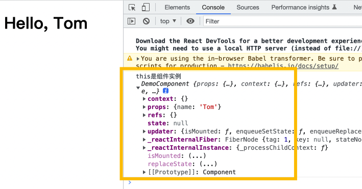

<h1 class="article-title no-number">React.JS</h1>

# 简介

React——用于构建用户界面的 JavaScript 库，将数据渲染为 HTML 视图的开源 JavaScript 库。

## 原生 JS 痛点

1. 原生 JS 操作 DOM 繁琐，效率低；
2. 原生 JS 直接操作 DOM，浏览器会大量**重绘重排**；
3. 原生 JS 没有组件化编码方案，代码复用率低。

## React 特点

1. **组件化模式**，**声明式编码**，提高开发效率和组件复用率；
2. React Native 进行移动端开发；
3. **虚拟 DOM**+**Diffing 算法**，减少操作真实 DOM（_React 高效的原因_）。

## Hello React

```html
<!DOCTYPE html>
<html>
  <head>
    <meta charset="UTF-8" />
    <title>Hello React</title>
  </head>
  <body>
    <!-- 容器 -->
    <div id="test"></div>
    <!-- 引入react核心库，必须在第一个，增加React全局变量 -->
    <script
      crossorigin
      src="https://unpkg.com/react@16/umd/react.development.js"
    ></script>
    <!-- 引入react-dom，用于react操作DOM -->
    <script
      crossorigin
      src="https://unpkg.com/react-dom@16/umd/react-dom.development.js"
    ></script>
    <!-- 引入babel，将jsx转为js -->
    <script src="https://cdnjs.cloudflare.com/ajax/libs/babel-standalone/6.26.0/babel.min.js"></script>
    <script type="text/babel">
      const vdom = <h1>Hello, world!</h1>;
      ReactDOM.render(vdom, document.getElementById('test'));
    </script>
  </body>
</html>
```

# JSX 简介

JSX，是一个 JavaScript 的语法扩展。

## JSX 特点

- 在 JSX 中嵌入表达式

  ```jsx
  const name = 'Josh Perez';
  const element = <h1>Hello, {name}</h1>;
  ```

- JSX 特定属性

  ```jsx
  const element = </img>;
  ```

- JSX 防止注入攻击

  ```jsx
  const title = response.potentiallyMaliciousInput;
  // 直接使用是安全的：
  const element = <h1>{title}</h1>;
  ```

## JSX 语法规则

1. 定义虚拟 DOM，不用加引号。
2. 标签中使用**JS 表达式**，用`{}`包含。
3. 样式类名指定不用`class`，要用`className`形式。
4. 内联样式`style="color:red;font-size:large;"`属性不能写字符串。
5. JSX 创建的虚拟 DOM 只能有一个根标签。
6. 标签首字母
   - 小写字母开头，则将标签转为 html 中同名元素，如无则报错；
   - 大写字母开头，以组件形式渲染，如果组件没有定义，则报错。

# React 面向组件编程

## 函数式组件

```jsx
function DemoComponent(props) {
  return <h1>Hello, {props.name}</h1>;
}
ReactDOM.render(<DemoComponent name="Tom" />, document.getElementById('test'));
```

## 类式组件

```jsx
class DemoComponent extends React.Component {
  // 必须重写render方法，并且render函数有返回值
  render() {
    // render中的this，指的是DemoComponent组件实例对象
    return <h1>Hello, {this.props.name}</h1>;
  }
}
ReactDOM.render(<DemoComponent name="Tom" />, document.getElementById('test'));
```

**用类定义的组件，其实例有三大属性，分别是：state、props、refs。**



# State 状态

React 把组件看成是一个状态机（State Machines），通过与用户的交互，实现不同状态，然后渲染 UI，让用户界面和数据保持一致。

React 里，只需更新组件的 state，然后根据新的 state 重新渲染用户界面（不要操作 DOM）。

**组件的状态都是隔离的，通常是局部或封装的，除了拥有它的组件外，其他组件不可访问。**

```jsx
class TimeComponent extends React.Component {
  constructor(props) {
    super(props);
    // 初始化状态
    this.state = {
      time: new Date(),
    };
  }
  componentDidMount() {
    // 在组件输出到 DOM 后会执行挂载
    this.timerID = setInterval(() => {
      this.tick();
    }, 1000);
  }
  componentWillUnmount() {
    // 卸载组件
    clearInterval(this.timerID);
  }
  // 自定义组件使用赋值语句+箭头函数
  tick = () => {
    // 调用 setState 方法更改状态
    this.setState({
      time: new Date(),
    });
  };
  render() {
    return <h1>现在时间是{this.state.time.toLocaleTimeString()}</h1>;
  }
}
ReactDOM.render(<TimeComponent />, document.getElementById('test'));
```

执行顺序：

1. 当`<TimeComponent />`传递给`ReactDOM.render`，React 调用组件的构造函数，并初始化组件状态。
2. React 调用组件的`render()`方法渲染，把组件更新到 DOM 中。
3. 当组件插入 DOM 时，React 调用组件的`componentDidMount()`生命周期钩子。
4. 浏览器每秒钟调用 `tick()` 方法。
5. 一旦 `TimeComponent` 组件被从 DOM 中移除，React 会调用 `componentWillUnmount()` 这个钩子函数，定时器也就会被清除。

#### 修改 State

State 状态不可直接更改，调用`setState` 方法更改状态，并且`setState`的更新是一种合并，不是替换。

组件的构造器`constructor`只在组件实例时调用。

组件的`render()`函数，在初始化时调用一次，状态更改后，也会调用。

#### 异步更新 State

出于性能考虑，React 可能会把多个 `setState()` 调用合并成一个调用。

因为 `this.props` 和 `this.state` 可能会**异步更新**，所以你不要依赖他们的值来更新下一个状态。

```jsx
// 错误写法
this.setState({
  counter: this.state.counter + this.props.increment,
});
// 正确写法1：箭头函数
this.setState((state, props) => ({
  counter: state.counter + props.increment,
}));
// 正确写法2：标准函数
this.setState(function (state, props) {
  return {
    counter: state.counter + props.increment,
  };
});
```

# Props 属性

state 和 props 主要的区别在于 **props 是只读的，不可变的**，而 state 可以根据与用户交互来改变。

这就是为什么有些容器组件需要定义 state 来更新和修改数据。 而子组件只能通过 props 来传递数据。

有这样一个组件。

```jsx
class DemoComponent extends React.Component {
  render() {
    return (
      <div>
        <h1>Name: {this.props.name}</h1>
        <h1>Age: {this.props.age}</h1>
      </div>
    );
  }
}
```

可以又两种方式传递 props：

- 方式 1：一个个传递，如果传递是 Number 类型，最好使用`{18}`方式来传递，这样能保证数据类型不变。

  ```jsx
  ReactDOM.render(
    <DemoComponent name="Tom" age={18} />,
    document.getElementById('test')
  );
  ```

- 方式 2：传递对象

  ```jsx
  let person = {
    name: 'Tom',
    age: 18,
  };
  ReactDOM.render(
    <DemoComponent {...person} />,
    document.getElementById('test')
  );
  ```

# Refs 转发

React 支持一种非常特殊的属性 **Ref** ，你可以用来绑定到 `render()` 输出的任何组件上。

组件里的标签可以通过`ref`来标识自己。

- 字符串类型 ref【_不推荐_】

  ```jsx
  class DemoComponent extends React.Component {
    constructor() {
      super(); // 必须写
      this.handleClick = this.handleClick.bind(this);
    }
    handleClick() {
      this.refs.myInput.focus();
    }
    render() {
      return (
        <div>
          <input type="text" ref="myInput" />
          <button onClick={this.handleClick}>
            <h3>点我输入框获取焦点</h3>
          </button>
        </div>
      );
    }
  }

  ReactDOM.render(<DemoComponent />, document.getElementById('test'));
  ```

- 函数回调形式 ref【_不推荐_，每次 render 都会执行】

  ```jsx
  class DemoComponent extends React.Component {
    constructor() {
      super(); // 必须写
      this.handleClick = this.handleClick.bind(this);
    }
    handleClick = () => {
      this.myInput.focus(); // render执行时，赋值了 myInput 的值
    };
    render() {
      return (
        <div>
          <input type="text" ref={(element) => (this.myInput = element)} />
          <button onClick={this.handleClick}>
            <h3>点我输入框获取焦点</h3>
          </button>
        </div>
      );
    }
  }

  ReactDOM.render(<DemoComponent />, document.getElementById('test'));
  ```

- 类绑定 ref

  ```jsx
  class DemoComponent extends React.Component {
    constructor() {
      super(); // 必须写
      this.handleClick = this.handleClick.bind(this);
    }
    handleClick = () => {
      this.myInput.focus(); // render执行时，赋值了 myInput 的值
    };
    saveInput = (element) => {
      this.myInput = element; // 放在class中，每次render不会重复执行
    };
    render() {
      return (
        <div>
          <input type="text" ref={this.saveInput} />
          <button onClick={this.handleClick}>
            <h3>点我输入框获取焦点</h3>
          </button>
        </div>
      );
    }
  }
  ReactDOM.render(<DemoComponent />, document.getElementById('test'));
  ```

- createRef

  ```jsx
  class DemoComponent extends React.Component {
    constructor() {
      super(); // 必须写
      this.handleClick = this.handleClick.bind(this);
    }
    myInput = React.createRef();
    handleClick = () => {
      console.log('this.myInput.current.value', this.myInput.current.value);
      // this.myInput.focus()  // ref.current.focus()方法失效
    };
    render() {
      return (
        <div>
          <input type="text" ref={this.myInput} />
          <button onClick={this.handleClick}>
            <h3>点我输入框获取焦点</h3>
          </button>
        </div>
      );
    }
  }
  ReactDOM.render(<DemoComponent />, document.getElementById('test'));
  ```

# 事件处理

React 元素的事件处理和 DOM 元素类似。但是有一点语法上的不同:

- React 事件绑定属性的命名采用驼峰式写法，而不是小写。
- 如果采用 JSX 的语法你需要传入一个函数作为事件处理函数，而不是一个字符串(DOM 元素的写法)

```jsx
class ButtonComponent extends React.Component {
  constructor(props) {
    super(props);
    this.state = { isToggleOn: true }; // 初始化状态
    // 因为onClick只是赋值，并没有调用，而且不是实例调用，而且类中的方法开启了局部的严格模式，所以handleClick中的this指向undefined
    // 这边绑定是必要的，这样this才能在回调函数中使用，bind返回一个新函数
    this.handleClick = this.handleClick.bind(this);
  }
  handleClick() {
    this.setState((prevState) => ({
      isToggleOn: !prevState.isToggleOn, // 更改状态
    }));
  }
  render() {
    return (
      <button onClick={this.handleClick}>
        <h1>{this.state.isToggleOn ? 'ON' : 'OFF'}</h1>
      </button>
    );
  }
}
ReactDOM.render(<ButtonComponent />, document.getElementById('test'));
```

# 生命周期

> **React17 以后，生命周期有所调整，使用最新的生命周期。**

[官方文档](https://zh-hans.reactjs.org/docs/react-component.html#reference)

组件的生命周期可分成三个状态：

- Mounting（挂载）：已插入真实 DOM
- Updating（更新）：正在被重新渲染
- Unmounting（卸载）：已移出真实 DOM


## 挂载

初始化阶段，通过 ReactDOM.render()触发，初次渲染，即当组件实例被创建并插入 DOM 中时。

组件挂载的生命周期调用顺序如下：

- `constructor()`：在 React 组件挂载之前，会调用它的构造函数。
- `getDerivedStateFromProps()`：在调用 render 方法之前调用，并且在初始挂载及后续更新时都会被调用。
- `render()`：**★★★【必须】render() 方法是 class 组件中唯一必须实现的方法**。
- `componentDidMount()`：**★【常用】在组件挂载后（插入 DOM 树中）立即调用。一般在钩子中做初始化的事情，例如：开启定时器、发送网络请求、订阅消息**
- `componentWillMount()`：_【避免使用】_

## 更新

每当组件自身或父组件的 state 或 props 发生变化时，组件就会更新。

组件更新的生命周期调用顺序如下：

- `getDerivedStateFromProps()`：从 props 中得到衍生的状态，**使用场景罕见**。在调用 render 方法之前调用，并且在初始挂载及后续更新时都会被调用。根据 shouldComponentUpdate() 的返回值，判断 React 组件的输出是否受当前 state 或 props 更改的影响。
- `shouldComponentUpdate()`:当 props 或 state 发生变化时，shouldComponentUpdate() 会在渲染执行之前被调用。返回 true 或 false，如果返回 false，则不更新组件。
- `render()`：**★★★【必须】render() 方法是 class 组件中唯一必须实现的方法。**
- `getSnapshotBeforeUpdate()`：**在更新前获取快照**。在最近一次渲染输出（提交到 DOM 节点）之前调用。
- `componentDidUpdate()`：在更新后会被立即调用。
- `componentWillUpdate()`：_【避免使用】_
- `componentWillReceiveProps()`：_【避免使用】_

## 卸载

当组件从 DOM 中移除时会调用如下方法：

- `componentWillUnmount()`：**★【常用】在组件卸载及销毁之前直接调用。做一些收尾工作，例如：关闭定时器、取消订阅消息**

## 案例

```jsx
<!DOCTYPE html>
<html>
  <head>
    <meta charset="UTF-8" />
    <title>Hello React</title>
  </head>
  <body>
    <div id="test"></div>
    <!-- 引入react核心库，必须在第一个 -->
    <script
      crossorigin
      src="https://unpkg.com/react@17/umd/react.development.js"
    ></script>
    <!-- 引入react-dom，用于react操作DOM -->
    <script
      crossorigin
      src="https://unpkg.com/react-dom@17/umd/react-dom.development.js"
    ></script>
    <!-- 引入babel，将jsx转为js -->
    <script src="https://cdnjs.cloudflare.com/ajax/libs/babel-standalone/6.26.0/babel.min.js"></script>
    <script type="text/babel">
      // 父组件
      class Button extends React.Component {
        constructor() {
          super();
          this.increase = this.increase.bind(this);
          this.state = {
            number: 0,
          };
        }
        increase = () => {
          this.setState((state, props) => ({
            number: state.number + 1,
          }));
        };
        render() {
          return (
            <div>
              <button onClick={this.increase}>
                <h1> 点击</h1>
              </button>
              <Content myNumber={this.state.number}></Content>
            </div>
          );
        }
      }
      // 子组件
      class Content extends React.Component {
        constructor() {
          super();
        }
        // 组件将要挂在钩子
        // UNSAFE_componentWillMount() {
        //   console.log('【不推荐】组件即将挂载 UNSAFE_componentWillMount');
        // }
        // 组件挂载完毕钩子
        componentDidMount() {
          console.log('组件挂载完毕 componentDidMount');
        }
        // 不更新钩子
        shouldComponentUpdate(newProps, newState) {
          if (newProps.myNumber > 5) return false;
          return true;
        }
        // 组件接收props钩子
        // UNSAFE_componentWillReceiveProps(newProps) {
        //   console.log(
        //     '【不推荐】组件将接收props UNSAFE_componentWillReceiveProps'
        //   );
        // }
        // 组件将要更新钩子
        // UNSAFE_componentWillUpdate(nextProps, nextState) {
        //   console.log('【不推荐】组将将要更新 UNSAFE_componentWillUpdate');
        // }
        // 更新前获取快照
        getSnapshotBeforeUpdate(prevProps, prevState) {
          console.log('更新前获取快照，并把数据传递给componentDidUpdate');
          return 'snapshot'; // 参数会传递给 componentDidUpdate
        }
        // 组件更新完毕钩子（接收先前的props、state）
        componentDidUpdate(prevProps, prevState, snapshotVal) {
          console.log(
            '组件更新完毕 componentDidUpdate',
            prevProps,
            prevState,
            snapshotVal
          );
        }
        // 组件将要卸载钩子
        componentWillUnmount() {
          console.log('组件将要卸载 componentWillUnmount');
        }
        // 组件渲染
        render() {
          console.log('组件将要渲染 render');
          return (
            <div>
              <h1>{this.props.myNumber}</h1>
            </div>
          );
        }
      }
      ReactDOM.render(<Button />, document.getElementById('test'));
    </script>
  </body>
</html>
```

# Diff 算法

React 最为核心的就是 **Virtual DOM** 和 **Diff 算法**。

React 在内存中维护一颗虚拟 DOM 树，当数据发生改变时（state & props），会自动的更新虚拟 DOM，获得一个新的虚拟 DOM 树，然后通过 Diff 算法，比较新旧虚拟 DOM 树，找出最小的有变化的部分，将这个变化的部分（Patch）加入队列，最终批量的更新这些 Patch 到实际的 DOM 中。

# key 的作用

#### 一、虚拟 DOM 中 key 的作用是什么？

**简单的说**key 是虚拟 DOM 对象的表示，在更新显示时，key 起着极其重要的作用。

**详细的说**，当状态的数据发生变化时，React 会**根据新数据生成新的虚拟 DOM**，然后 React 进行**新虚拟 DOM 与旧虚拟 DOM 进行 Diff 比较**，比较规则如下：

- 旧虚拟 DOM 中**找到了**新虚拟 DOM 中的 key：
  - 若虚拟 DOM 中内容没变，直接使用之前的真实 DOM
  - 若虚拟 DOM 中内容变了，则生成新的真实 DOM，随后替换掉页面中的真实 DOM
- 旧虚拟 DOM 中**没找到**新虚拟 DOM 中的 key：
  - 根据数据创建新的真实 DOM，随后渲染到页面

#### 二、用 index 作为 key 会引发什么问题？

1. 若对数据进行**逆序添加**、**逆序删除**等破坏顺序的操作，会产生不必要的真实 DOM 更新，降低渲染效率。
2. 如果结构中包含输入类的 DOM，产生错误 DOM 更新，界面会产生问题。
3. 如果不进行破坏顺序的操作，则没有任何影响。

#### 三、开发中如何选择 key？

1. 使用每条数据的唯一标识作为 key，例如：手机号、学号等。
2. 如果确实只是简单的展示，用 index 也可以的。

# 脚手架

```sh
# 创建一个React项目（Node版本要14以上）
npx create-react-app my-app
# 进入并启动
cd my-app && npm start
```


# Router

> React Router 有三个项目，分别针对 Web、Native 和 Anywhere 三个开发。
>
> 
>
> 我们使用`react-router-dom`库，针对 web 开发专门设计的路由插件库。
>
> [官方文档](https://reactrouterdotcom.fly.dev/docs/en/v6)

## BrowserRouter & HashRouter

| 区别                    | BrowserRouter                                   | HashRouter                  |
| ----------------------- | ----------------------------------------------- | --------------------------- |
| 底层原理                | 使用 H5 的 history API，不兼容 IE9 及以下版本。 | 使用 URL 的哈希部分         |
| 路径形式                | 路径中没有`#`                                   | 路径中带有`#`               |
| 刷新对路由 state 的影响 | 无任何影响，state 保存在 history 中             | 刷新后会导致路由 state 丢失 |

## 路由组件

```jsx
<Route path="/home" component={Home} />
```

`Home`组件现在是路由组件，是靠路由匹配展示出来的，一般是页面。

路由组件在渲染的时候，会有默认的`props`值，有`history`、`location`、`match`等信息。

| 区别         | 一般组件         | 路由组件                                                       |
| ------------ | ---------------- | -------------------------------------------------------------- |
| 写法         | `<Home />`       | `<Route path="/home" component={Home} />`                      |
| 代码位置     | components       | pages                                                          |
| 接收的 props | 接收父组件的传值 | 接收三个固定属性：<br />● history<br />● location<br />● match |

## 路由传参

- **params 参数**

路由链接：`<Link to='/demo/tom/18'>详情</Link>`

注册路由：`<Route path='/demo/:name/:age' component={Demo} />`

接收参数：`this.props.match.params`

- **search 参数**

路由链接：`<Link to='/demo?name=tom&age=18'>详情</Link>`

注册路由：`<Route path='/demo' component={Demo} />`

接收参数：`this.props.location.search`

> search 中的是 urlencoded 编码的字符串，需要借助 querystring 解析。

- **state 参数**

路由链接： `<Link to={{pathname:'/demo',state:{name:'tom',age:18}}}>详情</Link>`

注册路由：`<Route path='/demo' component={Demo} />`

接收参数：`this.props.location.state`

> 如果使用`<HashRouter>`，页面刷新后，state 会丢失。

# Redux

Redux 是 JavaScript 应用的状态容器，提供可预测的状态管理。

**Redux 是一个使用叫做“action”的事件来管理和更新应用状态的模式和工具库** 它以集中式 Store（centralized store）的方式对整个应用中使用的**状态进行集中管理**，其规则确保状态只能以可预测的方式更新。


## 核心概念

### action

**action** 是一个具有 `type` 字段的普通 JavaScript 对象，典型的示例如下：

```js
const addTodoAction = {
  type: 'todos/todoAdded',
  payload: 'Buy milk',
};
```

**action creator** 是一个创建并返回一个 action 对象的函数。它的作用是让你不必每次都手动编写 action 对象：

```js
const addTodo = (text) => {
  return {
    type: 'todos/todoAdded',
    payload: text,
  };
};
```

### reducer

**reducer** 是一个函数，接收当前的 `preState` 和一个 `action` 对象，必要时决定如何更新状态，并返回新状态。函数签名是：`(state, action) => newState`。

**你可以将 reducer 视为一个事件监听器，它根据接收到的 action（事件）类型处理事件。**

```js
const initialState = { value: 0 };
function counterReducer(state = initialState, action) {
  // 检查 reducer 是否关心这个 action
  if (action.type === 'counter/increment') {
    return {
      ...state,
      value: state.value + 1,
    };
  }
  // 返回原来的 state 不变
  return state;
}
```

### store

当前 Redux 应用的状态存在于一个名为 **store** 的对象中。

store 是通过传入一个 reducer 来创建的，并且有一个名为 `getState` 的方法，它返回当前状态值：

```js
import { configureStore } from '@reduxjs/toolkit';

const store = configureStore({ reducer: counterReducer });

console.log(store.getState()); // 获取当前状态值 {value: 0}

store.dispatch({ type: 'counter/increment' }); // dispatch执行传入的action对象
```

## 数据流


# 开发规范

1. 拆分组件，注意 className,style 的写法

2. 状态在哪里，操作状态的方法就在哪里。
