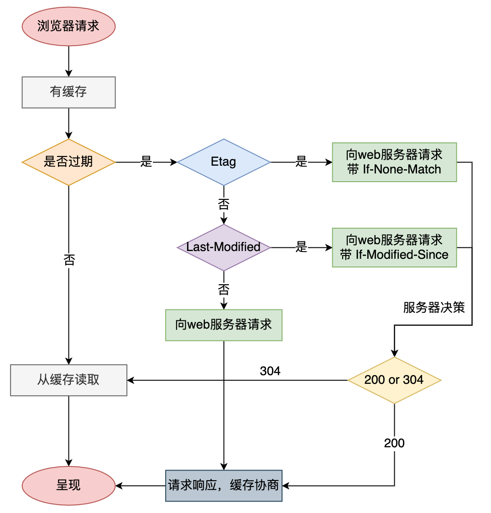

<span id="hidden-autonumber"></span>

# 前端总结

#### 箭头函数

写法简单，而且不绑定 this。一般用于匿名函数。

不能用作构造函数，即不能使用 new 来创建实例。

#### 扩展运算符

`...`一般用于解构赋值、合并数组、传参和函数返回值等。

#### Set 对象

类似于数组，成员的值唯一。

一般用于数组去重和获取两数组的交集、并集。

一般方法：add(value)、delete(value)、has(value)、clear()

```js
let a = new Set([1, 2, 3]);
let b = new Set([4, 3, 2]);

// 并集
let c1 = new Set([...a, ...b]); // Set {1,2,3,4}

// 交集
let c2 = new Set([...a].filter((x) => b.has(x))); // set {2,3}

// 差集
let c3 = new Set([...a].filter((x) => !b.has(x))); // set {1}
```

#### Map 对象

JS 对象的 key 只能是 string 类型，给开发带来很大限制。Map 提供 Key-Value 对，是一种 hash 结构实现。

一般方法：keys()、values()、entries()、forEach()

#### 原生 ajax、axios 实现原理

使用**XMLHttpRequest**构造函数创建一个实例，该构造函数用于与服务器交互。通过 XMLHttpRequest 可以在不刷新页面的情况下请求特定 URL，获取数据。

```js
const xhr = new XMLHttpRequest();
// 设置请求方式和请求地址
xhr.open('POST', 'http://127.0.0.1:3008');
// readystate是xhr对象中的属性，用来获取ajax状态码 0 1 2 3 4
xhr.onreadystatechange = function () {
  // 判断ajax状态码
  // status获取http状态码。200表示ok
  if (xhr.readyState === 4 && xhr.status === 200) {
    // xhr.responseText表示请求返回的数据内容
    console.log(xhr.responseText);
  }
};
// 发送
xhr.send('Hello Server!');
```

#### 原生 websocket 实现原理

使用**WebSocket**构造函数创建一个实例，用于管理 ws 连接。

```js
var ws = new WebSocket('ws://localhost:9998');
ws.onopen = function () {
  // Web Socket 已连接上，使用 send() 方法发送数据
  let send_msg = '你好，服务端！';
  ws.send(send_msg);
  alert(`发送数据: ${send_msg}`);
};
ws.onmessage = function (evt) {
  var received_msg = evt.data;
  console.log(`接收到数据: ${received_msg}`);
};
ws.onclose = function () {
  // 关闭 websocket
  console.log('连接已关闭...');
};
```

#### 同源策略

协议相同、域名相同、端口相同的页面之间才能够互相访问数据。

cookie 是服务器端写入浏览器的信息，只有同源的情况下才能够共享访问。

不同域的 ajax 也是无法请求的

解决方案主要是：**JSONP、WebSocket、CORS**。

- JSONP

  JSON with Padding，是 JSON 的一种使用模式，允许跨域读取数据。

- WebSocket

  直连 WebSocket 服务，而不用管同源策略。

- CORS

  Cross-Origin Resource Sharing，跨域资源共享。

  服务器端设置`Access-Control-Allow-Origin`允许站点请求。

#### CORS 详解

CORS 允许浏览器向跨源服务器，发出`XMLHttpRequest`请求，从而克服了 AJAX 同源策略的限制。

**实现 CORS 通信的关键是服务器。只要服务器实现了 CORS 接口，就可以跨源通信。**

CORS 请求分为两类，简单请求（simple request）和非简单请求（not-so-simple-request）。

##### 简单请求

请求方法：HEAD、GET、POST

请求头信息字段：

- Accept
- Accept-Language
- Content-Language
- Last-Event-ID
- Content-Type：只限于三个值`application/x-www-form-urlencoded`、`multipart/form-data`、`text/plain`

响应头字段：

- Access-Control-Allow-Origin： `Origin`值或`*`。
- Access-Control-Allow-Credentials：是否允许发送 Cookie，默认情况下 Cookie 不会在 CORS 请求中。
- Access-Control-Expose-Headers：可选。指定额外的请求头字段。

请求方式：**请求头中添加`Origin`字段，用来说明本次请求来自的源。**

服务器端判断是`Origin`是否在允许范围内，允许则继续操作。

##### 非简单请求

除简单请求的方法和请求头外，其他的都是非简单请求。

**非简单请求的 CORS 请求，会在正式通信之前，增加一次 HTTP 查询请求，称为"预检"请求（preflight）。**

#### 传输安全问题


##### HTTP 三次握手

第一次握手：客户端尝试连接服务器。服务器保证自己的接收能力正常。

第二次握手：服务器尝试回复客户端。客户端保证自己的接收能力和发送能力正常。

第三次握手：客户端尝试回复服务器。服务器保证自己发送能力正常。

##### HTTPS 工作流程

HTTPS 协议比 HTTP 协议多了 SSL 和 TLS 层，用于保证数据的安全传输。

工作流程如下：

1. TCP 三次握手。
2. 客户端验证服务器证书。
3. Diffie-Hellman**密钥协议算法**协商对称加密算法的密钥、hash 算法的密钥。（可以是对称，也可以是非对称的）
4. SSL 安全加密隧道协商完成。
5. 数据以加密的方式传输。协商的加密算法保证数据机密性，协商的 hash 算法保护数据完整性。

> [!note]
>
> **数据机密性**
>
> 使用加密算法来够保证数据的机密性。
>
> 对称加密算法很快，但存在安全性问题，密钥如何传递？通用的做法是，使用非对称算法传输密钥，保证客户端和服务端都能够解析得到密钥。接下来就通过密钥来进行对称加密传输数据。
>
> **数据完整性**
>
> 数据在传输过程中，可能被第三方篡改，如何保证数据不被篡改？数据除了进行加密，还要进行 hash。hash 是不可逆的。将 hash 值和加密的密文一同发送给服务端。
>
> 服务端在接收到密文后，对其进行解密，得到明文，并用明文进行 hash，比较客户端传来的 hash 与自己加密的 hash 是否一致，一致则数据未被篡改。

##### HTTPS 工作原理


1. **客户端发起 HTTPS 请求**

   浏览器输入网址，回车。访问对应服务的 443 端口。

2. **服务端传送证书**

   服务器端返回 SSL 版本、随机数、证书（携带公钥、颁发机构、过期时间）等。

   > 证书是在有资质的 CA 机构申请的。

3. **客户端解析证书**

   客户端校验证书是否合法，不合法则弹出警告。证书合法，客户端则得到了服务端的公钥。

4. **客户端发送证书**

   客户端验证通过后，将自己的证书发送给服务端。服务端校验，并得到客户端的公钥。

5. **协商解密方案**

   客户端告诉服务端可用的加密方案，服务端选择安全性最高的，并以通知客户端。

6. **传输随机数**

   收到加密方案后。客户端生成一个随机值，并用证书中的公钥对随机值进行加密，发送给服务端。

7. **服务端解析随机数**

   服务端用对应的私钥进行解密，得到生成的随机值。

8. **对称加密数据传输**

   在接下来的会话中，服务器和客户端将会使用该**随机值进行对称加密**，保证通信过程中信息的安全。

##### HTTP 和 HTTPS 区别

| HTTP                 | HTTPS                             |
| -------------------- | --------------------------------- |
| 明文传输，数据未加密 | 密文传输，数据加密                |
| 三次握手，响应速度快 | 三次握手+SSL 安全验证，响应速度慢 |
| 默认端口 80          | 默认端口 443                      |
| 服务器资源耗费小     | 服务器资源耗费大                  |

#### 协商缓存和强缓存

**强制缓存**相关字段有 expires，cache-control。如果 cache-control 与 expires 同时存在的话，cache-control 的优先级高于 expires。

**协商缓存**相关字段有 Last-Modified/If-Modified-Since，Etag/If-None-Match

因为服务器上的资源不是一直固定不变的，大多数情况下它会更新，这个时候如果我们还访问本地缓存，那么对用户来说，那就相当于资源没有更新，用户看到的还是旧的资源；所以我们希望服务器上的资源更新了浏览器就请求新的资源，没有更新就使用本地的缓存，以最大程度的减少因网络请求而产生的资源浪费。



#### JS 中的垃圾

- 全局变量不是垃圾。
- 局部变量执行结束后，就被当做垃圾。
- 一个地址指向对象 A，如果地址断开，则对象 A 就被当做垃圾。

#### 垃圾回收机制

JS 垃圾回收机制：定期找出不再使用的变量，然后释放其内存。（由于开销大，所以并非实时清理，而是定期清理）

##### 如何判断变量不再使用？

- **标记清除**

  遍历空间所有变量，并标记为“存在”状态。对于没有标记到的变量，则视为垃圾，在回收时就会被清除。

  **缺点**：1、执行效率慢；2、标记过程中，浏览器无法执行 JS 脚本。

  **优化**：1、分代回收，全局变量可减少遍历和标记，重点标记新创建的局部变量；2、增量执行，一次遍历一部分，分批次遍历完；3、空闲时间段执行遍历和标记。

- **引用计数**

  对象被新建、引用和删除的时候，都更新计数，如果计数器值为 0 则表示无引用，则可以删除。

  **优点**：不需要遍历，节省浏览器运行开销。

  **缺点**：处理繁琐，而且对于循环引用的对象无法回收。

#### JS 内存泄漏

产生的原因：

1. 没有及时对垃圾进行回收。
2. 处理量突然增大，导致内存在短时间内被占用。
3. 死循环

#### 浏览器的 Application Storage

##### cookie

HTTP 是无状态的协议，为了记录状态，服务器在响应报文中通过 set-cookie 将信息写入浏览器的 cookie 中。

浏览器每次请求，都会携带 cookie，cookie 是可以设置有效期的。

cookie 不提供修改和删除操作，只能通过响应报文的 set-cookie 来覆盖或设置过期。

##### session

cookie 保存在客户端，session 保存在服务端。

浏览器第一次请求时，服务端会产生一个 sessionID，并存在 cookie 中返回。

当再次请求时，cookie 会携带 sessionID，服务端就可以找到对应的客户端。

> session 仅在当前会话下有效，关闭会话或浏览器后被清除。

##### localStorage

本质上是浏览器上的 hash 表，数据可以做到永久持久化存储。

##### sessionStorage

本质与**localStorage**一样，不过仅在当前会话过程有效，会话结束即清除。

#### 前端性能优化手段

1. 减少 HTTP 请求。
2. 使用最新版的 HTTP2 协议。

3. 服务器端渲染。
4. 静态资源使用 CDN。
5. CSS 放在头部，JS 放在底部。等 HTML 解析完再加载 JS 文件。
6. 使用字体图标 iconfont 替代图片。
7. webpack 打包时，对文件进行压缩。
8. 图片懒加载、降低图片质量。
9. 减少重绘重排。
10. 降低 CSS 选择器的复杂度

#### 尾调用优化

**尾调用**：函数的最后一步是另一个函数。

**优化**：直接调用内层函数。

#### 节流和防抖

##### 节流

高频率执行的事件，但某一周期内只会执行一次，即稀释了函数的执行频率，**原理是通过判断是否有延迟调用函数未执行。**

每次触发事件时，如果当前有等待执行的延时函数，有则直接 return。使得一定时间内只触发一次函数。

使用场景：播放事件计算进度条、滚动事件、input 输入。

```js
//节流throttle代码：
function throttle(fn) {
  let canRun = true; // 通过闭包保存一个标记
  return function () {
    // 在函数开头判断标记是否为true
    // true，表示现在没有延时任务，继续执行
    // false，表示现在还有延时任务，直接return
    if (!canRun) return;
    // 立即设置为false
    canRun = false;
    // 将外部传入的函数的执行放在setTimeout中
    setTimeout(() => {
      // 最后在setTimeout执行完毕后再把标记设置为true(关键)表示可以执行下一次循环了。
      // 当定时器没有执行的时候标记永远是false，在开头被return掉
      fn.apply(this, arguments);
      canRun = true;
    }, 500);
  };
}

function sayHi(e) {
  console.log(e.target.innerWidth, e.target.innerHeight);
}
window.addEventListener('resize', throttle(sayHi));
```

##### 防抖

某一周期内，事件只会执行一次。

每次触发事件时设置一个延迟调用方法，并且取消之前的延时调用方法。

使用场景：短信验证码、提交表单、input 输入。

```js
//防抖debounce代码：
function debounce(fn) {
  // 创建一个标记用来存放定时器的返回值
  let timeout = null;
  return function () {
    // 每当用户输入的时候把前一个 setTimeout clear 掉
    clearTimeout(timeout);
    // 然后又创建一个新的 setTimeout
    // 保证interval 间隔内如果时间持续触发，就不会执行 fn 函数
    timeout = setTimeout(() => {
      fn.apply(this, arguments);
    }, 500);
  };
}
// 处理函数
function handle() {
  console.log(Math.random());
}
// 滚动事件
window.addEventListener('scroll', debounce(handle));
```
