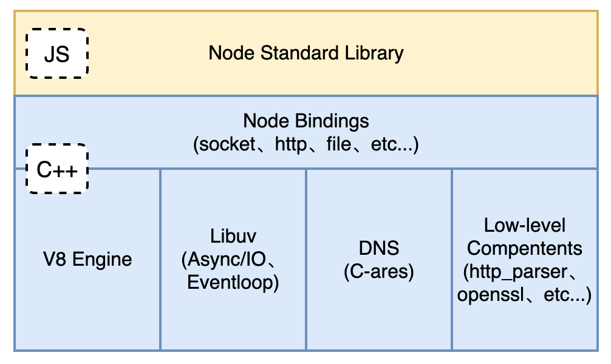
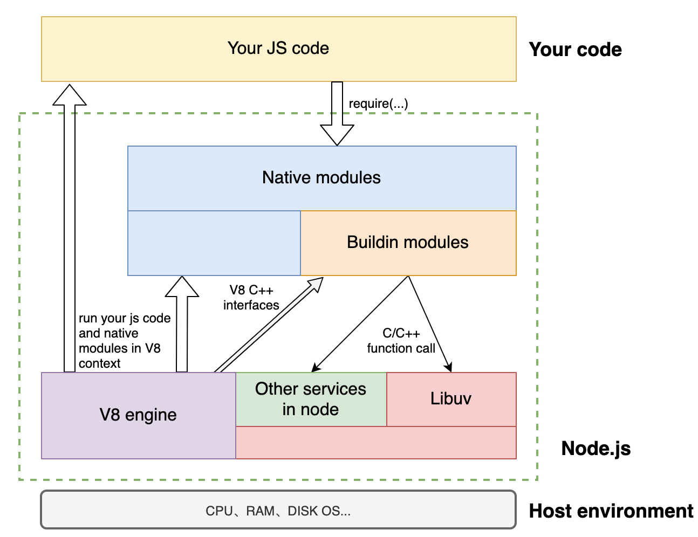
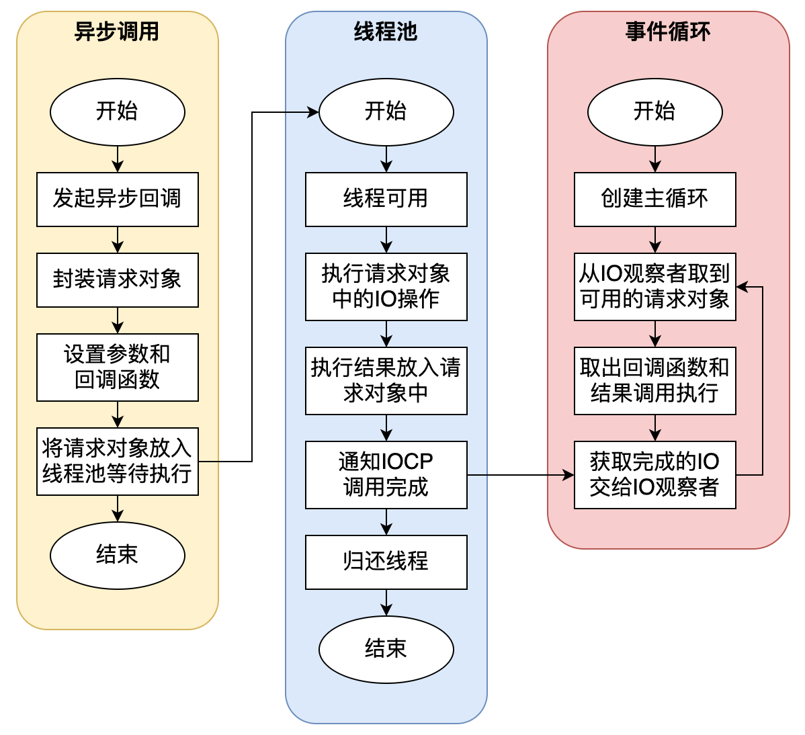
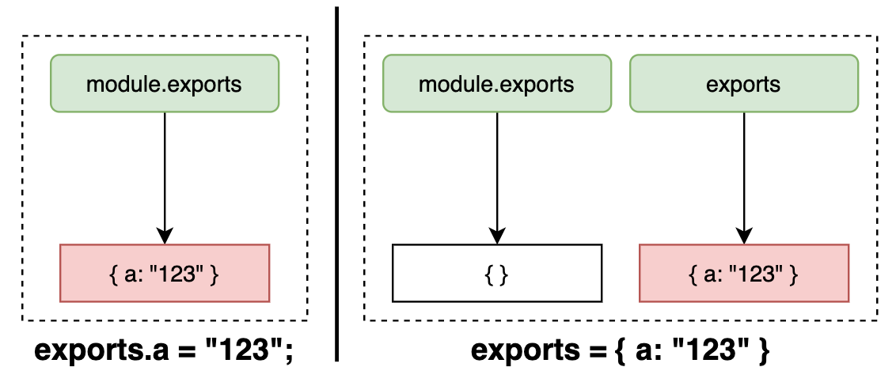
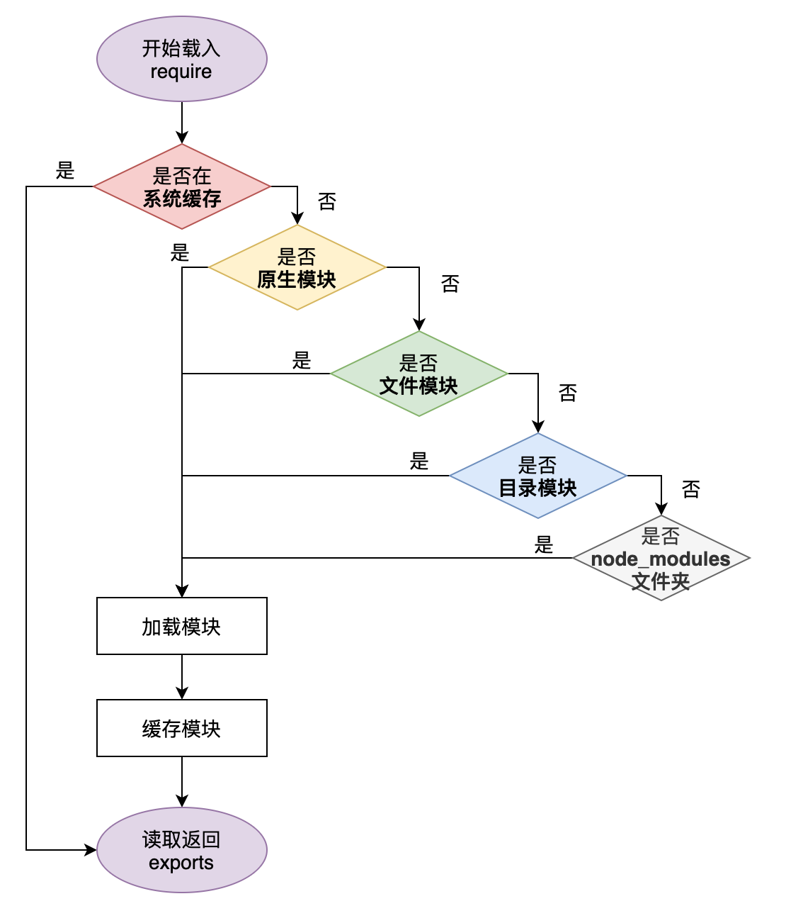
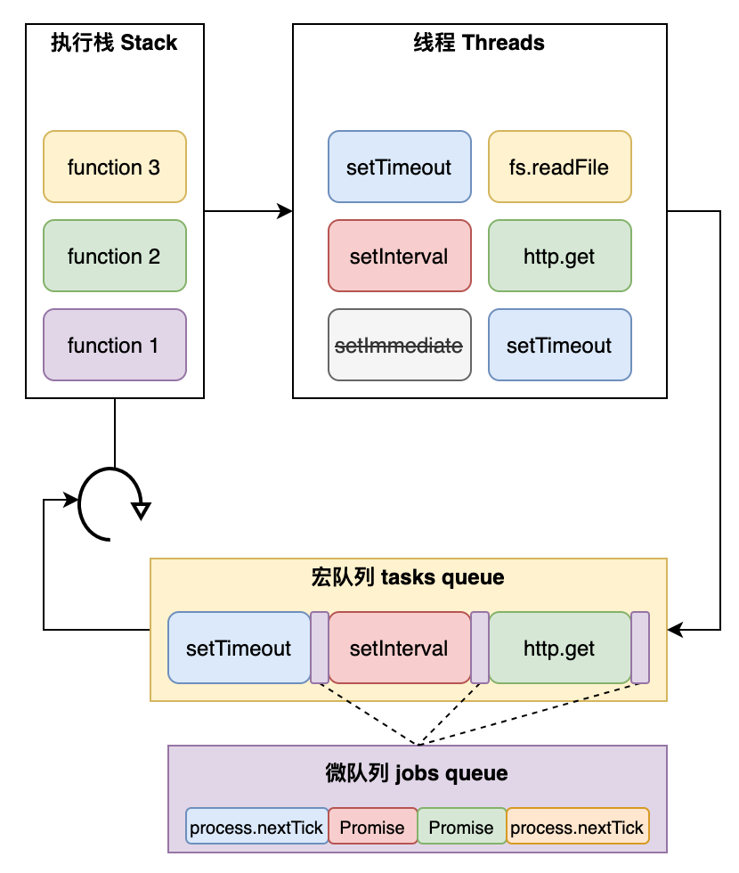
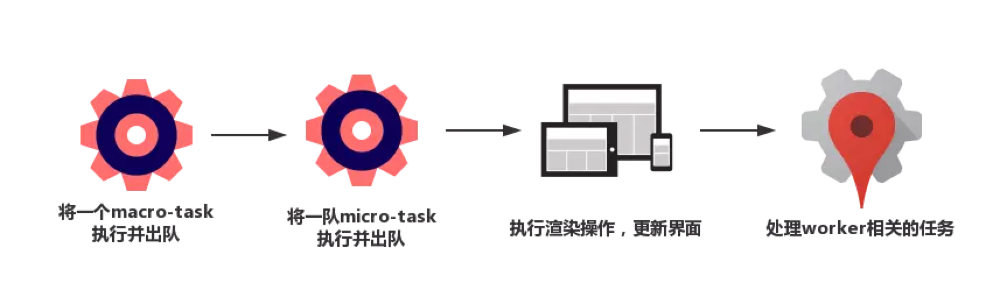
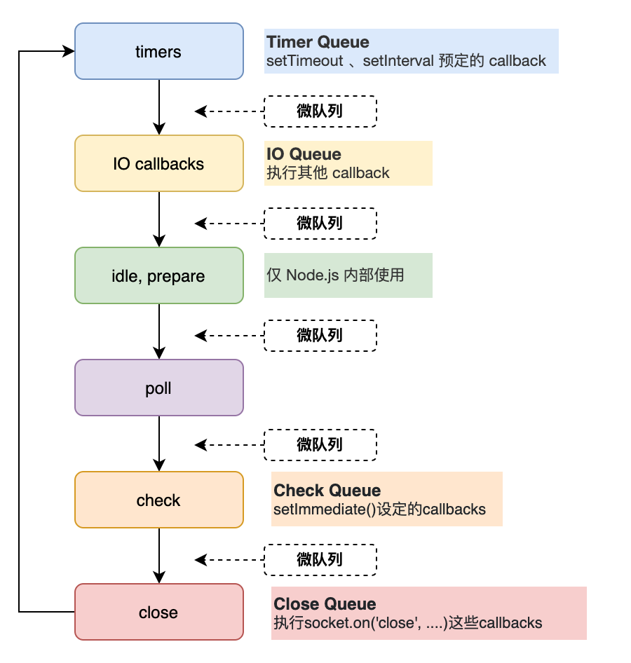
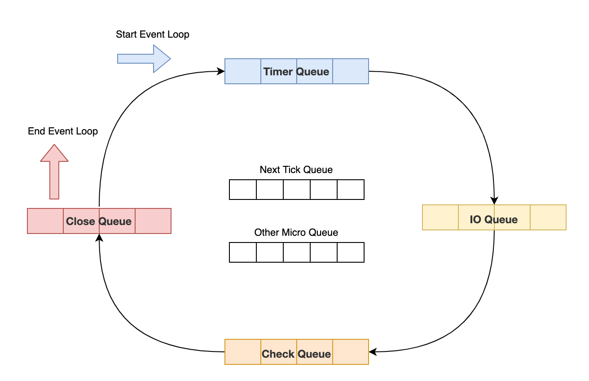
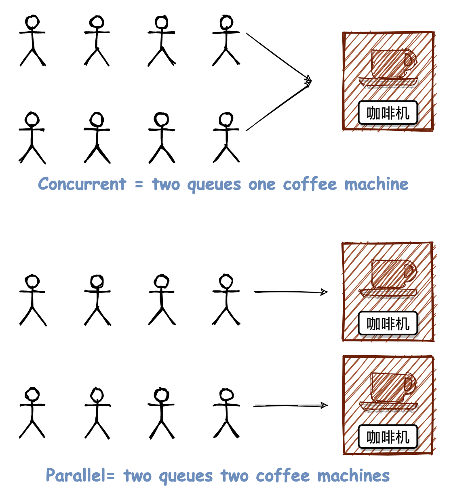

<h1 class="article-title no-number">Node.js</h1>
简单的说 Node.js 就是运行在服务端的 JavaScript。

Node.js 是一个事件驱动 I/O**服务端 JavaScript 环境**，基于 Google 的**Chrome V8 引擎**，V8 引擎执行 JavaScript 的速度非常快，性能非常好。

# Node.js 概念

## 架构

Node.js 由 Libuv、Chrome V8、一些核心 API 构成。其标准架构如下图所示。



上面展示了 Node.js 的架构，下面做简单说明。

- **Node Standard Library**

  Node.js 标准库，对外提供的 JavaScript 接口，例如模块 http、buffer、fs、stream 等

- **Node bindings**

  这里就是 JavaScript 与 C++ 连接的桥梁，对下层模块进行封装，向上层提供基础的 API 接口。

- **V8 Engine**

  Google 开源的高性能 JavaScript 引擎，使用 C++ 开发，并且应用于谷歌浏览器。

- **Libuv**

  是一个跨平台的支持事件驱动的 I/O 库。它是使用 C 和 C++ 语言为 Node.js 所开发的，同时也是 I/O 操作的核心部分，例如读取文件和 OS 交互。

- **C-ares**

  C-ares 是一个异步 DNS 解析库

- **Low-Level Components**

  提供了 http 解析、OpenSSL、数据压缩（zlib）等功能。

## 运行原理

我们先从代码的运行角度来看 Node.js 的架构，代码运行的示例图如下所示。



上图主要分为三块，最底层就是我们的主机环境（macOS、windows、Linux），上面就是我们的 Node.js 运行环境，最顶层就是我们编写的代码。这里，我们重点介绍中间的 Node.js 部分。

- **V8 Engine**

  Chrome V8 引擎。主要提供两个功能：

  1. 虚拟机动能，执行 JS 代码（自己的代码、第三方代码和内置代码等）。
  2. 提供 C++函数接口，为 Node.js 提供 V8 初始化，创建 context，scope 等。

- **Libuv**

  它是基于事件驱动的异步 IO 模型库，我们的 JS 代码发出请求，最终由 Libuv 完成，而我们所设置的回调函数则是在 Libuv 触发。

- **Buildin modules**

  它是由 C++代码写成各类模块，包含了 crypto，zlib, file stream etc 基础功能。（v8 提供了函数接口，libuv 提供异步 IO 模型库，以及一些 nodejs 函数，为 builtin modules 提供服务）。

- **Native modules**

  它是由 JS 写成，提供我们应用程序调用的库，同时这些模块又依赖 builtin modules 来获取相应的服务支持。

> [!note]
>
> 如果把 Nodejs 看做一个黑匣子，起暴露给开发者的接口则是 Native modules 原生模块，当我们发起请求时，请求自上而下，穿越 Native modules，在 V8 引擎上执行。V8 引擎通过调用 Builtin modules 内置模块提供的接口，将请求传送至 Libuv 和其他辅助服务，由 Libuv 执行。执行结束后，则从下回溯至上，最终调用我们的回调函数。
>
> 当我们执行**node xxx.js**的时候，Node.js 会先做一些 V8 初试化，Libuv 启动的工作，然后交由 V8 来执行 Native modules 以及我们的 JS 代码。

## 特点

**Node.js 采用事件驱动和异步 I/O 的方式，实现了一个单线程、高并发的 JavaScript 运行时环境**。

单线程就意味着同一时间只能做一件事，那么 Node.js 如何通过单线程来实现高并发和异步 I/O 呢？首先，我们来看下 Node.js 的主要特点：

- 一个单线程、高并发的 Javascript 运行环境
- 依赖于 Chrome V8 引擎进行代码解释
- **事件驱动**
- **异步 I/O**（也称作“非阻塞 IO”。_注：Linux 的异步 IO 和非阻塞 IO 不是同一类_）
- 轻量、可伸缩，适于实时数据交互应用
- 单进程，单线程（_注：Node.js 的单线程并不准确。为了便于理解，暂时说单线程_）

上述特点中，最主要的两个就是**事件驱动**和**异步 IO**。

### 异步 IO

**异步 IO 是 Node.js 处理高并发请求的策略。**一般来说，高并发的解决方案就是提供多线程模型，服务器为每个客户端请求分配一个线程，使用同步 I/O，系统通过线程切换来弥补同步 I/O 调用的时间开销。比如 Apache 就是这种策略，由于 I/O 一般都是耗时操作，因此这种策略很难实现高性能，但非常简单，可以实现复杂的交互逻辑。

而事实上，大多数网站的服务器端都不会做太多的计算，它们接收到请求以后，把请求交给其它服务来处理（比如读取数据库），然后等着结果返回，最后再把结果发给客户端。因此，Node.js 针对这一事实采用了单线程模型来处理，它不会为每个接入请求分配一个线程，而是用一个主线程处理所有的请求，然后对 I/O 操作进行异步处理，避开了创建、销毁线程以及在线程间切换所需的开销和复杂性。



### 事件驱动

Node.js 在主线程里维护了一个**事件队列，**当接到请求后，就将该请求作为一个事件放入这个队列中，然后继续接收其他请求。当主线程空闲时(没有请求接入时)，就开始循环事件队列，检查队列中是否有要处理的事件，这时要分两种情况：如果是非 I/O 任务，就亲自处理，并通过回调函数返回到上层调用；如果是 I/O 任务，就从 **线程池** 中拿出一个线程来处理这个事件，并指定回调函数，然后继续循环队列中的其他事件。

当线程中的 I/O 任务完成以后，就执行指定的回调函数，并把这个完成的事件放到事件队列的尾部，等待事件循环，当主线程再次循环到该事件时，就直接处理并返回给上层调用。 这个过程就叫 **事件循环** (Event Loop)，其运行原理如下图所示。


这个图是整个 Node.js 的运行原理，从左到右，从上到下，Node.js 被分为了四个层块，分别是 **应用层**、**V8 引擎层**、**Node API 层** 和 **Libuv 层。**

> [!note]
>
> - **应用层**
>
>   即 JavaScript 交互层，常见的就是 Node.js 的模块，比如原生模块 http，fs 等。
>
> - **V8 引擎层**
>
>   即利用 V8 引擎来解析 JavaScript 语法，进而和下层 API 交互。
>
> - **NodeAPI 层**
>
>   内置模块，一般是由 C/C++ 语言来实现，为上层模块提供系统调用，和操作系统进行交互 。
>
> - **Libuv 层**
>
>   是跨平台的底层封装，实现了事件循环、文件操作等，是 Node.js 实现异步的核心 。

无论是 Linux 平台还是 Windows 平台，Node.js 内部都是通过**线程池**来完成异步 I/O 操作的，而 Libuv 针对不同平台的差异性实现了统一调用。

因此，**Node.js 的单线程仅仅是指 JavaScript 运行在单线程中，而并非 Node.js 是单线程。**

我们可以简单的理解为，**Node.js 本身是一个多线程平台，而它对 JavaScript 层面的任务处理是单线程的。**

## 解决的问题

### 并发连接

异步 IO、事件驱动整个过程没有阻塞新用户的连接，也不需要维护已有用户的连接。

基于这样的机制，理论上陆续有用户请求连接，Node.js 都可以进行响应，因此 Node.js 能支持比 Java、PHP 程序更高的并发量。

但是，维护事件队列也需要成本，再由于 Node.js 是单线程，事件队列越长，得到响应的时间就越长，并发量上去还是会力不从心。

### IO 阻塞

IO 密集型处理是 Node.js 的强项，虽然 Java、PHP 也有办法实现并行请求（子线程），但 Node.js 通过回调函数（callback）和异步机制会做得很自然。

## 优缺点

**优点**

- 高并发（最重要的优点）
- 适合 I/O 密集型应用

**缺点**

- 不适合 CPU 密集型应用，如加解密数据、解/压缩文件等。
- 只支持单核 CPU，不能充分利用 CPU（单线程、单进程）。
- 可靠性低，一旦代码某个环节崩溃，整个系统都崩溃（单线程、单进程）。

## 适合的场景

### RESTful API

这是 Node.js 最理想的应用场景，可以处理数万条连接，本身没有太多的逻辑，只需要请求 API，组织数据进行返回即可。

它本质上只是从某个数据库中查找一些值并将它们组成一个响应。由于响应是少量文本，入站请求也是少量的文本，因此流量不高，一台机器甚至也可以处理最繁忙的公司的 API 需求。

### 统一 Web 应用的 UI 层

目前 MVC 的架构，在某种意义上来说，Web 开发有两个 UI 层，一个是在浏览器里面我们最终看到的，另一个在 server 端，负责生成和拼接页面。

不讨论这种架构是好是坏，但是有另外一种实践，面向服务的架构，更好的做前后端的依赖分离。如果所有的关键业务逻辑都封装成 REST 调用，就意味着在上层只需要考虑如何用这些 REST 接口构建具体的应用。那些后端程序员们根本不操心具体数据是如何从一个页面传递到另一个页面的，他们也不用管用户数据更新是通过 Ajax 异步获取的还是通过刷新页面。

### 大量 Ajax 请求的应用

例如个性化应用，每个用户看到的页面都不一样，缓存失效，需要在页面加载的时候发起 Ajax 请求，Node.js 能响应大量的并发请求。

**总而言之，Node.js 适合运用在高并发、I/O 密集、少量业务逻辑的场景。**

# 模块机制

Node.js 模块机制采用了 CommonJS 规范，弥补了当前 JavaScript 开发大型应用没有标准的缺陷，类似于 Java 中的类文件，Python 中的 import 机制，Node.js 中可以通过 `module.exports`、`require` 来导出和引入一个模块

在模块加载机制中，Node.js 采用了延迟加载的策略，只有在用到的情况下，系统模块才会被加载，加载完成后会放到**binding_cache**缓存中。

## 模块分类

### 系统模块

- **内建模块**：Buildin modules，也叫 C/C++模块。一般用于原生模块调用。
- **原生模块**：Native modules，是 Node.js 的核心模块。这些模块定义在 Node.js 源代码的 `lib/` 目录下。在开发中使用的 Node.js 的 http、buffer、fs 等都是 Node.js 的原生模块，其底层也是调用的内建模块 (C/C++)。

### 第三方模块

非 Node.js 自带的模块称为第三方模块，其实还分为路径形式的文件模块（以 `.`、`..`、`/` 开头的）和自定义的模块（比如 express、koa 框架、moment.js 等）

- **JavaScript 模块**：例如 `hello.js`。
- **JSON 模块**：例如 `hello.json`。
- **C/C++ 模块**：编译之后扩展名为 .node 的模块，例如 `hello.node`。

## 模块的引入和导出

Node.js 提供了 exports 和 require 两个对象，其中 exports 是模块公开的接口，require 用于从外部获取一个模块的接口，即所获取模块的 exports 对象。

### require 引入模块

在 Node.js 中，引入一个模块非常简单，如下我们创建一个 **main.js** 文件并引入 hello 模块，代码如下:

```js
var hello = require('./hello');
hello.world();
```

以上实例中，代码 require('./hello') 引入了当前目录下的 hello.js 文件（./ 为当前目录，node.js 默认后缀为 js）。

> [!note]
>
> **并不常见的 module.require()方法**
>
> 对于模块的引用，常见的写法是 require()，但是看过 Node.js 官方文档的同学可能知道，Node.js 的 module 对象有很多属性和方法，比如：
>
> - module.filename：模块完全解析后的文件名
> - module.path：模块的路径
> - module.paths：模块的搜索路径
> - module.require：模块的引用（不常见）
>
> 现在有这样几个文件：
>
> ```
> ├── a
> │   ├── index.js
> │   └── name.js
> └── b
>     ├── index.js
>     └── name.js
> ```
>
> ```js
> // a/name.js
> module.exports = 'AAA';
>
> // a/index.js
> const aname = require('./name'); // 引用的是'a/name.js'
> const bModule = require('../b');
> const bName = bModule.require('./name'); // 引用的是'b/name.js'
> console.log(aname); // 输出：AAA
> console.log(bName); // 输出：BBB
>
> // b/name.js
> module.exports = 'BBB';
>
> // b/index.js
> module.exports = module;
> ```
>
> 然后，我们执行**node a/index.js**，可以看出虽然都是引用的'./name.js'模块，但是引用的是不同的模块，所以输出不同。

### exports 导出模块

程序的导出通过 module.exports 实现，module.exports 可以对外提供函数、变量或者对象。

在每个模块中， `module` 的自由变量是对表示当前模块的对象的引用。 为方便起见，还可以通过全局模块的 `exports` 访问 `module.exports`。 `module` 实际上不是全局的，而是每个模块本地的。

接下来我们就来创建 hello.js 文件，代码如下：

```js
// 直接导出 world 函数
exports.world = function () {
  console.log('Hello World');
};
```

在以上示例中，hello.js 通过 exports 对象把 world 作为模块的访问接口，在 main.js 中通过 require('./hello') 加载这个模块，然后就可以直接访 问 hello.js 中 exports 对象的成员函数了。

有时候我们只是想把一个对象封装到模块中，例如：

```js
//hello.js
function Hello() {
  var name;
  this.setName = function (thyName) {
    name = thyName;
  };
  this.sayHello = function () {
    console.log('Hello ' + name);
  };
}
module.exports = Hello;
```

这样就可以直接获得这个对象了：

```js
//main.js
var Hello = require('./hello');
hello = new Hello();
hello.setName('Lou');
hello.sayHello();
```

模块接口的唯一变化是使用 `module.exports = Hello` 代替了 `exports.world = function(){}`。

在外部引用该模块时，其接口对象就是要输出的 Hello 对象本身，而不是原先的 exports。即当一个模块既有 exports，又有 module.exports 时，模块的导出是 module.exports，而 exports 会被忽略。

> [!note]
>
> **exports 和 module.exports 的区别？**
>
> 
>
> exports 相当于 module.exports 的快捷方式，原理如下所示。
>
> ```js
> // Node.js 内核原理
> var module = {
>   exports: {}, // module对象中有一个exports引用类型
> };
> exports = module.exports; // 将 module.exports 指向 exports
> ```
>
> 我们可以对 exports 中的属性进行赋值，比如这样是正常的写法：
>
> ```js
> // ✅ 正确的写法
> exports.name = 'A';
> exports.add = function () {
>   console.log('hi');
> };
> ```
>
> 但是，我们不能对 exports 重新赋值，这样仍然不会改变 module.exports 的内容。
>
> ```js
> // ❌ 错误的写法
> // exports被重新赋值，就不再和 module.exports 一样了
> exports = {
>   name: 'A',
>   add: function () {
>     console.log('hi');
>   },
> };
> ```
>
> 所以，为了保险起见，我们一般建议使用 module.exports 的写法：
>
> ```js
> // ✅ 非常非常非常正确的写法！！！
> module.exports = {
>   name: 'A',
>   add: function () {
>     console.log('hi');
>   },
> };
> ```

## 模块加载

也许你已经注意到，我们已经在代码中使用了模块了。像这样：

```js
var httpObj = require("http");
// some code
httpObj.createServer(...);
```

Node.js 中自带了一个叫做 http 的模块，我们在我们的代码中请求它并把返回值赋给一个本地变量。

这把我们的本地变量变成了一个拥有所有 http 模块所提供的公共方法的对象。

Node.js 的 require 方法中的文件查找策略如下：

由于 Node.js 中存在各种类型的模块（内置模块、JS 模块、JSON 模块、C/C++模块等），尽管 require 方法极其简单，但是内部的加载却是十分复杂的，其加载优先级也各自不同。如下图所示：



在 Node.js 中模块加载一般会经历 3 个步骤，**路径分析、文件定位、编译执行**。

当然，加载的优先级不同。

1. **系统缓存加载**：模块被执行之后会会进行缓存，首先是先进行缓存加载，判断缓存中是否有值。
2. **原生模块加载**：也就是系统模块，这个优先级仅次于缓存加载，部分核心模块已经被编译成二进制，省略了路径分析和文件定位，直接加载到了内存中，系统模块定义在 Node.js 源码的 lib 目录下，可以去查看。
3. **文件模块加载**：优先加载`.`、`..`、`/`等开头的相对路径，如果文件没有加拓展名，会依次按照`.js`、`.json`、`.node`依次补足尝试，那么**在尝试的过程中也是以同步阻塞模式来判断文件是否存在**，从性能优化的角度来看待，`.json`、`.node`最好还是加上文件的扩展名。
4. **目录作为模块加载**：这种情况发生在文件模块加载过程中，也没有找到，但是发现是一个目录的情况，这个时候会将这个目录当作一个**包**来处理，Node 这块采用了 CommonJS 规范，先会在项目根目录查找 `package.json` 文件，取出文件中定义的 main 属性 `("main": "lib/hello.js")` 描述的入口文件进行加载，也没加载到，则会抛出默认错误` Error: Cannot find module 'lib/hello.js'`。
5. **node_modules 目录加载**：对于系统模块、路径文件模块都找不到，Node.JS 会从当前模块的父目录进行查找，直到系统的根目录。

## 模块缓存

**模块在第一次加载后会被缓存，多次 require 调用模块不会导致模块的代码被执行多次。，这是一个重要的特性。** 借助它, 可以返回“部分完成”的对象，从而允许加载依赖的依赖, 即使它们会导致循环依赖。

模块加载后会被缓存起来，那么缓存在哪里呢？

Node.js 提供了 `require.cache` API 查看已缓存的模块，返回值为对象，为了验证，这里做一个简单的测试。

新建一个`test-modules.js`文件，作为模块文件，文件内容如下：

```js
module.exports = {
  a: 1,
  test: () => {},
};
```

新建一个执行文件`test.js`，文件内容如下：

```js
require('./test-module.js');
console.log(require.cache);
```

执行命令`node test.js`，控制台输出信息如下：

```sh
➜  code git:(master) ✗ node test.js
[Object: null prototype] {
  '/Users/pg/Documents/Gitee/nodejs-blue-book/Chapter2/code/test.js':
   Module {
     id: '.',
     exports: {},
     parent: null,
     filename:
      '/Users/pg/Documents/Gitee/nodejs-blue-book/Chapter2/code/test.js',
     loaded: false,
     children: [ [Module] ],
     paths:
      [ '/Users/pg/Documents/Gitee/nodejs-blue-book/Chapter2/code/node_modules',
        '/Users/pg/Documents/Gitee/nodejs-blue-book/Chapter2/node_modules',
        '/Users/pg/Documents/Gitee/nodejs-blue-book/node_modules',
        '/Users/pg/Documents/Gitee/node_modules',
        '/Users/pg/Documents/node_modules',
        '/Users/pg/node_modules',
        '/Users/node_modules',
        '/node_modules' ] },
  '/Users/pg/Documents/Gitee/nodejs-blue-book/Chapter2/code/test-module.js':
   Module {
     id:
      '/Users/pg/Documents/Gitee/nodejs-blue-book/Chapter2/code/test-module.js',
     exports: { a: 1, test: [Function: test] },
     parent:
      Module {
        id: '.',
        exports: {},
        parent: null,
        filename:
         '/Users/pg/Documents/Gitee/nodejs-blue-book/Chapter2/code/test.js',
        loaded: false,
        children: [Array],
        paths: [Array] },
     filename:
      '/Users/pg/Documents/Gitee/nodejs-blue-book/Chapter2/code/test-module.js',
     loaded: true,
     children: [],
     paths:
      [ '/Users/pg/Documents/Gitee/nodejs-blue-book/Chapter2/code/node_modules',
        '/Users/pg/Documents/Gitee/nodejs-blue-book/Chapter2/node_modules',
        '/Users/pg/Documents/Gitee/nodejs-blue-book/node_modules',
        '/Users/pg/Documents/Gitee/node_modules',
        '/Users/pg/Documents/node_modules',
        '/Users/pg/node_modules',
        '/Users/node_modules',
        '/node_modules' ] } }
```

从上面的输出我们可以看到，模块的文件名、地址和导出数据都输出了。

> [!note]
>
> 被引入的模块将被缓存在这个对象中。 从此对象中删除键值对将会导致下一次**require**重新加载被删除的模块。 这不适用于原生模块，因为它们的重载将会导致错误。可以添加或替换入口， 在加载原生模块之前会检查此缓存，如果将与原生模块匹配的名称添加到缓存中，则引入调用将不再获取原生模块。 谨慎使用！

## 模块循环引用

首先，我们通过代码演示一下 require 的运行逻辑。

```js
function require(/* ... */) {
  const module = { exports: {} }; // 模块的导出是默认的{}
  ((module, exports) => {
    // 模块代码在这。在这个例子中，定义了一个函数。
    function someFunc() {}
    exports = someFunc; // 此时，exports 不再是一个 module.exports 的快捷方式
    /*** 截止到上面，该模块导出仍然是默认对象{} ***/
    module.exports = someFunc; // 此时，该模块导出才是 someFunc，而不是默认对象。
  })(module, module.exports);
  return module.exports;
}
```

现在，我们思考这样一种场景。假设现在有 a.js、b.js 两个文件，两个文件模块相互引用，如下所示：

```js
// a.js
console.log('a模块start');
exports.test = 1;
undeclaredVariable = 'a模块未声明变量';
const b = require('./b');
console.log('a模块加载完毕: b.test值：', b.test);
```

```js
// b.js
console.log('b模块start');
exports.test = 2;
const a = require('./a');
console.log('undeclaredVariable: ', undeclaredVariable);
console.log('b模块加载完毕: a.test值：', a.test);
```

如果执行`node a.js`，结果会怎样？思考两个问题：

1. a 和 b 相互引用，是否会陷入死循环？
2. b 中`undeclaredVariable`能否获取到值？

经过实验，我们执行的结果如下：

```sh
a模块start
b模块start
undeclaredVariable:  a模块未声明变量
b模块加载完毕: a.test值： 1
a模块加载完毕: b.test值： 2
```

启动 `a.js` 的时候，会加载 `b.js`，那么在 `b.js` 中又加载了 `a.js`，但是此时 `a.js` 模块还没有执行完，返回的是一个 `a.js` 模块的 `exports` 对象**未完成的副本**给到 `b.js` 模块（因此是不会陷入死循环的）。然后 `b.js` 完成加载之后将 `exports` 对象提供给了 `a.js` 模块。

又因为 `undeclaredVariable` 是一个未声明的变量，也就是一个挂在全局的变量，那么在其他地方当然是可以拿到的。

在执行代码之前，Node.js 会使用一个代码封装器进行封装，例如下面所示：

```js
(function (exports, require, module, __filename, __dirname) {
  // 模块的代码
});
```

# 事件

Node.js 两大特性分别是**事件驱动**和**异步 IO**，我们先来看看 Node.js 的事件。

## Event Loop

**事件驱动**和**异步 IO**的核心都是通过 Event Loop 来实现的，上一篇我们简单介绍了 Event Loop 的运行原理，本篇我们将具体来介绍一下 Event Loop 的相关知识。

**Event Loop 是一个执行模型，在不同的地方有不同的实现。浏览器和 Node.js 基于不同的技术实现了各自的 Event Loop。**

> [!note]
>
> - 浏览器的 Event Loop 是在[HTML5 的规范](https://www.w3.org/TR/html5/webappapis.html#event-loops)中明确定义。
>
> - Node.js 的 Event Loop 是基于 Libuv 实现的（上一篇介绍过）。
>
> - Libuv 已经对 Event Loop 做出了实现，而 HTML5 规范中只是定义了浏览器中 Event Loop 的模型，具体的实现留给了浏览器厂商。

### 宏队列和微队列

| 名称       | 定义                                                        | 异步任务                                                                                                                                               |
| ---------- | ----------------------------------------------------------- | ------------------------------------------------------------------------------------------------------------------------------------------------------ |
| **宏队列** | **macrotask**，也叫 tasks。异步任务的回调会依次进入宏队列。 | **setTimeout**<br />**setInterval**<br />**setImmediate** (Node 独有) <br />requestAnimationFrame (浏览器独有)<br />UI rendering (浏览器独有)<br />I/O |
| **微队列** | **microtask**，也叫 jobs。异步任务的回调会依次进入微队列。  | **process.nextTick** (Node 独有) <br />**Promise** <br />Object.observe <br />MutationObserver                                                         |

### 浏览器事件循环

#### 执行过程

我们先来看一张图（一定要仔细看，对后续学习有帮助）。



这张图将浏览器的 Event Loop 完整的描述了出来，我来讲执行一个 JavaScript 代码的具体流程。

1. **初始状态**，执行栈和微队列都是空，宏队列只有一个全局 Script 代码准备执行。

2. **执行全局 Script 同步代码。**这些同步代码有一些是同步语句，有一些是异步语句（比如 setTimeout 等）；

3. 全局 Script 代码执行完毕后，调用栈 Stack 会清空。

4. **执行微队列。**从微队列中取出位于队首的回调任务，放入执行栈 Stack 中执行，执行完后微队列的长度减 1。

5. 继续取出微队列位于队首的任务，放入调用栈 Stack 中执行，以此类推，直到直到把微队列中的所有任务都执行完毕。

   **注意，如果在执行微队列的过程中，又产生了微队列，那么会加入到队列的末尾，也会在这个周期被调用执行。**

6. 微队列中的所有任务都执行完毕，此时微队列为空队列，执行栈 Stack 也为空。

7. **执行宏队列。**取出宏队列 macrotask queue 中位于队首的任务，放入 Stack 中执行。

8. 所有宏队列都执行完毕后，执行栈 Stack 为空。

9. 浏览器执行渲染操作，更新界面（_如果有就执行，浏览器自行判断_）。

10. 检查是否存在 Web worker 任务，如果有，则对其进行处理 。

11. 上述过程循环往复，直到两个队列都清空。

> [!note]
>
> - 宏队列是一个一个的执行。
> - 微队列是一队一队的执行。
> - 宏队列执行完，就执行微队列中的任务。
> - 执行微队列过程中，只要微队列中有 jobs（无论是执行前插入的还是执行过程中插入的），就会一直按顺序执行。
> - 第 9 步浏览器渲染没有在图中画出来，因为这个是由浏览器自行判断决定的。渲染操作在微队列结束后，宏队列开始前执行。如果你需要在异步的操作后重新渲染 DOM 最好的方法是将它包装成 micro 任务，这样 DOM 渲染将会在本次 Tick 内就完成。
>
> 

#### 练习

我们来看一看，下面的代码输出的是什么？

```js
// console1
console.log(1);
// setTimeout1
setTimeout(() => {
  // callback1
  // console3
  console.log(2);
  // Promise2
  Promise.resolve().then(() => {
    // callback4
    console.log(3);
  });
});
// Promise1
new Promise((resolve, reject) => {
  console.log(4);
  resolve(5);
}).then((data) => {
  // callbace2
  console.log(data);
});
// setTimeout2
setTimeout(() => {
  // callback3
  console.log(6);
});
// console2
console.log(7);
```

我们来分析一下程序执行的流程。

| 步骤                                                                           | 执行栈        | 微队列      | 宏队列                                        | 输出                                        |
| ------------------------------------------------------------------------------ | ------------- | ----------- | --------------------------------------------- | ------------------------------------------- |
| 执行全局 JS 代码                                                               |               |             | `全局代码`                                    |                                             |
| 执行宏队列第一行`console1`。<br />`console1`是同步任务，直接执行。             | `console1`    |             | `全局代码`                                    | 1                                           |
| 执行`setTimeout1`，其回调任务`callback1`放到宏队列。                           | `setTimeout1` |             | `全局代码`<br />`callback1`                   | 1                                           |
| 执行`Promise1`，其回调任务`callbace2`放到微队列。                              | `Promise1`    | `callback2` | `全局代码`<br />`callback1`                   | 1<br />4                                    |
| 执行`setTimeout2`，其回调任务`callback3`放到宏队列。                           | `setTimeout2` | `callback2` | `全局代码`<br />`callback1` `cakkback3`       | 1<br />4                                    |
| 执行最后一行`console2`。`console2`是同步任务，直接执行。                       | `console2`    | `callback2` | `全局代码`<br />`callback1` <br />`cakkback3` | 1<br />4<br />7                             |
| 全局 Script 代码都执行完毕                                                     |               | `callback2` | `callback1` <br />`cakkback3`                 | 1<br />4<br />7                             |
| 先执行微队列的`callback2`                                                      | `callback2`   |             | `callback1` <br />`cakkback3`                 | 1<br />4<br />7<br />5                      |
| 微队列执行完，再执行宏队列的`callback1` <br />                                 | `callback1`   | `callback4` | `cakkback3`                                   | 1<br />4<br />7<br />5                      |
| 执行`callback1`中的`console3`                                                  | `console3`    |             | `cakkback3`                                   | 1<br />4<br />7<br />5<br />2               |
| 执行`callback1`中的`Promise2`<br />将`Promise2`的回调任务`callback4`放入微队列 | `Promise2`    | `callback4` | `cakkback3`                                   | 1<br />4<br />7<br />5<br />2               |
| 执行微队列`callback4`                                                          | `callback4`   |             | `cakkback3`                                   | 1<br />4<br />7<br />5<br />2<br />3        |
| 执行宏队列`callback3`                                                          | `callback3`   |             |                                               | 1<br />4<br />7<br />5<br />2<br />3<br />6 |
| 执行栈和队列都空，程序执行完毕。                                               |               |             |                                               | 1<br />4<br />7<br />5<br />2<br />3<br />6 |

> [!note]
>
> **在执行微队列 microtask queue 中任务的时候，如果又产生了 microtask，那么会继续添加到队列的末尾，也会在这个周期执行，直到 microtask queue 为空停止。**
>
> 当然如果你在 microtask 中不断的产生 microtask，那么其他宏任务 macrotask 就无法执行了，但是这个操作也不是无限的，拿 Node.js 中的微任务 process.nextTick()来说，它的上限是 1000 个，后面我们会讲到。

### Node.js 事件循环

#### 执行过程

上一篇我们讲解了 Node.js 的运行原理，讲解了这张图，其中最重要的就是右边的 Libuv 运行图。


Node.js 的 Event Loop 中，执行宏队列的回调任务有**6 个阶段**，如下图所示。



各个阶段执行的任务如下：

- **timers 阶段**：这个阶段执行 setTimeout 和 setInterval 预定的 callback
- **I/O callback 阶段**：执行除了 close 事件的 callbacks、被 timers 设定的 callbacks、setImmediate()设定的 callbacks 这些之外的 callbacks
- **idle,prepare 阶段**：仅 node 内部使用
- **poll 阶段**：获取新的 I/O 事件，适当的条件下 node 将阻塞在这里
- **check 阶段**：执行 setImmediate()设定的 callbacks
- **close 阶段**：执行 socket.on('close', ....)这些 callbacks

上面我们知道，Node.js 中进入宏队列的回调任务有：**setTimeout、setInterval 和 setImmediate**，微队列的回调任务有：**Promise 和 process.nectTick()**。

**Node.js 中宏队列细分主要有 4 个：**

- Timers Queue
- IO Callbacks Queue
- Check Queue
- Close Callbacks Queue

**Node.js 中微队列细分主要有 2 个：**

- Next Tick Queue：是放置 process.nextTick(callback)的回调任务的。

- Other Micro Queue：放置其他 microtask，比如 Promise 等。

在浏览器中，也可以认为只有一个微队列，所有的微队列的回调任务都会被加到这一个微队列中，但是在 Node.js 中，不同的 microtask 会被放置在不同的微队列中。

具体可以通过下图加深一下理解：



> [!note]
>
> 大体解释一下 NodeJS 的 Event Loop 过程：
>
> 1.  执行全局 Script 的同步代码
> 2.  执行 microtask 微任务，先执行所有 Next Tick Queue 中的所有任务，再执行 Other Microtask Queue 中的所有任务
> 3.  开始执行 macrotask 宏任务，共 6 个阶段，从第 1 个阶段开始执行相应每一个阶段 macrotask 中的所有任务，注意，这里是所有每个阶段宏任务队列的所有任务，在浏览器的 Event Loop 中是只取宏队列的第一个任务出来执行，每一个阶段的 macrotask 任务执行完毕后，开始执行微任务，也就是步骤 2
> 4.  Timers Queue -> 步骤 2 -> I/O Queue -> 步骤 2 -> Check Queue -> 步骤 2 -> Close Callback Queue -> 步骤 2 -> Timers Queue ......
> 5.  这就是 Node.js 的 Event Loop

#### 练习 1

我们来看一看，下面的代码输出的是什么？

```js
console.log('start');

setTimeout(() => {
  // callback1
  console.log(111);
  setTimeout(() => {
    // callback2
    console.log(222);
  }, 0);
  setImmediate(() => {
    // callback3
    console.log(333);
  });
  process.nextTick(() => {
    // callback4
    console.log(444);
  });
}, 0);

setImmediate(() => {
  // callback5
  console.log(555);
  process.nextTick(() => {
    // callback6
    console.log(666);
  });
});

setTimeout(() => {
  // callback7
  console.log(777);
  process.nextTick(() => {
    // callback8
    console.log(888);
  });
}, 0);

process.nextTick(() => {
  // callback9
  console.log(999);
});

console.log('end');
```

请运用前面学到的知识，我们可以知道，最终输出的结果如下。

```js
// 正确答案
start;
end;
999;
111; // timers 阶段执行输出
777; // timers 阶段执行输出
444; // timers 阶段执行完，执行微队列输出
888;
555;
333;
666;
222;
```

#### 练习 2

这次，我们加入 Promise 微队列，增加难度。试一试吧。

```js
console.log('1');

setTimeout(function () {
  console.log('2');
  process.nextTick(function () {
    console.log('3');
  });
  new Promise(function (resolve) {
    console.log('4');
    resolve();
  }).then(function () {
    console.log('5');
  });
});

new Promise(function (resolve) {
  console.log('7');
  resolve();
}).then(function () {
  console.log('8');
});
process.nextTick(function () {
  console.log('6');
});

setTimeout(function () {
  console.log('9');
  process.nextTick(function () {
    console.log('10');
  });
  new Promise(function (resolve) {
    console.log('11');
    resolve();
  }).then(function () {
    console.log('12');
  });
});
```

输出结果如下。

```js
1;
7;
6;
8;
2;
4;
9;
11;
3;
10;
5;
12;
```

> [!note]
>
> #### setTimeout & setImmediate & process.nextTick
>
> - **setTimeout(fn, 0)**在 Timers 阶段执行，并且是在 poll 阶段进行判断是否达到指定的 timer 时间才会执行，回调代码插入到**宏队列 Timer Queue**中。**精确度不高，可能有延迟执行的情况发生，且因为动用了红黑树，所以消耗资源大。**
> - **setImmediate(fn, 0)**在 Check 阶段执行，回调代码插入到**宏队列 Check Queue**中。**消耗的资源小，也不会造成阻塞，但效率也是最低的。**
> - **process.nextTick(fn)**在微队列中执行，回调代码插入到**微队列 Next Tick Queue** 中。process.nextTick(fn)调用深度有限制，上限是 1000，而 setImmedaite 则没有。**效率最高，消费资源小，但会阻塞 CPU 的后续调用。**
>
> ```js
> setTimeout(function () {
>   console.log('setTimeout');
> }, 延长时间); // 延长时间在[1, 2^31-1]之间，超出区间则默认设置1
>
> setImmediate(function () {
>   console.log('setImmediate');
> }, 延长时间); // 延长时间在[1, 2^31-1]之间，超出区间则默认设置1
>
> process.nextTick(function () {
>   console.log('nextTick');
> });
> ```
>
> #### setTimeout & setInterval
>
> - **setTimeout(fn, 0)**，延迟一定之间去执行，只执行一次。
> - **setInterval(fn, 0)**，每隔一定时间就执行，无限次重复执行。
>
> setTimeout 和 setInterval 函数，都返回一个表示计数器编号的整数值，将该整数传入 clearTimeout 和 clearInterval 函数，就可以取消对应的定时器。
>
> ```js
> let id1 = setTimeout(function () {
>   console.log('setTimeout');
> }, 1000);
> let id2 = setInterval(function () {
>   console.log('setInterval');
> }, 1000);
>
> setTimeout(() => {
>   clearTimeout(id1);
>   clearInterval(id2);
> }, 5000);
> ```

### 总结

1. 浏览器的 Event Loop 和 Node.js 的 Event Loop 是不同的，实现机制也不一样，不要混为一谈。

2. 浏览器可以理解成只有 1 个宏任务队列和 1 个微任务队列，先执行全局 Script 代码，执行完同步代码调用栈清空后，从微任务队列中依次取出所有的任务放入调用栈执行，微任务队列清空后，从宏任务队列中只取位于队首的任务放入调用栈执行，注意这里和 Node.js 的区别，只取一个，然后继续执行微队列中的所有任务，再去宏队列取一个，以此构成事件循环。

3. Node.js 可以理解成有 4 个宏任务队列和 2 个微任务队列，但是执行宏任务时有 6 个阶段。先执行全局 Script 代码，执行完同步代码调用栈清空后，先从微任务队列 Next Tick Queue 中依次取出所有的任务放入调用栈中执行，再从微任务队列 Other Microtask Queue 中依次取出所有的任务放入调用栈中执行。

   **每个 Macrotask 执行完后，就去执行 Microtask 了，和浏览器的模型一致。**

4. MacroTask 包括： setTimeout、setInterval、 setImmediate(Node)、requestAnimation(浏览器)、IO、UI rendering

5. Microtask 包括： process.nextTick(Node)、Promise、Object.observe、MutationObserver

## Promise

如何处理 Callback Hell？有很多种方式，但是从来流程程度来看，Promise 还是独领风骚，并且是在 ES6 的 JavaScript 标准上赢得了支持。


关于 Promsie 的基础，这里不再赘述，可以去看前面的 JS 部分。

另外关于同步与异步，有个问题希望大家看一下，这是很简单的 Promise 的使用例子：

```js
let doSth = new Promise((resolve, reject) => {
  console.log('hello');
  resolve();
});

doSth.then(() => {
  console.log('over');
});
```

毫无疑问的可以得到以下输出结果。

```js
hello; // 立刻输出
over; // 立刻输出
```

但是首先的问题是，该 Promise 封装的代码肯定是同步的，那么这个 then 的执行是异步的吗？其次的问题是, 如下代码：

```js
let doSth = new Promise((resolve, reject) => {
  console.log('hello');
  resolve();
});

setTimeout(() => {
  doSth.then(() => {
    console.log('over');
  });
}, 3000);
```

`setTimeout` 到 10s 之后再 `.then` 调用, 那么 `hello` 是会在 10s 之后在打印吗，还是一开始就打印？

经过实验，我们看到输出结果如下。

```js
hello; // 立刻输出
over; // 3秒后输出
```

接下来，我们看这个代码：

```js
setTimeout(function () {
  console.log(1);
}, 0);
new Promise(function executor(resolve) {
  console.log(2);
  for (var i = 0; i < 10000; i++) {
    i == 9999 && resolve();
  }
  console.log(3);
}).then(function () {
  console.log(4);
});
console.log(5);
```

最终输出结果是：

```js
2;
3;
5;
4;
1;
```

说了这么多，其实想告诉大家，Promise 并没有将异步转为同步，只不过是异步回调的**语法糖形式**而已。

Promise 的 resolve 后，状态会改变。然后，会将 then 的回调任务插入到微队列中等待执行。

> [!note]
>
> Pormise 的 resolve 或 reject 后，状态改变后，并非立即同步执行 then 或 catch 中的回调方法，而是将回调方法插入到微队列中，等待异步方式调用执行。

## Events

Node.js 所有的异步 I/O 操作在完成时都会发送一个事件到事件队列。

Node.js 里面的许多对象都会分发事件：一个 net.Server 对象会在每次有新连接时触发一个事件， 一个 fs.readStream 对象会在文件被打开的时候触发一个事件。 **所有这些产生事件的对象都是 events.EventEmitter 的实例。**

**Events** 是 Node.js 中一个非常重要的原生模块，在 Node.js 中有许多重要的原生 API 都是依赖其建立的。比如 **Stream 是基于 Events 实现的**，而 **fs、 net、 http 等模块都依赖 Stream**，所以 Events 模块的重要性可见一斑。

### EventEmitter 类

events 模块只提供了一个对象： events.EventEmitter。

**EventEmitter 的核心就是事件触发与事件监听器功能的封装。**

可以通过`require("events");`来访问该模块。

```js
// 引入 events 模块
var events = require('events');
// 创建 eventEmitter 对象
var eventEmitter = new events.EventEmitter();
```

EventEmitter 对象如果在实例化时发生错误，会触发 error 事件。当添加新的监听器时，newListener 事件会触发，当监听器被移除时，removeListener 事件被触发。

下面我们用一个简单的例子说明 EventEmitter 的用法：

```js
//event.js 文件
const EventEmitter = require('events').EventEmitter;
const event = new EventEmitter();
event.on('execute', function () {
  console.log('事件触发');
});
setTimeout(function () {
  event.emit('execute');
}, 1000);
```

运行这段代码，1 秒后控制台输出了 **事件触发**。

其原理是 event 对象注册了事件 execute 的一个监听器，然后我们通过 setTimeout 在 1000 毫秒以后向 event 对象发送事件 execute，此时会调用 execute 的监听器。

EventEmitter 的每个事件由一个事件名和若干个参数组成，事件名是一个字符串，通常表达一定的语义。对于每个事件，EventEmitter 支持若干个事件监听器。

**当事件触发时，注册到这个事件的事件监听器被依次调用，事件参数作为回调函数参数传递。**

比如，下面的时间，有两个监听器，名字都是 someEvent，当开始执行 someEvent 时，会依次执行。

```js
let { EventEmitter } = require('events');
let emitter = new EventEmitter();
emitter.on('someEvent', function (arg1, arg2) {
  console.log('listener1', arg1, arg2);
});
emitter.on('someEvent', function (arg1, arg2) {
  console.log('listener2', arg1, arg2);
});
emitter.emit('someEvent', 'arg1 参数', 'arg2 参数');
```

执行以上代码，运行的结果如下：

```js
listener1 arg1参数 arg2参数	// 监听器1的输出
listener2 arg1参数 arg2参数	// 监听器2的输出
```

以上例子中，emitter 为事件 someEvent 注册了两个事件监听器，然后触发了 someEvent 事件。

运行结果中可以看到两个事件监听器回调函数被先后调用。 这就是 EventEmitter 最简单的用法。

EventEmitter 提供了多个属性，如 **on** 和 **emit**。**on** 函数用于绑定事件函数，**emit** 属性用于触发一个事件。

**Node.js 中 Eventemitter 的 emit 是同步的。**Node.js 的官网说明是：The EventListener calls all listeners synchronously in the order in which they were registered. This is important to ensure the proper sequencing of events and to avoid race conditions or logic errors.

### 继承 EventEmitter

大多数时候我们不会直接使用 EventEmitter，而是在对象中继承它。包括 fs、net、 http 在内的，只要是支持事件响应的核心模块都是 EventEmitter 的子类。

为什么要这样做呢？原因有两点：

- 具有某个实体功能的对象实现事件符合语义， 事件的监听和发生应该是一个对象的方法。

- JS 的对象机制是基于原型的，支持 部分多重继承，继承 EventEmitter 不会打乱对象原有的继承关系。

### 内部调用

如果一个 EventEmitter 对象，其事件执行中又调用本身事件，是否会陷入死循环呢？

可对比下面两段代码。

- 代码 1

  ```js
  const EventEmitter = require('events');
  let emitter = new EventEmitter();
  emitter.on('myEvent', function sth() {
    emitter.on('myEvent', sth);
    console.log('hi');
  });
  emitter.emit('myEvent');

  // 最终输出
  // hi（只输出 1 次）
  ```

- 代码 2

  ```js
  const EventEmitter = require('events');
  let emitter = new EventEmitter();
  emitter.on('myEvent', () => {
    console.log('hi');
    emitter.emit('myEvent');
  });
  emitter.emit('myEvent');

  // 最终输出
  // hi（输出 N 次）
  // RangeError: Maximum call stack size exceeded
  ```

on 添加绑定事件的时候，会根据是否有过绑定，如果有过绑定，就会将其改成一个 Array\<Function\>

emit 的时候，会先用 arrayClone 拿到 Array\<Function\> 的拷贝，遍历调用，如果在 on 里面写多个监听，此时是监听不到的，因为没有被注册进去。

> [!note]
>
> 使用 emitter 处理问题可以处理比较复杂的状态场景，比如 TCP 的复杂状态机，做多项异步操作的时候每一步都可能报错，这个时候。emit 错误并且执行某些。once 的操作可以将你从泥沼中拯救出来。
>
> 另外可以注意一下的是，有些同学喜欢用 emitter 来监控某些类的状态，但是在这些类释放的时候可能会忘记释放 emitter，而这些类的内部可能持有该 emitter 的 listener 的引用从而导致内存泄漏。

### Timers 定时器

#### setTimeout(fn, 0)

**setTimeout(fn, 0)**在 Timers 阶段执行，并且是在 poll 阶段进行判断是否达到指定的 timer 时间才会执行，回调代码插入到**宏队列 Timer Queue**中。**精确度不高，可能有延迟执行的情况发生，且因为动用了红黑树，所以消耗资源大。**

#### setImmediate(fn, 0)

**setImmediate(fn, 0)**在 Check 阶段执行，回调代码插入到**宏队列 Check Queue**中。**消耗的资源小，也不会造成阻塞，但效率也是最低的。**

#### process.nextTick(fn)

**process.nextTick(fn)**在微队列中执行，回调代码插入到**微队列 Next Tick Queue** 中。process.nextTick(fn)调用深度有限制，上限是 1000，而 setImmedaite 则没有。**效率最高，消费资源小，但会阻塞 CPU 的后续调用。**

## 并行&并发

并行 (Parallel) 与并发 (Concurrent) 是两个很常见的概念。

关于并行和并发，可以看这张漫画图（Erlang 之父 Joe Armstrong 提出的**咖啡机模型**）。



**并发 (Concurrent) = 2 队列对应 1 咖啡机。**

**并行 (Parallel) = 2 队列对应 2 咖啡机。**

> [!note]
>
> Node.js 通过事件循环来挨个抽取事件队列中的一个个 Task 执行，从而避免了传统的多线程情况下（2 个队列对应 1 个咖啡机的时候）上下文切换以及资源争抢/同步的问题，所以获得了高并发的成就。
>
> 至于在 Node.js 中并行，你可以通过 **cluster** 来再添加一个咖啡机。

# 热更新

对于开发者来说，我们在开发过程中都希望文件修改后，能够自动更新，而不必每次都重启服务，这就是所谓的“热更新”（或者叫“热加载”）。

对于启动的 Node.js 服务来说，其模块已经加载到缓存中了，当我们在磁盘上改动了文件模块后，该启动服务是无法更新的，这时候我们就需要监听某些文件，当文件被修改后，则自动将该文件对应的模块从 module cache 上清除，这样，当执行 require 时，在缓存中找不到对应的模块，就会重新从新代码中重新编译加载并缓存。

## 模拟实验

下面，我们就根据原理来模拟实现以下热更新操作。我们新建一个模拟热更新的文件`hot-patch.js`，其内容如下：

```js
const fs = require('fs'); //文件系统模块

function cleanCache(modulePath) {
  const module = require.cache[modulePath];
  if (!module) {
    return;
  }
  // 该模块是否有主模块
  // module.parent 在 Node.js v14 版本后被弃用
  if (module.parent) {
    module.parent.children.splice(module.parent.children.indexOf(module), 1);
  }
  require.cache[modulePath] = null;
}

const watchFile = function (filepath) {
  // require.resolve() 返回该模块完整的文件名
  const fullpath = require.resolve(filepath);
  // fs.watch() 监听文件事件
  fs.watch(fullpath, function (event, filename) {
    if (event === 'change') {
      try {
        cleanCache(fullpath);
      } catch (ex) {
        console.error('模块加载失败');
      }
    }
  });
};
// 热更新
function startHotPatch() {
  const watchFiles = ['./test.js'];
  for (let i = 0; i < watchFiles.length; i++) {
    watchFile(watchFiles[i]);
  }
}

setInterval(function () {
  startHotPatch();
  // 加载test文件，test.js 文件返回字符串
  var test = require('./test.js');
  console.log('test', test);
}, 3000);
```

对于`test.js`，其文件内容如下：

```js
module.exports = '123';
```

然后，我们执行**node hot-patch.js**启动程序，然后当我们改变`test.js`的文本内容时，我们可以发现，输出也会随之改变。

上面就是热更新的模拟示例。

## nodemon 库

对于 Node.js 开发来说，常见的热更新方式是借助`nodemon`库实现，它能够监听文件的修改，并在文件修改后做出响应。

#### 常用命令

```shell
# 启动程序
nodemon [your node app]
# 如果程序启动可传入host和port，也可以通过这种方式启动
nodemon ./server.js localhost 8080
```

#### nodemon.json 配置文件

nodemon 支持 local 和 global 配置文件，配置文件名称为`nodemon.json`，可以通过`--config <file>`来指定配置文件。启动命令中携带的参数都可以在配置文件中配置，比如：

```json
{
  "verbose": true,
  "ignore": ["*.test.js", "fixtures/*"], // 忽略监听的文件
  "ext": "js,json", // 监听文件的拓展名
  "env": {
    "NODE_ENV": "development"
  },
  "execMap": {
    "rb": "ruby", // 支持 ruby 文件的处理
    "pde": "processing --sketch={{pwd}} --run" // 支持 pde 文件的处理
  }
}
```

更多详细功能，可前往[nodemon 官网](https://nodemon.io/)查看。

# 上下文

在 JavaScript 篇章，我们已经学习了执行上下文。

对于 Node.js 而言，正常情况下只有一个上下文，甚至于内置的很多方面例如 `require` 的实现只是在启动的时候运行了内置的函数。

**每个单独的 JS 文件并不意味着单独的上下文，在某个 JS 文件中污染了全局的作用域一样能影响到其他的地方（JS 文件中的局部变量仍然不受影响）。**

而目前的 Node.js 将 VM 的接口暴露了出来，可以让你自己创建一个新的 js 上下文，这一点上跟前端 JS 还是区别挺大的。在执行外部代码的时候，通过创建新的上下文沙盒 (sandbox) 可以避免上下文被污染。

> [!note]
>
> vm 模块可在 V8 虚拟机上下文中编译和运行代码。vm 模块不是安全的机制。 不要使用它来运行不受信任的代码。
>
> JavaScript 代码可以被立即编译并运行，也可以编译、保存并稍后运行。
>
> 一个常见的用例是在不同的 V8 上下文中运行代码。 这意味着被调用的代码与调用的代码具有不同的全局对象。
>
> 可以通过使对象**上下文隔离化**来提供上下文。 被调用的代码将上下文中的任何属性都视为全局变量。 由调用的代码引起的对全局变量的任何更改都将会反映在上下文对象中。

```js
const vm = require('vm');

const x = 1;

const context = { x: 2 };
vm.createContext(context); // 上下文隔离化对象。

const code = 'x += 40; var y = 17;';
// x 和 y 是上下文中的全局变量。
// 最初，x 的值为 2，因为这是 context.x 的值。
vm.runInContext(code, context);

console.log(context.x); // 42
console.log(context.y); // 17

console.log(x); // 1
// console.log(y); // ReferenceError: y is not defined
```

> [!question]
>
> **Node.js 为什么不给每个单独的 JS 文件分配单独的上下文，这样就避免了作用域污染问题？**
>
> 对于这个问题，其实就是 Node.js 的模块引用机制。我们都知道，Node.js 采用 CommonJS 规范，在运行 JS 文件时，每个 JS 文件都是被包裹在一个函数中运行的，即每个模块都是独立的上下文。所以，正常情况下，每个模块内的变量都只是其内部变量，都只作用在该模块内部，并不存在作用域污染的问题。
>
> 非正常情况就是，不小心漏写了**var 定义**成了全局变量，对于这个问题，只能严格模式来避免。
>
> ```js
> // 添加 'use strict';
> 'use strict';
> globalVar = 1; // 禁止这样意外创建全局变量，代码执行时将抛出 globalVar 未定义的错误
> ```

# Node.js 管理器

## NPM 包管理器

**npm**的全称是 Node Package Manager，是随同 NodeJS 一起安装的包管理和分发工具，它很方便让 JavaScript 开发者下载、安装、上传以及管理已经安装的包。

在 2017 年 1 月时，npm 仓库中就已有超过 350000 个软件包，这使其成为世界上最大的单一语言代码仓库，并且可以确定几乎有可用于一切的软件包。

它起初是作为下载和管理 Node.js 包依赖的方式，但其现在也已成为前端 JavaScript 中使用的工具。

常用的 npm 命令如下所示。

```sh
# 安装所有依赖
# package.json文件中的依赖自动安装到node_modules文件夹中
npm i

# 安装特定软件包
npm i express	# 安装 express 包
npm i express@1.0.0	# 安装指定版本的 express 包
npm i express -D # 安装 express 包，并保存在package.json的devDependencies中
npm i express -S # 安装 express 包，并保存在package.json的dependencies中
npm i express -g # 安装 express 包到全局环境

# 卸载软件包
npm uninstall express

# 更新软件包
npm update express

# 检查软件包是否过时
npm outdated

# 查看安装的模块
npm ls

# 初始化项目
npm init

# 查看包安装路径
npm root # 输出当前项目的 node_modules 路径
npm root -g	# 全局 node_modules 路径

# 缓存
npm cache clean # 清除缓存

# 发布模块
npm publish

# 本地链接模块
npm link # theme-lou项目中执行，模块link到该项目文件夹中
npm link theme-lou # 需要依赖的项目中执行，则链接到上一条命令的项目中
```

## NVM 版本管理

在我们的日常开发中经常会遇到这种情况：手上有好几个项目，每个项目的需求不同，进而不同项目必须依赖不同版的 Node.js 运行环境。如果没有一个合适的工具，这个问题将非常棘手。

**nvm**就应运而生，全称是 Node Version Manager。nvm 是 Mac 下的 node 管理工具，有点类似管理 Ruby 的 rvm，如果需要管理 Windows 下的 node，官方推荐使用 [nvmw](https://github.com/hakobera/nvmw) 或 [nvm-windows](https://github.com/coreybutler/nvm-windows)。不过，nvm-windows 并不是 nvm 的简单移植，他们也没有任何关系。但下面介绍的所有命令，都可以在 nvm-windows 中运行。

常用的 nvm 命令如下所示。

```shell
# 安装指定版本的 Node.js
nvm install 12.16
nvm install 10.23.0

# 切换 Node.js 版本
nvm use 12.16

# 列出版本
nvm list/ls

# 版本命名
nvm alias node12 12.16 # node12就指代12.16版本
nvm unalias node12 # 取消指代

# 设置默认的版本
nvm alias default 10.23.0

# 查找安装路径
nvm which 10.23.0 # 查找某个版本的路径

# 快捷命令
nvm install node # 安装最新版 Node
nvm install unstable # 安装最新不稳定版本 Node
```
