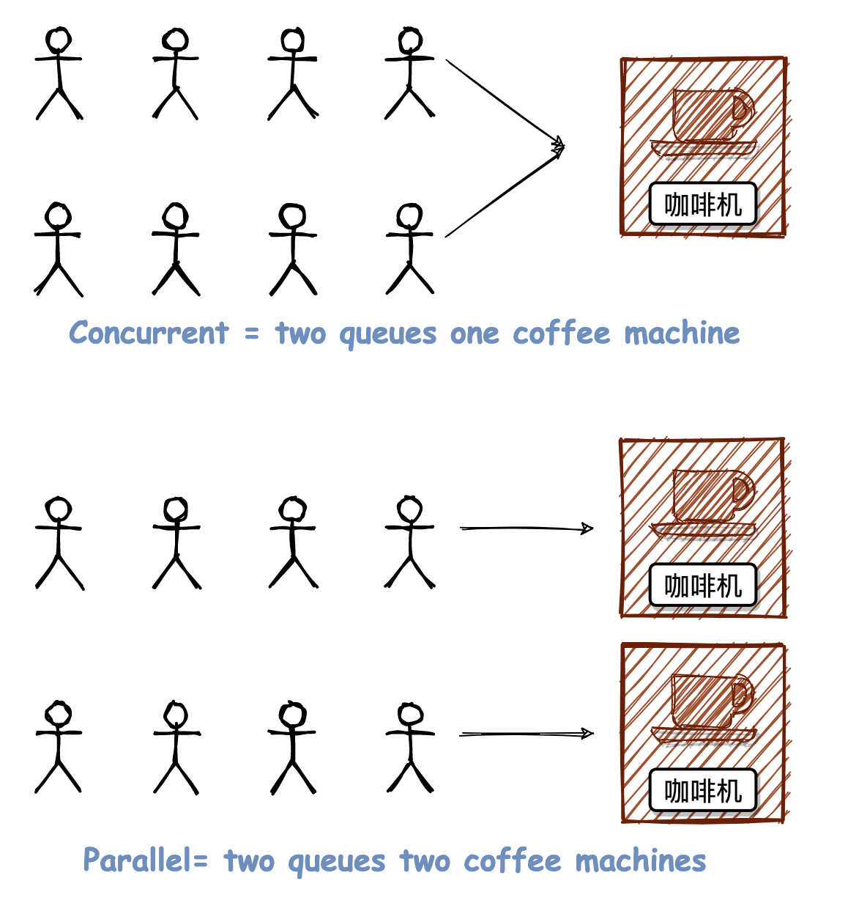

<h1 class="article-title no-number">进程 Process</h1>

# 系统的进程

## 进程与线程

### 进程

**进程**是并发执行的程序在执行过程中分配和管理资源的基本单位，是一个动态概念，竞争计算机系统资源的基本单位。

**一个应用程序启动，就是一个进程。**进程是具有一定功能的程序，是系统进行资源分配调度的一个独立单位。

### 线程

**线程**是进程的一个执行单元，是进程内的调度实体。

比进程更小的独立运行的基本单位，线程也被称为轻量级进程。

线程是进程的一个实体，是 CPU 调度分配的基本单位，线程之间基本上不拥有系统资源。

> [!note]
>
> **线程共享的资源**：堆、全局变量、静态变量、文件等共用资源
>
> **线程独享的资源**：栈、寄存器

### 两者区别

| 区别     | 线程                                                                                     | 进程                                                                         |
| -------- | ---------------------------------------------------------------------------------------- | ---------------------------------------------------------------------------- |
| 地址空间 | 共享本进程的地址空间。                                                                   | 独立的地址空间。                                                             |
| 资源     | 共享本进程的资源，如内存、I/O、CPU 等。<br />不利于资源的管理和保护。                    | 进程间的资源是独立的，很好的管理和保护了资源。                               |
| 健壮性   | 一个线程崩掉，整个进程都死掉。                                                           | 一个进程崩溃后，在保护模式下不会影响其他进程。                               |
| 执行过程 | 线程不能独立执行，必须依存在应用程序中，由应用程序提供多个线程执行控制，**执行开销小**。 | 每个独立的进程有一个程序运行的入口、顺序执行序列和程序入口，**执行开销大**。 |
| 可并发行 | 可并发执行。                                                                             | 可并发执行。                                                                 |
| 切换时   | 线程切换，**资源消耗小**，涉及频繁切换，线程要优于进程。                                 | 进程切换时，**消耗的资源大，效率高**。                                       |
| 调度     | 处理器调度的最小单位。<br />程序执行的最小单位。                                         | 不是。                                                                       |
| 使用场景 | **要求效率高，频繁切换时，资源的保护管理要求不是很高时，使用多线程。**                   | **对资源的管理和保护要求高，不限制开销和效率时，使用多进程。**               |

## 进程三种状态

- 就绪（Ready）状态

  进程已分配到除 CPU 以外的所有必要资源，只要获得处理机便可立即执行。

- 执行（Running）状态

  进程已获得处理机，其程序正在处理机上执行。

- 阻塞（Blocked）状态

  正在执行的程序，由于等待某个事件发生而无法执行时，便放弃处理机而处于阻塞状态。

  引起进程阻塞的原因可能是等待 I/O 完成、申请缓冲区不能满足、等待信号等。


> [!question]
>
> 为什么在转换图中没有就绪到阻塞和阻塞到执行的转换方向？
>
> ~~**就绪->阻塞**~~：就绪状态进程没有占有处理机，即不经过执行，其状态就不会改变。
>
> **~~阻塞->执行~~**：阻塞状态进程唤醒后要先进入到就绪队列，才会被调度程序选中，进行执行状态

## 进程调度

### 进程调度任务

1. 保存处理机的现场信息，如程序计数器、多个通用寄存器中的内容等；
2. 按照某种算法选取进程，将其状态改为运行状态；
3. 把处理器分配给进程，将进程控制块内有关处理器现场。信息装入处理器相应的寄存器中，处理器的控制权交给该进程，让它从上次断点处恢复运行。

### 进程调度机制

- **排队器**：将所有就绪的进程按照一定的策略排成一个或多个队列
- **分派器**：取出进程调度程序选中的进程，进行进程间上下文切换、分配处理器
- **上下文切换器**：将当前进程的上下文信息保存到相应单元，装入分派程序的上下文；移出分派程序的上下文，装入新选进程的现场信息

### 进程调度方式

- **非抢占式**：一旦处理机分配给某个进程后，就一直让其运行直到完成或者发生某事件而阻塞。
- **抢占式**：允许调度程序根据某种规则，暂停某个正在执行的进程。

### 进程调度算法

1. **FCFS 先来先服务算法**（非抢占式）

   按照作业进入后备作业队列的先后次序来挑选作业

   优点：实现简单

   缺点：效率不高，性能不好；有利于长作业，不利于短作业

2. **短作业优先算法**（非抢占式）

   每次从后备作业队列中挑选估计服务时间最短的一个或几个作业

   优点：优先照顾短作业，可以降低平均等待时间，提高吞吐量

   缺点：不利于长作业，长作业可能一直处于等待状态，容易出现饥饿现象；未考虑作业的优先紧迫程度，不能用于实时系统

3. **HPF 优先级调度算法**（非抢占式）

   按照优先级由高到低的顺序进行调度

4. **HRRF 高响应比优先调度算法**（非抢占式）

   适用于批处理系统。每次进行作业调度时，先计算后备作业队列中每个作业的响应比，挑选响应比最高的作业。

   优点：能够避免饥饿现象，兼顾长短作业

   缺点：计算响应比开销大

5. **RR 时间片轮转调度算法**（抢占式）

   适用于分时系统。给每个进程固定的执行时间，根据进程到达的先后顺序让进程在单位时间片内执行，执行完成后便调度下一个进程执行。

   切换时机：（1）时间片未用完，进程便完成；（2）时间片用完，终端处理程序被激活，进程若未完成被送入就绪队列尾部

   优点：兼顾长短作业

   缺点：平均等待时间较长，上下文切换较费时

6. **多级反馈队列调度算法**（抢占式）

   适用于各种作业环境。设置多个就绪队列，每个队列赋予不同的优先级；每个队列采用 FCFS 算法，新进程进入时首先放入第一队列末尾，若第一个时间结束未完成，将其转入第二队列末尾……。队列按优先级调度，仅当前一队列空闲时才调用下一队列。

   优点：兼顾长短作业，有较好的响应时间，可行性强

## 死锁

死锁是两个或两个以上进程在执行过程中，由于竞争资源或者由于彼此通信而造成的一种阻塞现象；若无外力干预，它们都将无法推进下去。（竞争的资源可以是锁、线程、网络连接、通知事件、打印机、磁盘、宽带等）。

### 产生原因

- 系统资源不足
- 进程运行推进顺序不当
- 资源分配不当

### 死锁的四个必要条件

只要系统发生死锁，这些条件必然成立；只要条件之一不满足就不会发生死锁。

- 互斥条件：一个资源每次只能被一个进程使用
- 请求与保持条件：一个进程因请求资源而阻塞时，对已获得的资源保持不放
- 不剥夺条件：进程已获得的资源在未使用完之前不能强行剥夺
- 循环等待条件：若干进程之间形成一种头尾相接的循环等待资源关系

### 解决死锁的方法

三种方法：死锁的预防、死锁的避免、死锁的检查与恢复。

#### 1. 死锁的预防（静态策略）

**基本思想**：要求进程申请资源时遵循某种协议，从而打破产生死锁的四个必要条件中的一个或几个，保证系统不会进入死锁状态。

#### 2. 死锁的避免（动态策略）

**基本思想**：预测发生死锁的可能性，确定资源分配的安全性。即不限制进程有关申请资源的命令，而是对进程所发出的每一个申请资源命令加以动态地检查，并根据检查结果决定是否进行资源分配。

#### 3. 死锁的检查与恢复

**基本思想**：系统为进程分配资源时，不采取任何限制性措施，但提供检测和解脱死锁的手段（能发现死锁并从死锁状态中恢复出来）

### 银行家算法

这是一个著名的避免死锁的算法，是有 Dijstra 首先提出并加以解决的。

#### 算法背景

一个银行家如何将一定数目的资金安全地借给若干个用户，使这些客户既能拿到钱完成要干的事，同时银行家又能收回全部资金而不至于破产。这个生活中的实际问题很像操作系统中的资源分配问题：银行家就是一个操作系统，客户就像运行的进程，而银行家的资金就是系统的资源。

#### 算法描述

让我们来具体规范地描述一下这个问题。

一个银行家拥有一定数量的资金，有若干个客户想要贷款，每个客户必须在一开始就声明他所需贷款的总额。若该客户贷款总额不超过银行家的资金总数，银行家可以满足客户的要求。客户不一定能一次性拿到自己所需的全部贷款，他在借满全部款额之前可能会等待，但银行家必须保证这种等待是有限的并且等待是有有结果的。

举个例子，假设银行家的资金总额为 10 个资金单位的，有三位客户 C1、C2、C3 向银行家借款，C1 客户要借 8 个资金单位，C2 客户要借 4 个资金单位，C3 客户要借 9 个资金单位，总计 21 个资金单位。某一时刻的状态如下：

（1）银行家已经借给 C1 客户 4 个资金单位、C2 客户 2 个资金单位、C3 客户 2 个资金单位，剩 2 个资金单位可分配 。

| 客户编号 | 已拥有的款额 | 还需要的款额 |
| :------: | :----------: | :----------: |
|    C1    |      4       |      4       |
|    C2    |      2       |      2       |
|    C3    |      2       |      7       |

（2）若将剩下的 2 个资金单位分配给 C1 或 C3，就会形成如下情况：

| 客户编号 | 已拥有的款额 | 还需要的款额 |
| :------: | :----------: | :----------: |
|    C1    | 4 或 5 或 6  | 4 或 3 或 2  |
|    C2    |      2       |      2       |
|    C3    | 2 或 3 或 4  | 7 或 6 或 5  |

此后，C1、C2、C3 中任何一位客户再提出申请都不能被满足，最后就可能产生死锁。

（3）若将剩下的 2 个资金单位分配给 C2，则 C2 的贷款请求全部被满足，银行家此时可以收回 C2 已拥有的 2 个资金单位的款额，那么此时银行家拥有资金总额为 4 个资金单位。

| 客户编号 | 已拥有的款额 | 还需要的款额 |
| :------: | :----------: | :----------: |
|    C1    |      4       |      4       |
|    C3    |      2       |      7       |

（4）以此类推，接下来满足 C1 客户的请求，收回资金后银行家资金总额为 8 个资金单位，最后满足 C3 客户的请求。最终银行家可以收回全部 10 个资金单位的款额，且 3 位客户的需求都在有限等待时间内被满足，安全序列为{C2, C1, C3}。

综上，银行家算法是从当前状态出发，逐个按安全序列检查各客户谁能完成其工作，然后假定其完成工作且归还全部贷款，再进而检查下一个能完成工作的客户……如果所有客户都能完成工作，则找到一个安全序列，银行家才是安全的。

#### 优点

允许互斥条件、请求与保持条件、不剥夺条件的存在，限制减少，资源利用率提高。

#### 缺点

算法要求客户数固定不变，在多道程序系统中难以做到；仅能保证所有客户在有限时间内得到满足，不能满足实时客户要求快速响应的需求；需要寻找一个安全序列，增加了系统开销。

## 进程通信

- 无名管道：半双工通信方式，数据只能单向流动且只能在有亲缘关系的进程间使用
- 有名管道：半双工通信方式，允许在非亲缘关系的进程间使用
- 信号：通知接收进程某个事件已发生
- 消息队列：传递消息的链表，存放在内核中。克服了信号传输信息少，管道只能传输无格式字节流以及缓冲区大小受限的缺点
- 信号量：一个计数器，用来控制多个进程对共享资源的访问。常作为一种锁机制，防止某进程正在访问共享资源时，其他进程也访问该资源
- 共享内存：映射一份能被其他进程所访问的内存，这份内存由一个进程创建但其他进程可以访问
- 套接字：Socket，不同机器之间的进程通信

> [!question]
>
> **共享内存有什么缺点？如何解决？**
>
> 共享内存不提供同步机制，在使用共享内存进行通信时需要借助其他手段来进行进程间的同步工作，常与信号量一起使用实现同步对共享内存的访问。

## 并发&并行

并行 (Parallel) 与并发 (Concurrent) 是两个很常见的概念。

关于并行和并发，可以看这张漫画图（Erlang 之父 Joe Armstrong 提出的**咖啡机模型**）。



并发 (Concurrent) = 两个队列交替使用一台咖啡机

并行 (Parallel) = 两个队列同时使用两台咖啡机

> [!note]
>
> Node.js 通过事件循环来挨个抽取事件队列中的一个个 Task 执行，从而避免了传统的多线程情况下（2 个队列对应 1 个咖啡机的时候）上下文切换以及资源争抢/同步的问题，所以获得了高并发的成就。
>
> 至于在 Node.js 中并行，你可以通过 **cluster** 来再添加一个咖啡机。

## 协程

是一种比线程更加轻量级的存在。一个线程也可以拥有多个协程。其执行过程更类似于子例程，或者说不带返回值的函数调用。

**协程避免了无意义的调度，由此可以提高性能**，但程序员必须自己承担调度的责任。同时，协程也失去了标准线程使用多 CPU 的能力。

| 线程                                           | 协程                                           |
| ---------------------------------------------- | ---------------------------------------------- |
| 相对独立<br/>有自己的上下文<br/>切换受系统控制 | 相对独立<br/>有自己的上下文<br/>切换由自己控制 |

# process 模块

> 本篇只记录 process 的常用功能，完整内容可以参考[官方文档](http://nodejs.cn/api/process.html#process_process)。

process （进程）对象是一个全局变量，提供了有关当前 Node.js 进程的信息并对其进行控制。 作为全局变量，它始终可供 Node.js 应用程序使用，无需使用 require()。 它也可以使用 require() 显式地访问：

```js
const process = require('process'); // 可省略
```

Node.js 里通过 `node app.js` 开启一个服务进程，比如下面的代码：

```js
const http = require('http');
const server = http.createServer();
server.listen(3000, () => {
  // 指定一个进程名称，便于查找
  process.title = 'Node.js服务开启的进程';
  console.log('进程id', process.pid);
});
```

启动服务后，通过 Mac 电脑的活动监视器工具，可以看到该服务的进程及其相关信息。


## process 的属性

process 有很多属性。

| 属性                | 描述                                                                                                                                                                                                      |
| ------------------- | --------------------------------------------------------------------------------------------------------------------------------------------------------------------------------------------------------- |
| `process.env`       | **环境变量**，分为系统自带和自定义两种。<br />● 系统环境变量：USER、PATH 路径、PWD 路径 等。<br />● 自定义环境变量：NODE*ENV 等自定义的。<br />*注：Windows 系统中，环境变量不区分大小写！！！\_          |
| `process.argv`      | **命令行参数**：进程被启动时（执行 JS 文件时），命令行传入的参数。返回是一个数组形式。                                                                                                                    |
| `process.execArgv`  | **Node 程序运行的参数**：运行 Node 程序特有的参数。<br />比如，`node --harmony execArgv.js --nick chyingp`：<br />`--harmony`是`process.execArgv`；<br />`--nick`和`chyingp`是`process.argv`。            |
| `process.execPath`  | **当前工作路径**：启动 Node.js 进程的可执行文件的绝对路径。                                                                                                                                               |
| `process.title`     | **进程名**：当前进程名称。                                                                                                                                                                                |
| `process.pid`       | **进程号**：当前进程的 PID。                                                                                                                                                                              |
| `process.ppid`      | **父进程号**：当前进程的父进程的 PID。                                                                                                                                                                    |
| `process.platform`  | **平台**：标识操作系统平台（Node.js 进程运行其上的）的字符串。<br />可能值有：`aix`、`darwin`、`freebsd`、`linux`、`openbsd`、`sunos`、`win32`。                                                          |
| `process.arch`      | **CPU 架构**：编译 Node.js 二进制文件的操作系统的 CPU 架构。<br /> 可能的值有：`'arm'`、 `'arm64'`、 `'ia32'`、 `'mips'`、 `'mipsel'`、 `'ppc'`、 `'ppc64'`、 `'s390'`、 `'s390x'`、 `'x32'` 和 `'x64'`。 |
| `process.version`   | **Node 版本信息**：返回当前 Node.js 的版本，比如'v6.1.0'。                                                                                                                                                |
| `process.versions`  | **Node 和依赖库版本**：返回当前 Node.js 的版本，以及依赖库的版本。                                                                                                                                        |
| `process.release`   | **Node 发行版本**：返回当前 Node.js 的发行版本的相关信息。                                                                                                                                                |
| `process.config`    | **Node 编译参数**：返回当前 Node.js 版本编译时的参数，很少会用到，一般用来查问题。                                                                                                                        |
| `process.debugPort` | **调试端口**：Node.js 调试器使用的端口。                                                                                                                                                                  |

## process 的方法

### process.nextTick(fn)

使用频率很高，通常用在异步的场景，来个简单的例子：

```js
console.log('海贼王');
process.nextTick(function () {
  console.log('火影忍者');
});
console.log('死神');

// 输出如下：
// 海贼王
// 死神
// 火影忍者
```

> [!note]
>
> 前面有讲过 process.nextTick(fn) 和 setTimeout(fn, 0) 的区别。
>
> - **process.nextTick(fn)** 是微任务，回调任务存储于**微队列**。
>
> - **setTimeout(fn, 0)** 是宏任务，回到任务存储于**宏队列**。

### process.cwd()

`process.cwd()` 方法会返回 Node.js 进程的当前工作目录。

> [!note]
>
> - **\_\_dirname**：\_\_dirname 是被执行的 JS 文件的地址——文件所在目录。
> - **process.cwd()**：是当前执行 Node 命令时候的文件夹地址——工作目录，保证了文件在不同的目录下执行时，路径始终不变。

### process.chdir(directory)

`process.chdir()` 方法可以**切换 Node.js 进程的当前工作目录**，如果操作失败（例如，指定的 `directory` 不存在）则抛出异常。

```js
console.log('工作目录: ' + process.cwd());
try {
  process.chdir('/tmp');
  console.log('新的工作目录: ' + process.cwd());
} catch (err) {
  console.log('切换目录失败: ' + err);
}

/** 输出结果：
工作目录: /Users/pg/Documents/Gitee/nodejs-blue-book/Chapter2/code/process
新的工作目录: /private/tmp
*/
```

### process.exit([exitCode])

同步的立即终止进程，即使还有尚未完全完成的异步操作在等待，都会终止执行。

省略 exitCode 参数，则使用 0 或者`process.exitCode`的值退出。

```
// 成功退出
process.exit();
process.exit(0);
// 以失败方式退出
process.exit(1);
```

> [!danger]
>
> 整个`process.exit() `的接口说明，都在说明`process.exit()`这个接口有多不可靠，所以在开发过程中**尽量不要使用`process.exit() `**。
>
> 正确退出的方法是，通过 process.exitCode 设置退出码，然后等进程自动退出。
>
> ```js
> // 如何正确地设置退出码，同时让进程正常地退出。
> if (someConditionNotMet()) {
>   // 打印有用的信息
>   process.exitCode = 1; // 设置退出码
>   // 然后等进程自动退出
> }
> ```

### process.kill(pid[, signal])

这个方法不是杀死进程，而是向进程发送信号的。信号名称为字符串（比如 `'SIGINT'` 或 `'SIGHUP'`），关于信号的含义，可以参考[process 的信号事件](http://nodejs.cn/api/process.html#process_signal_events)。
直接看官方例子：

```js
process.on('SIGHUP', () => {
  console.log('收到 SIGHUP 信号');
});

// 避免异步操作未执行，设置1s后终止程序
setTimeout(() => {
  console.log('退出中');
  process.exit(0);
}, 1000);

process.kill(process.pid, 'SIGHUP');

// 运行结果
// 收到 SIGHUP 信号
// 退出中
```

### process.memoryUsage()

返回进程占用的内存，单位为字节。输出内容大致为：

```js
{
    rss: 19181568, 	//
    heapTotal: 6537216, //  V8占用的内存
    heapUsed: 4001920, // V8实际使用的内存
    external: 8272	// V8管理的绑定到JS对象的C++对象的内存使用情况(太绕了o(╥﹏╥)o)
}
```

### process.cpuUsage()

返回当前进程的用户 CPU 时间和系统 CPU 时间。

### process.hrtime([time])

`time` 是可选参数，传入的值是上一次调用 `process.hrtime()` 返回的结果，用于与当次调用做差值计算。

返回是一个数组，数组里的值为 [seconds, nanoseconds]，第一个是 seconds，第二个是无法用 seconds 精确的剩余 nanoseconds 部分。

```js
const NS_PER_SEC = 1e9; // 10^9，10的九次方（1秒=10^9纳秒）
const time = process.hrtime(); // 第一次调用

setTimeout(() => {
  const diff = process.hrtime(time); // 第二次调用
  // 两次调用之间的时间差
  console.log(`基准工具 ${diff[0] * NS_PER_SEC + diff[1]} 纳秒`);
}, 1000);
```

### process.uptime()

当前 node 进程已经运行了多长时间（单位是秒）。

```js
console.log('进程运行时间', process.uptime());
setTimeout(() => {
  console.log('进程运行时间', process.uptime());
}, 3000);
// 输出结果
// 进程运行时间 0.247
// 进程运行时间 3.253
```

### process.emitWarning()

可以用来抛出警告信息。**可看后面的监听'warning'事件。**

### 标准输出方法

process.stdin、process.stdout、process.stderr 分别代表进程的标准输入、标准输出、标准错误输出。

```js
process.stdin.setEncoding('utf8');

process.stdin.on('readable', () => {
  var chunk = process.stdin.read();
  if (chunk !== null) {
    process.stdout.write(`data: ${chunk}`);
  }
});

process.stdin.on('end', () => {
  process.stdout.write('end');
});
```

## process 的事件

### beforeExit 事件

当 Node.js 清空其事件循环并且没有其他工作要调度时，则 `'beforeExit'` 事件会被触发。 通常，当没有工作被调度时，则 Node.js 进程会退出，但是在 `'beforeExit'` 事件上注册的监听器可以进行异步的调用，从而使 Node.js 进程继续。

`process.exit()`退出不会触发 `'beforeExit'` 事件。

```js
process.on('beforeExit', (code) => {
  // process.exit()退出不会进入
  console.log('进程 beforeExit 事件的退出码: ', code);
});

process.on('exit', (code) => {
  console.log('进程 exit 事件的退出码: ', code);
});

console.log('此消息会最先显示');

// 打印：
// 此消息会最先显示
// 进程 beforeExit 事件的退出码: 0
// 进程 exit 事件的退出码: 0
```

### exit 事件

当 Node.js 退出时，都会触发该事件。此时无法阻止事件循环的退出，并且一旦所有的 `'exit'` 事件的监听器都已完成运行，则 Node.js 进程就会终止。

监听器函数必须只执行同步的操作。 在调用 `'exit'` 事件监听器之后，Node.js 进程会立即退出，从而使仍在事件循环中排队的任何其他的工作都被放弃。

```js
process.on('beforeExit', (code) => {
  // process.exit()退出不会进入
  console.log('进程 beforeExit 事件的退出码: ', code);
});

process.on('exit', (code) => {
  console.log('进程 exit 事件的退出码: ', code);
  // 内部只能继续执行同步任务的代码
  // 下面队列中的任务会被放弃
  setTimeout(() => {
    console.log('此处不会运行');
  }, 0);
});

console.log('此消息会最先显示');

process.exit(1);

// 打印：
// 此消息会最先显示
// 进程 exit 事件的退出码: 1
```

### uncaughtException 事件

当未捕获的 JS 异常冒泡回到事件循环时，则会触发 `'uncaughtException'` 事件。

默认情况下，Node.js 会这样处理此类异常：打印堆栈跟踪到 `stderr` 并使用退出码 `1` 来退出，且会覆盖任何先前设置的`process.exitCode`。

注意，在触发 `'uncaughtException'` 事件，执行后，退出码会由 1 变为 0，所以根据需要可能要更改退出码。

```js
const fs = require('fs');

process.on('uncaughtException', (err, origin) => {
  console.log(`捕获的异常: ${err}\n异常的来源: ${origin}`);
  // 执行该事件后，退出码会由1变为0，所以根据需要改变退出码
  process.exitCode = 1;
});

process.on('exit', (code) => {
  console.log('进程 exit 事件的退出码: ', code);
});

setTimeout(() => {
  console.log('这里仍然会运行');
}, 1000);

// 调用不存在的函数，故意引起异常，但不要捕获它。
nonexistentFunc();
console.log('这里不会运行');

// 运行结果：
// 捕获的异常: ReferenceError: nonexistentFunc is not defined
// 异常的来源: uncaughtException
// 这里仍然会运行
// 进程 exit 事件的退出码:  1
```

> [!danger]
>
> `'uncaughtException'` 事件是一种粗糙的异常处理的机制，**尽量不要使用**。
>
> 未处理的异常本身就意味着应用程序处于未定义的状态，这明显表示程序代码存在问题。
>
> 因此，良好的习惯是对**异常都要进行捕获**。

### warning 事件

任何时候 Node.js 触发进程警告，都会触发 `'warning'` 事件。

进程警告与进程错误的相似之处，在于两者都描述了需要引起用户注意的异常条件。

区别在于，警告不是 Node.js 和 Javascript 错误处理流程的正式组成部分。 一旦探测到可能导致应用性能问题，缺陷或安全隐患相关的代码实践，Node.js 就可发出警告。

```js
// 抛出警告信息
process.emitWarning('Something Happened!', 'CustomWarning');
// 监听到 warning
process.on('warning', (warning) => {
  console.warn(warning.name); // 警告的名称，默认是'Warning'
  console.warn(warning.message); // 警告描述
  console.warn(warning.stack); // 代码位置堆栈信息
});

/** 输出结果：
(node:6070) CustomWarning: Something Happened!（ 6070 是 process.pid）
CustomWarning
Something Happened!
CustomWarning: Something Happened!
    at Object.<anonymous> (/Users/pg/Documents/Gitee/Chapter2/code/process/test.js:1:9)
    at Module._compile (internal/modules/cjs/loader.js:778:30)
    at Object.Module._extensions..js (internal/modules/cjs/loader.js:789:10)
    at Module.load (internal/modules/cjs/loader.js:653:32)
    at tryModuleLoad (internal/modules/cjs/loader.js:593:12)
    at Function.Module._load (internal/modules/cjs/loader.js:585:3)
    at Function.Module.runMain (internal/modules/cjs/loader.js:831:12)
    at startup (internal/bootstrap/node.js:283:19)
    at bootstrapNodeJSCore (internal/bootstrap/node.js:623:3)
*/
```

### 信号事件

当 Node.js 进程接收到信号时，则会触发信号事件。

信号句柄会接收信号的名称（`'SIGINT'`， `'SIGTERM'` 等）作为第一个参数。

每个事件的名称是信号的通用名称的大写 (比如 `'SIGINT'` 事件对应 `SIGINT` 信号)。

> [!danger]
>
> **Windows 不支持信号，尽量不要使用**，如果必须使用，但是可以用`process.kill()`来替代模拟：
>
> - 发送 `SIGINT`、 `SIGTERM` 和 `SIGKILL` 会使目标进程被无条件地终止，然后子进程会报告该进程已被信号终止。
> - 发送信号 `0` 可以用作与平台无关的方式来测试进程的存在性。

# child_process 模块

> 本篇只记录 child_process 的常用功能，完整内容可以参考[官方文档](http://nodejs.cn/api/child_process.html)。

正如模块名，该模块用于创建子进程。主要是通过`spawn()`函数实现。

```js
const { spawn } = require('child_process');
const ls = spawn('ls', ['-al']);

console.log('当前进程的PID：', process.pid);
console.log('子进程PID：', ls.pid);

ls.stdout.on('data', (data) => {
  console.log(`stdout: ${data}`);
});

ls.stderr.on('data', (data) => {
  console.error(`stderr: ${data}`);
});

ls.on('exit', (code) => {
  console.log(`子进程退出，退出码 ${code}`);
});
// 打印输出：
// 当前进程的PID 8623
// 子进程PID 8624
```

`child_process.spawn()`方法会异步地衍生子进程，且不阻塞 Node.js 事件循环。

`child_process.spawnSync()`函数则以同步的方式提供了等效的功能，但会阻塞事件循环直到衍生的进程退出或被终止。

为方便起见， `child_process`模块提供了 `child_process.spawn()` 和 `child_process.spawnSync()` 的一些同步和异步的替代方法。 这些替代方法中的每一个都是基于 `child_process.spawn()` 或 `child_process.spawnSync()` 实现的。

- `child_process.exec()`：衍生 shell 并且在 shell 中运行命令，当完成时则将 stdout 和 stderr 传给回调函数。
- `child_process.execFile()`：类似于 `child_process.exec()`，但是默认情况下它会直接衍生命令而不先衍生 shell。
- `child_process.fork()`：衍生新的 Node.js 进程，并调用指定的模块，该模块已建立了 IPC 通信通道，可以在父进程与子进程之间发送消息。
- `child_process.execSync()`：`child_process.exec()` 的同步版本，会阻塞 Node.js 事件循环。
- `child_process.execFileSync()`：`child_process.execFile()` 的同步版本，会阻塞 Node.js 事件循环。

## exec()

创建一个 shell，并在 shell 中执行命令。执行完成后，将 stdout、stderr 作为参数传入回调方法。

`child_process.exec(command[, options][, callback])`

- **command**：执行的命令，参数用空格分隔，如`ls -al`。
- **options**：配置选项，常用的有：
  - cwd：子进程当前的工作路径。默认值为：null。
  - env：默认值为 process.env。
  - encoding：默认值 utf8。
  - shell：用来执行命令的 shell，unix 上默认是`/bin/sh`，windows 上默认是`cmd.exe`。
  - timeout：默认值 0。**如果 `timeout > 0`，则当子进程运行时间超过 `timeout` 毫秒时，父进程会发送由 `killSignal` 属性（默认为 `'SIGTERM'`）标识的信号。**
  - maxBuffer：stdout 或 stderr 上允许的最大数据量（以字节为单位）。 如果超过限制，则子进程会被终止，并且输出会被截断。默认是 1024\*1024 字节（1MB）。
  - killSignal：默认是`SIGTERM`。
  - uid：设置进程的用户标识。
  - gid：设置进程的群组标识。
- **callback**：回调函数，错误优先。如果运行没有出错，那么`error`为`null`。如果运行出错，那么，`error.code`就是退出代码（exist code），`error.signal`会被设置成终止进程的信号。（比如`CTRL+C`时发送的`SIGINT`）

```js
const { exec } = require('child_process');

// 成功的例子
exec('ls -al', function (error, stdout, stderr) {
  console.log('=== 成功的例子 ===');
  console.log('1. ls -al命令的输出：', stdout || '无输出');
  console.log('2. ls -al命令的错误：', stderr || '无输出');
});

// 失败的例子
exec('ls hello.txt', function (error, stdout, stderr) {
  console.log('\n=== 失败的例子 ===');
  console.log('4. ls hello.txt命令的输出：', stdout || '无输出');
  console.log('5. ls hello.txt命令的错误：', stderr || '无输出');
});

/**
输出结果：
=== 成功的例子 ===
1. ls -al命令的输出： total 8
drwxr-xr-x   3 Dobe  staff    96  4 10 14:47 .
drwxr-xr-x  15 Dobe  staff   480  4 10 14:47 ..
-rw-r--r--   1 Dobe  staff  1032  4 11 00:42 test.js
2. ls -al命令的错误： 无输出

=== 失败的例子 ===
4. ls hello.txt命令的输出： 无输出
5. ls hello.txt命令的错误： ls: hello.txt: No such file or directory

*/
```

> [!danger]
>
> **注入攻击**
>
> 传入的命令，如果是用户输入的，有可能产生类似 SQL 注入的风险，比如：
>
> ```js
> const { exec } = require('child_process');
>
> // 会执行 rm 删除命令 terrible
> exec('ls; rm -rf file.txt', function (error, stdout, stderr) {
>   if (error) {
>     console.error('error: ' + error);
>   }
>   console.log('stdout: ' + stdout);
>   console.log('stderr: ' + stderr);
> });
> ```

## execFile()

跟`.exec()`类似，不同点在于，没有创建一个新的 shell，执行的是一个文件。

```js
const { execFile } = require('child_process');
// 执行同级目录下的 test.sh 文件
execFile('./test.sh', function (error, stdout, stderr) {
  if (error) {
    console.error('error: ' + error);
    // return;
  }
  console.log('stdout: ' + stdout);
  console.log('stderr: ' + stderr);
});
```

## fork()

fork 这个单词大家不陌生，经常使用 Github 的同学都知道，遇到好的项目，我们想改改的话，那就 fork 下来，简单来说，就是”**复制**“的意思。

在 Node.js 中，`child_process.fork()`就是复制创建新的进程，在新的进程中执行 Node 模块。`fork() `是 `spawn() `的变体，用来创建 Node 进程，最大的特点是父子进程自带通信机制（IPC 管道）。不同点在于，它创建 Node.js 的子进程只需要**指定要执行的 JS 文件模块**即可。

**fork 出来的每个进程都拥有自己的独立空间地址、数据栈，一个进程无法访问另外一个进程里定义的变量、数据结构，只有建立了 IPC 通信，进程之间才可数据共享。**

`child_process.fork(modulePath[,args][,options])`

**modulePath**：子进程运行的模块。

**参数说明**：（重复的参数说明就不在这里列举）

- `execPath`： 用来创建子进程的可执行文件，默认是`/usr/local/bin/node`。也就是说，你可通过`execPath`来指定具体的 Node 可执行文件路径。（比如多个 node 版本）
- `execArgv`： 传给可执行文件的字符串参数列表。默认是`process.execArgv`，跟父进程保持一致。
- `silent`： 默认是`false`，即子进程的`stdio`从父进程继承。如果是`true`，则直接`pipe`向子进程的`child.stdin`、`child.stdout`等。
- `stdio`： 如果声明了`stdio`，则会覆盖`silent`选项的设置。

现在有两个文件，`parent.js`和`child.js`，代码如下：

```js
// parent.js
const child_process = require('child_process');
child_process.fork('./child.js', {
  silent: false, // 默认是false，不写也可
});
```

```js
// child.js
console.log('来自子进程的输出');
```

当执行`node parent.js`后，控制台会输出如下：

```
来自子进程的输出
```

但是，当`parent.js`中的`silent`参数改成 true 后，则上面的一段话不会输出出来。

如果想要子进程的输出，则需要对`parent.js`加上子进程的 stdout 监听事件，代码如下：

```js
// parent.js
const child_process = require('child_process');
const child = child_process.fork('./child.js', {
  silent: true, // 子进程单独输出
});
child.stdout.setEncoding('utf8');
child.stdout.on('data', function (data) {
  // 子进程的输出，在父进程有事件可以监听到
  console.log(data);
});
```

## spawn()

创建一个子进程，并执行`command`命令。

`child_process.spawn(command[,args][,options])`

```js
const spawn = require('child_process').spawn;
const ls = spawn('bash', ['-c', 'echo "Hello Nodejs"']);

ls.stdout.on('data', function (data) {
  console.log('子进程的正常输出：' + data);
});

ls.stderr.on('data', function (data) {
  console.log('子进程的错误输出：' + data);
});

ls.on('close', function (code) {
  console.log('子进程退出，退出码：' + code);
});

// 打印结果：
// 子进程的正常输出：Hello Nodejs
// 子进程退出，退出码：0
```

> [!note]
>
> child_process 模块给予了 node 随意创建子进程（child_process）的能力，它提供了 4 个方法用于创建子进程。
>
> - **spawn()**：启动一个子进程来执行命令
> - **exec()**：启动一个子进程来执行命令，与 spawn()不同的是使用了不同的接口，它有一个回调函数获知子进程的状况。
> - **execFile()**：启动一个子进程来执行可执行文件（**.bat、.sh、.exe**等）。
> - **fork()**：与 spawn()类似，不同点在于，它创建 node 的子进程只需要指定要执行的**JS 文件模块**即可。
>
> ```js
> const cp = require('child_process');
> // 1.执行命令
> cp.exec('node worker.js', function (err, stdout, stderr) {
>   // 回调
> });
> // 2. 执行可执行文件
> cp.execFile('./worker.sh', function (err, stdout, stderr) {
>   // 回调
> });
> // 3. 执行JS模块
> cp.fork('./worker.js');
> // 4. 执行命令
> cp.spawn('node', ['worker.js']);
> ```
>
> | 类型       | 回调/异常 | 进程类型 | 执行命令     | 可设置超时 |
> | ---------- | --------- | -------- | ------------ | ---------- |
> | exec()     | √         | 任意     | Command 命令 | √          |
> | execFile() | √         | 任意     | 可执行文件   | √          |
> | fork()     | ×         | Node     | JS 文件模块  | ×          |
> | spawn()    | ×         | 任意     | Command 命令 | ×          |
>
> 尽管 4 种创建子进程的方式存在差别，但是事实上前面 3 种方法都是`spawn()`的延伸应用。

## 进程间通信

**IPC 通道**：Inter-Process Communication，即内部进程通信。创建子进程后，为了实现父子进程之间的通信，父进程与子进程之间将会**创建 IPC 通道**，通过 IPC 通道，父子进程之间才能通过 message 和 send()传递消息。

进程间通信的目的是为了让不同的进程能够互相访问资源，并进程协调工作。实现进程间通信的技术有很多，如命名管道、匿名管道、socket、信号量、共享内存、消息队列、Domain Socket 等，**Node 中实现 IPC 通道的是管道技术（pipe）**。

**创建子进程的过程如下：**

1. 父进程创建 IPC 通道（Libuv 提供），并监听它。
   - Windows 系统：Named Pipe，命名管道实现。
   - 类 Unix 系统：Domain Socket 实现。
2. 父进程创建子进程。
3. 子进程根据环境变量（NODE_CHANNEL_FD）找到文件描述符，找到通道并连接。


建立连接之后的父子进程就可以自由的通信了，由于 IPC 通道是用命名管道或者 Domain Socket 创建的，他们与网络 Socket 的行为比较类似，属于**双向通道**。不同的是他们在系统内核中就完了进程间的通信，而不经过实际的网络层，非常高效。

在 Node 中，IPC 通道被抽象为 stream 对象，在调用 send()时发送数据（类似于 write()），接收到的消息会通过 message 事件（类似于 data）触发给应用层。

> [!tip]
>
> 启动的子进程是 Node 进程时，子进程才会根据环境变量去连接 IPC 通道，对于其他类型的子进程则无法自动实现进程间通信，需要让其他进程也按照约定去连接这个已经创建好的 IPC 通道才行。

## ChildProcess 类

通过 child_process 模块提供的四种方法创建子进程后，会对应生成 ChildProcess 类的实例。

### exit 事件

当子进程结束后时会触发 exit 事件。

**当 exit 事件被触发时，子进程的 stdio 流可能依然是打开的。**

### close 事件

当子进程的 stdio 流已被关闭时会触发 close 事件。

```js
const { spawn } = require('child_process');
const ls = spawn('pwd');

ls.stdout.on('data', (data) => {
  console.log(`stdout: ${data}`);
});

ls.on('close', (code) => {
  console.log(`close事件：子进程使用代码 ${code} 关闭所有 stdio`);
});

ls.on('exit', (code) => {
  console.log(`exit事件：子进程使用代码 ${code} 退出`);
});

// 打印输出：
// exit事件：子进程使用代码 0 退出
// close事件：子进程使用代码 0 关闭所有 stdio
```

### error 事件

当发生下列事情时，error 就会被触发。当 error 触发时，exit 可能触发，也可能不触发。

- 无法创建子进程。
- 进程无法 kill。
- 向子进程发送消息失败。

### disconnect 事件

调用父进程中的`subprocess.disconnect()` 或子进程中的 `process.disconnect()` 后会触发 `'disconnect'` 事件。 断开连接后就不能再发送或接收信息，且 `subprocess.connected` 属性为 false。

### message 事件

当采用`process.send()`来发送消息时触发。

现在有两个文件`parent.js`和`child.js`，他们进行通信。

`parent.js`代码如下：

```js
// parent.js
const child_process = require('child_process');
const child = child_process.fork('./child.js');
// 子进程process.send()触发事件
child.on('message', function (m) {
  console.log('父进程得到消息：', m);
});
// 发消息给子进程
child.send({ hello: 'from parent' });
```

`child.js`代码如下：

```js
// 子进程是Node.js实例，用message事件接收消息
process.on('message', function (m) {
  console.log('子进程得到消息：', m);
});
// 子进程发送消息给父进程
process.send({ hello: 'from child' });
```

然后，执行`parent.js`，最终输出的结果是：

```js
子进程得到消息： { hello: 'from parent' }
父进程得到消息： { hello: 'from child' }
```

### 句柄传递

建立好进程之间的 IPC 后，如果仅仅只用来发送一些简单的数据，显然不够我们的实际应用使用。

在子进程`subprocess.send`的时候，能够通过 IPC 发送数据外还能发送句柄。第二个参数`sendHandle` ，这个参数就是一个句柄。

句柄是一种可以用来标识资源的引用，它的内部包含了指向对象的文件描述符。因此，句柄可以用来标识一个服务端的 socket 对象、一个客户端的 socket 对象、一个 udp 套接字、一个管道等。

#### 1. 发送 server 对象

父进程文件：

```js
const child_process = require('child_process');
// 创建子进程
const child = child_process.fork('child.js');
// 创建server对象
const server = require('net').createServer();
// server连接触发的事件
server.on('connection', (socket) => {
  console.log('由父进程处理');
  socket.end('由父进程处理');
});
// 监听端口
server.listen(3000, () => {
  child.send('server', server);
});
```

子进程文件：

```js
process.on('message', (m, server) => {
  if (m === 'server') {
    server.on('connection', (socket) => {
      console.log('由子进程处理');
      socket.end('由子进程处理');
    });
  }
});
```

这个示例中直接将一个 TCP 服务器发送给子进程，这是看起来不可思议的事情，但是当我们请求这个服务的时候，确实一部分处理分给了子进程。

因为，一旦服务器在父进程和子进程之间是共享的，则一些连接可被父进程处理，另一些可被子进程处理。

#### 2. 发送 socket 对象

父进程文件：

```js
const { fork } = require('child_process');
const normal = fork('child.js', ['normal']);
const special = fork('child.js', ['special']);

// 开启 server，并发送 socket 给子进程。
// 使用 `pauseOnConnect` 防止 socket 在被发送到子进程之前被读取。
const server = require('net').createServer({ pauseOnConnect: true });
server.on('connection', (socket) => {
  // 特殊优先级。
  if (socket.remoteAddress === '127.0.0.1') {
    console.log('特殊处理');
    special.send('socket', socket);
    return;
  }
  // 普通优先级
  console.log('普通处理');
  normal.send('socket', socket);
});
server.listen(1337);
```

子进程文件：

```js
process.on('message', (m, socket) => {
  if (m === 'socket') {
    if (socket) {
      // 检查客户端 socket 是否存在。
      // socket 在被发送与被子进程接收这段时间内可被关闭。
      socket.end(`请求使用 ${process.argv[2]} 优先级处理`);
    }
  }
});
```
