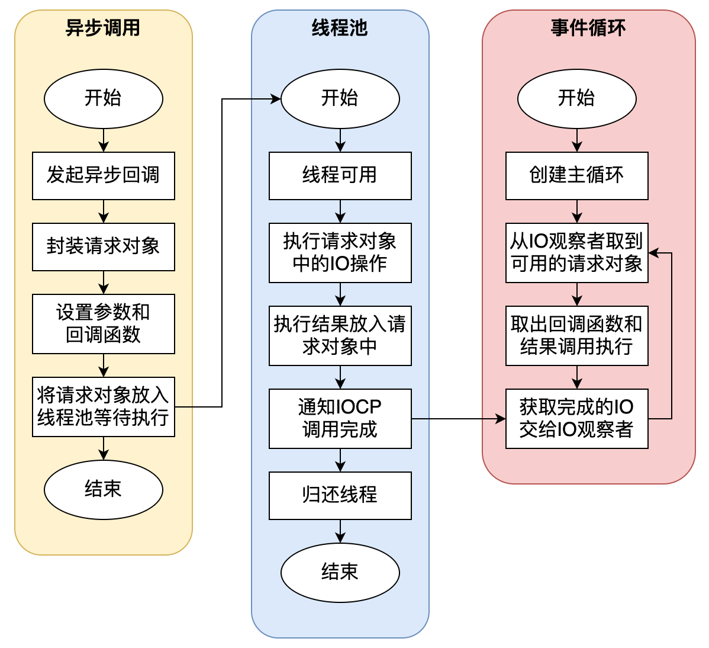
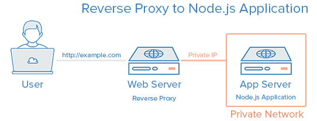
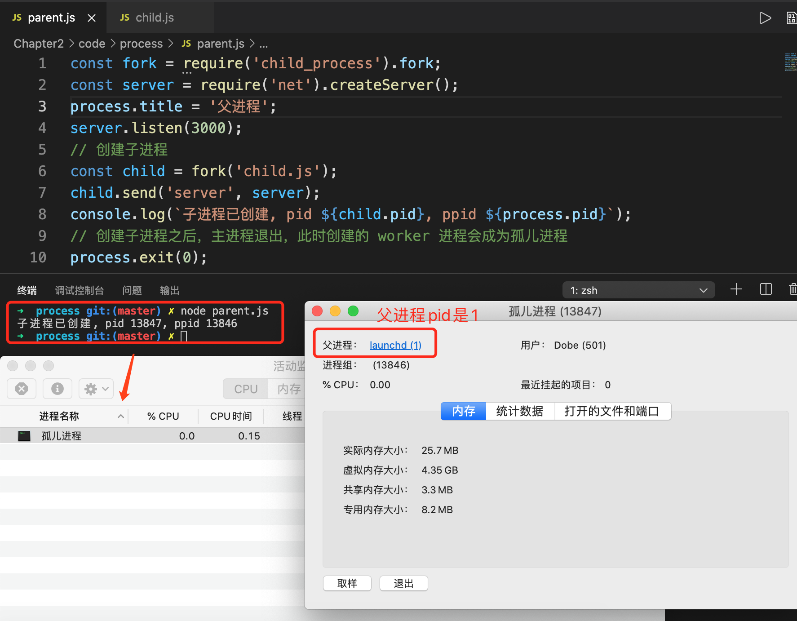
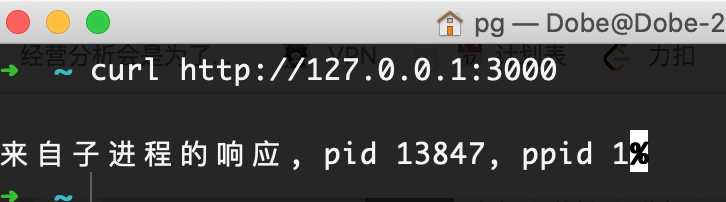
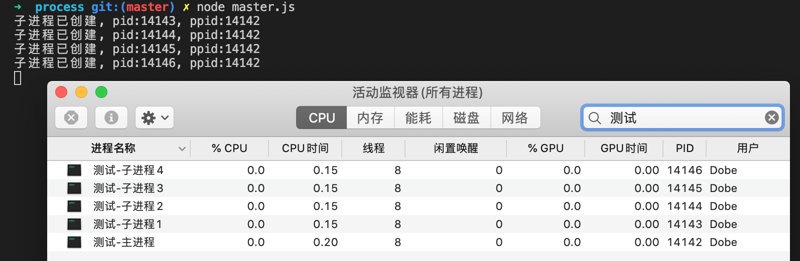

<span id="hidden-autonumber"></span>

<h1 class="article-title">Node.js 总结</h1>

#### 为什么要用 Node.js？优点、特点是什么？

1. V8 引擎，执行速度快。
2. 异步处理机制，不用担心多线程、锁、并行计算等问题。
3. 前后端都是 JS 语言开发，学习成本低，开发效率高。

#### 异步 IO 流程



#### 什么是事件循环？

Node.js 是单线程的处理机制，即**JS 的执行是在单线程内**。

在 Node.js 内部，有一个 Libuv 库会创建一个线程池，负责执行 Node API，将不同的任务分配给不同的工作线程。当每个工作线程执行结束后，会将其回调函数插入对应的事件队列中，事件循环机制会不断从队列中读取并执行。


#### setTimeout 和 setImmediate 的区别。

都是 Node.js 的定时器功能，其回调函数也都是进入宏队列中等待调用。

不同的时，执行阶段和消耗资源不同。

setTimeout 在 timer 阶段执行，动用了红黑树，消耗资源大。

setImmediate 在 check 阶段执行，消耗资源相对较小。

#### 回调函数和回调地狱

回调函数是指用一个函数作为参数传入另一个函数，这个函数会被在某个时机调用。

嵌套过多的回调函数，导致部分函数无法到达，并且很难维护。

**如何避免回调地狱？**

1. 模块化编程，将回调函数转化为独立的 function。
2. 使用 Promise（ES6+新增规范）。
3. 使用 Generator。
4. 使用 async/await。

#### Promise

Promise 可以帮助我们更好地处理异步操作，但 Promise 并没有将异步转化为同步，而是以语法糖的形式让代码看起来像同步执行。

Promise 可以理解为一个状态机，有三种状态：pending（进行中）、fulfilled（操作完成）、rejected（操作失败）。只能从 pending 状态转化到其他两种状态。**状态一旦改变后，就不可变了。**

#### API 函数的类型有哪些?

- 阻塞型函数：等待操作完成才执行下一步。
- 非阻塞型函数：使用回调函数来处理函数的返回的结果。

#### 解释一下 Error 优先（Error-first）

Error 优先是在回调函数中，一般回调函数的第一个参数是 Error 对象，如果该值为空，表示没有错误。

```js
 fs.readFile('/test.txt',function(err,data){
    if(err) throw err;
    console.log(data)
 })s
```

#### 如何用 Node.js 监听 80 端口？

在类 Unix 系统中，80 端口是超级管理员权限，**不应该去监听**。

如果非要监听，应该在 Node 应用的前面加一层反向代理，如 Nginx 等。通过反向代理，将 80 端口的请求转发到对应的 Node 应用。



#### 什么是 stub？举个使用场景

stub 用于模块的行为。测试时，stub 可以为函数调用返回模拟的结果。

比如说，我们写文件时，实际上并不需要真正去写。

```js
const fs = require('fs');
const writeFileStub = sinon.stub(fs, 'writeFile', function (path, data, cb) {
  return cb(null);
});

expect(writeFileStub).to.be.called;

writeFileStub.restore();
```

#### NPM 的作用

Node Package Manageer，Node 包管理器。提供依赖包管理和版本管理。

#### Node 的模块机制

Node.js 中的模块就像 Java 中的类。

模块有原生模块和一些第三方模块。

可以用`module.exports`输出模块，`require`引用模块。

引用模块后，模块会存在缓存中。

**模块加载机制**：

1. 如果有缓存，从缓存中取
2. 按`原生模块 - 文件模块 - 目录模块 - node_modules`的顺序依次找到模块。
3. 生成模块实例，存入缓存。
4. 加载模块

#### exports 和 module.exports 的区别

exports 是 module.exports 的简写。但是，exports 只能对属性赋值，**不能直接给 exports 赋值为一个对象**，这样 exports 就是一个新的对象，而不是 module.exports 了。

```js
// ✅ 正确的写法
exports.name = 'A';
exports.add = function () {
  console.log('hi');
};

// ❌ 错误的写法
// exports被重新赋值，就不再和 module.exports 一样了
exports = {
  name: 'A',
  add: function () {
    console.log('hi');
  },
};
```

#### 什么是进程和线程？之间的区别？

进程：一个程序启动，相当于一个进程。

线程：一个进程中，有很多的执行单元，这就是线程。

区别：线程共享内存和空间，资源消耗小，一个线程崩掉，整个进程都死掉了。进程占有独立内存，资源消耗大，但在保护模式下，进程崩掉不会影响其他进程。

#### 什么是孤儿进程？

父进程创建子进程之后，父进程退出了，但是父进程对应的一个或多个子进程还在运行，这些子进程会被系统的 init 进程收养，对应的进程 ppid 为 1，这就是孤儿进程。

通过以下代码示例说明，现在有父进程和子进程：

```js
// ====== parent.js 父进程文件 ======
const fork = require('child_process').fork;
const server = require('net').createServer();
process.title = '父进程';
server.listen(3000);
// 创建子进程
const child = fork('child.js');
child.send('server', server);
console.log(`子进程已创建, pid ${child.pid}, ppid ${process.pid}`);
// 创建子进程之后，主进程退出，此时创建的 worker 进程会成为孤儿进程
process.exit(0);

// ====== child.js 子进程文件 ======
const http = require('http');
process.title = '孤儿进程';
const server = http.createServer((req, res) => {
  // 记录当前工作进程 pid 及父进程 ppid
  res.end(`来自子进程的响应, pid ${process.pid}, ppid ${process.ppid}`);
});
process.on('message', function (m, sendHandle) {
  if (m === 'server') {
    sendHandle.on('connection', function (socket) {
      server.emit('connection', socket);
    });
  }
});
```

我们执行父进程文件，控制台进行测试，输出当前工作进程 pid 和 父进程 ppid：

```
子进程已创建, pid 13758, ppid 13757
```

由于父进程退出了，那么在活动监视器中，我们只能够看到命名为“孤儿进程”的子进程，而且这个孤儿进程的父进程是 1（init 进程）。



然后，执行命令，已然可以看到响应。



#### 创建多进程时，代码里有 `app.listen(port)` 在进行 fork 时，为什么没有报端口被占用？

因为这些子进程通过句柄传递支持进程之间发送句柄，就能将主进程的 socket 发送到子进程，而且不会报端口占用的错误。

**句柄传递解决端口占用问题的示例**

```js
// master.js 主进程文件
const { fork } = require('child_process');
const cpus = require('os').cpus(); // CPU核数
const server = require('net').createServer();
server.listen(3000);
process.title = '测试-主进程';
process.env.num = 1;
for (let i = 0; i < cpus.length; i++) {
  const worker = fork('worker.js');
  process.env.num++;
  worker.send('server', server);
  console.log(`子进程已创建, pid:${worker.pid}, ppid:${process.pid}`);
}

// worker.js 子进程文件
const http = require('http');
http.createServer((req, res) => {
  res.end(`子进程响应, pid:${process.pid}, ppid:${process.ppid}`);
});
process.title = `测试-子进程${process.env.num}`;
process.on('message', function (m, sendHandle) {
  if (m === 'server') {
    sendHandle.on('connection', function (socket) {
      server.emit('connection', socket);
    });
  }
});
```

执行父进程文件，我们可以看到，创建了四个子进程。 

#### 什么是 IPC 通信，如何建立 IPC 通信？什么场景下需要用到 IPC 通信？

IPC (Inter-process communication) ，即进程间通信技术，由于每个进程创建之后都有自己的独立地址空间，实现 IPC 的目的就是为了进程之间资源共享访问，实现 IPC 的方式有多种：管道、消息队列、信号量、Domain Socket，Node.js 通过 pipe 来实现。


#### JS 为什么是单线程的？

浏览器环境中需要对 DOM 进行操作，如果多线程同时操作一个 DOM 会很混乱。那也就意味着对于 DOM 的操作只能是单线程，**为了避免 DOM 渲染冲突**。

在浏览器环境中 UI 渲染线程和 JS 执行引擎是互斥的，一方在执行时都会导致另一方被挂起，这是由 JS 引擎所决定的。

#### Node.js 是单线程的吗？

Node.js 的单线程指的是**只有一个主线程**，但同时**还有若干个工作线程**。

#### 守护进程是什么？怎么实现？

`node app.js`启动后，如果控制台关闭，则服务也停止了，**守护进程则是保证服务不受控制台的影响**。

守护进程创建步骤：

- 创建子进程
- 在子进程中创建新会话（调用系统函数 setsid）
- 改变子进程工作目录（如：“/” 或 “/usr/ 等）
- 父进程终止（这样，子进程就成了孤儿进程）

守护进程一般不用我们编写，可以使用 pm2 等工具启动 Node 服务。

#### 如何让一个 JS 文件在 Linux 下成为一个可执行命令程序?

头部须加上 `#!/usr/bin/env node`，表示当前脚本使用 Node.js 进行解析。

#### 进程的当前工作目录是什么? 有什么作用?

进程的当前工作目录可以通过 process.cwd() 命令获取，默认为当前启动的目录，如果是创建子进程则继承于父进程的目录，可通过 process.chdir() 命令重置，例如通过 spawn 命令创建的子进程可以指定 cwd 选项设置子进程的工作目录。

作用：查找文件可以通过相对路径查找。

#### 多进程或多个 Web 服务之间的状态共享问题？

多进程模式下各个进程之间是相互独立的，例如用户登陆之后 session 的保存，如果保存在服务进程里，那么如果我有 4 个工作进程，每个进程都要保存一份这是没必要的，假设服务重启了数据也会丢失。多个 Web 服务也是一样的，还会出现我在 A 机器上创建了 Session，当负载均衡分发到 B 机器上之后还需要在创建一份。一般的做法是通过 **Redis 缓存**或者**数据库**来做数据共享。

#### Node.js 为什么不给每个单独的 JS 文件分配单独的上下文，这样就避免了作用域污染问题？

对于这个问题，其实就是 Node.js 的模块引用机制。我们都知道，Node.js 采用 CommonJS 规范，在运行 JS 文件时，每个 JS 文件都是被包裹在一个函数中运行的，即每个模块都是独立的上下文。所以，正常情况下，每个模块内的变量都只是其内部变量，都只作用在该模块内部，并不存在作用域污染的问题。

#### Node 中的模块化导入导出和 ES6 有何区别？

| ES6                                  | Node.js                        |
| ------------------------------------ | ------------------------------ |
| `import 模块名 from 模块标识符/路径` | `require(模块标识符/路径)`     |
| `export default`或`export`导出       | `module.export`或`exports`导出 |

#### Node 中间件

中间件是请求到响应过程中的处理方法，通常是对请求或响应做一些处理。
