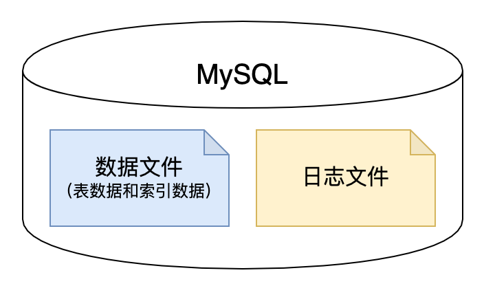

<h1 class="article-title no-number">基础知识</h1>

# 数据库

数据库（Database）是按照数据结构来组织、存储和管理数据的仓库。

每个数据库都有一个或多个不同的 API 用于创建，访问，管理，搜索和复制所保存的数据。

我们也可以将数据存储在文件中，但是在文件中读写数据速度相对较慢。

# 关系型数据库

## 简介

**关系型数据库：指采用了关系模型来组织数据的数据库。**

关系模型指的就是二维表格模型，而一个关系型数据库就是由二维表及其之间的联系所组成的一个数据组织。主要特点如下：

- 数据以表格的形式出现
- 每行为各种记录名称
- 每列为记录名称所对应的数据域
- 许多的行和列组成一张表单
- 若干的表单组成 database

## 常用术语

- **数据库**： 数据库是一些关联表的集合。
- **数据表**： 表是数据的矩阵。在一个数据库中的表看起来像一个简单的电子表格。
- **列**： 一列(数据元素) 包含了相同类型的数据，例如邮政编码的数据。
- **行**：一行（=元组，或记录）是一组相关的数据，例如一条用户订阅的数据。
- **冗余**：存储两倍数据，冗余降低了性能，但提高了数据的安全性。
- **主键**：主键是唯一的。一个数据表中只能包含一个主键。你可以使用主键来查询数据。
- **外键**：外键用于关联两个表。
- **复合键**：复合键（组合键）将多个列作为一个索引键，一般用于复合索引。
- **索引**：使用索引可快速访问数据库表中的特定信息。索引是对数据库表中一列或多列的值进行排序的一种结构。类似于书籍的目录。
- **参照完整性**：参照的完整性要求关系中不允许引用不存在的实体。与实体完整性是关系模型必须满足的完整性约束条件，目的是保证数据的一致性。
- **表头(header)**：每一列的名称。
- **列(col)**：具有相同数据类型的数据的集合。
- **行(row)**：每一行用来描述某条记录的具体信息。
- **值(value)**：行的具体信息，每个值必须与该列的数据类型相同。
- **键(key)**：键的值在当前列中具有唯一性。

## 优点

- **容易理解**：二维表结构是非常贴近逻辑世界的一个概念，关系模型相对网状、层次等其他模型来说更容易理解。

- **使用方便**：通用的 SQL 语言使得操作关系型数据库非常方便。

- **易于维护**：丰富的完整性(实体完整性、参照完整性和用户定义的完整性)大大减低了数据冗余和数据不一致的概率。

## 缺点

- **磁盘 I/O 开销大**：网站的用户并发性非常高，往往达到每秒上万次读写请求，对于传统关系型数据库来说，硬盘 I/O 是一个很大的瓶颈。
- **单表数据量增大查询效率低**：网站每天产生的数据量是巨大的，对于关系型数据库来说，在一张包含海量数据的表中查询，效率是非常低的。
- **难以横向拓展**：在基于 web 的结构当中，数据库是最难进行横向扩展的，当一个应用系统的用户量和访问量与日俱增的时候，数据库却没有办法像 web server 和 app server 那样简单的通过添加更多的硬件和服务节点来扩展性能和负载能力。当需要对数据库系统进行升级和扩展时，往往需要停机维护和数据迁移。
- **性能欠佳**：在关系型数据库中，导致性能欠佳的最主要原因是多表的关联查询，以及复杂的数据分析类型的复杂 SQL 报表查询。为了保证数据库的 ACID 特性，必须尽量按照其要求的范式进行设计，关系型数据库中的表都是存储一个格式化的数据结构。

# 事务和 ACID 特性

事务在英文中是 transaction，和现实世界中的交易很类似，它有如下四个特性：

## A (Atomicity) 原子性

原子性很容易理解，也就是说事务里的所有操作**要么全部做完，要么都不做**，事务成功的条件是事务里的所有操作都成功，**只要有一个操作失败，整个事务就失败，需要回滚**。

比如银行转账，从 A 账户转 100 元至 B 账户，分为两个步骤：1）从 A 账户取 100 元；2）存入 100 元至 B 账户。这两步要么一起完成，要么一起不完成，如果只完成第一步，第二步失败，钱会莫名其妙少了 100 元。

## C (Consistency) 一致性

一致性也比较容易理解，也就是说数据库要一直处于一致的状态，事务的运行不会改变数据库原本的一致性约束。**几个并行事务的执行结果，与其串行执行的结果一致。**

例如现有完整性约束 a+b=10，如果一个事务改变了 a，那么必须得改变 b，使得事务结束后依然满足 a+b=10，否则事务失败。

## I (Isolation) 隔离性

所谓的隔离性是指并发的事务之间不会互相影响，如果一个事务要访问的数据正在被另外一个事务修改，只要另外一个事务未提交，它所访问的数据就不受未提交事务的影响。

比如现在有个交易是从 A 账户转 100 元至 B 账户，在这个交易还未完成的情况下，如果此时 B 查询自己的账户，是看不到新增加的 100 元的。

## D (Durability) 持久性

持久性是指一旦事务提交后，它所做的修改将会永久的保存在数据库上，即使出现宕机也不会丢失。

> [!note]
>
> 事务的 ACID 特性是由关系数据库系统(RDBMS)来实现的，RDBMS 采用日志来保证事务的原子性、一致性和持久性。
>
> 日志记录了事务对数据库所作的更新，如果某个事务在执行过程中发生错误，就可以根据日志撤销事务对数据库已做的更新，使得数据库回滚到执行事务前的初始状态。

# MySQL

MySQL 是最流行的关系型数据库管理系统，在 WEB 应用方面 MySQL 是最好的 RDBMS(Relational Database Management System：关系数据库管理系统)应用软件之一。

## MySQL 事务

MySQL 事务主要用于处理操作量大，复杂度高的数据。比如说，在人员管理系统中，你删除一个人员，你既需要删除人员的基本资料，也要删除和该人员相关的信息，如信箱，文章等等，这样，这些数据库操作语句就构成一个事务！

- 在 MySQL 中只有使用了 **InnoDB 数据库引擎**的数据库或表才支持事务。
- 事务处理可以用来维护数据库的完整性，保证成批的 SQL 语句**要么全部执行，要么全部不执行**。
- 事务用来管理 insert、update、delete 语句。

## MySQL 存储引擎

数据库存储引擎是数据库底层软件组件，数据库管理系统使用数据引擎进行创建、查询、更新和删除数据操作。不同的存储引擎提供不同的存储机制、索引技巧、锁定水平等功能，使用不同的存储引擎还可以获得特定的功能。

现在许多数据库管理系统都支持多种不同的存储引擎。**MySQL 的核心就是存储引擎。**

MySQL 支持多种类型的数据库引擎，可分别根据各个引擎的功能和特性为不同的数据库处理任务提供各自不同的适应性和灵活性。

在 MySQL 中，可以利用`SHOW ENGINES`语句来显示可用的数据库引擎和默认引擎。

不同的存储引擎都有各自的特点，以适应不同的需求。为了做出选择，首先要考虑每一个存储引擎提供了哪些不同的功能，各种存储引擎如表所示。

| 功能         | MylSAM | MEMORY | InnoDB | Archive |
| ------------ | ------ | ------ | ------ | ------- |
| 存储限制     | 256TB  | RAM    | 64TB   | None    |
| 支持事务     | No     | No     | Yes    | No      |
| 支持全文索引 | Yes    | No     | No     | No      |
| 支持树索引   | Yes    | Yes    | Yes    | No      |
| 支持哈希索引 | No     | Yes    | No     | No      |
| 支持数据缓存 | No     | N/A    | Yes    | No      |
| 支持外键     | No     | No     | Yes    | No      |

> [!note]
>
> **InnoDB** 是事务型数据库的首选引擎，支持事务安全表（ACID），支持行锁定和外键。MySQL 5.5.5 之后，InnoDB 作为默认存储引擎。

## InnoDB 引擎

InnoDB 是 MySQL 中第一个提供外键约束的存储引擎，而且它对事务的处理能力是其它存储引擎无法与之相比的。

MySQL 5.5 版本以后，默认存储引擎由 MyISAM 修改为 InnoDB。InnoDB 是目前最重要、使用最广泛的存储引擎。

InnoDB 一直在持续改进，随着处理能力的不断提高，其优秀的性能和可维护性使它成为生产中普遍推荐使用的存储引擎。一般情况下，除非有特别的原因需要使用其它存储引擎，否则应该优先考虑 InnoDB 引擎。

### InnoDB 优势

1. **支持事务安装**

   InnoDB 最重要的一点就是支持事务，可以说这是 InnoDB 成为 MySQL 中最流行的存储引擎的一个非常重要的原因。InnoDB 还实现了 SQL92 标准所定义的 4 个隔离级别（READ UNCOMMITTED，READ COMMITTED，REPEATABLE READ 和 SERIALIZABLE）。

2. **灾难恢复性好**

   InnoDB 通过 commit、rollback、crash-recovery 来保障数据的安全。

   具体来说，crash-recovery 就是指如果服务器因为硬件或软件的问题而崩溃，不管当时数据是怎样的状态，在重启 MySQL 后，InnoDB 都会自动恢复到发生崩溃之前的状态，并回到用户离开的地方。

3. **使用行级锁**

   InnoDB 改变了 MyISAM 的锁机制，实现了行锁。虽然 InnoDB 的行锁机制是通过索引来完成的，但毕竟在数据库中 99%的 SQL 语句都要使用索引来检索数据。行锁定机制也为 InnoDB 在承受高并发压力的环境下增强了不小的竞争力。

   在 SQL 查询中可以自由地将 InnoDB 类型的表与其他类型的表混合起来，甚至在同一个查询中也可以混合。

4. **实现了缓冲处理**
   InnoDB 提供了专门的缓存池，实现了缓冲管理，不仅能缓冲索引也能缓冲数据，常用的数据可以直接从内存中处理，比从磁盘获取数据处理速度要快。相比之下，MyISAM 只是缓存了索引。

   InnoDB 的表和索引在一个逻辑表空间中，表空间可以包含数个文件（或原始磁盘分区）。这与 MyISAM 表不同，比如在 MyISAM 表中每个表被保存在分离的文件中。InnoDB 表可以是任何尺寸，即使在文件尺寸被限制为 2GB 的操作系统上。

5. **支持外键**
   InnoDB 支持外键约束，检查外键、插入、更新和删除，以确保数据的完整性。在存储表中数据时每张表的存储都按主键顺序存放，如果没有显式地在定义表时指定主键，InnoDB 会为每一行生成一个 6 字节的 ROWID ，并以此作为主键。

   InnoDB 实现外键引用这一重要特性，使在数据库端控制部分数据的完整性成为可能。虽然很多数据库系统调优专家都建议不要这样做，但是对于不少用户来说，大部分情况下，在数据库端加外键控制仍然是成本最低的选择。

6. **适合需要大型数据库的网站**
   InnoDB 被用在众多需要高性能的大型数据库网站上。

   InnoDB 是为处理巨大数据量时的最大性能设计，它的 CPU 效率可能是任何其他基于磁盘的关系数据库引擎所不能匹敌的。

除了以上几个亮点之外，InnoDB 常常还有很多其它的功能特色带给使用者惊喜。当然，使用 InnoDB 存储引擎肯定也有缺点。相对于其它存储引擎来说，使用 **InnoDB 存储引擎的读写效率稍差**，且**占用的数据空间较大**。

## MySQL 物理存储

使用 InnoDB 时，MySQL 会在数据目录（Data）下创建一个名为 ibdata1 的 10MB 大小的自动扩展数据文件，以及两个名为 ib_logfile0 和 ib_logfile1 的 5MB 大小的日志文件。



### 数据文件

数据文件用来存放数据表中的数据和所有的索引数据，包括主键和其他普通索引。

InnoDB 存储的数据采用表空间（Tablepace）进行存放设计。表空间是用来存放 MySQL 系统相关信息的一个特殊共享表空间。

InnoDB 的表空间分为以下两种形式：

1. **共享表空间**：表数据和索引都存放在同一个表空间。默认的表空间文件就是上面所提到的 MySQL 初始化路径下的 ibdata1 文件。
2. **独立表空间**：每个表的数据和索引被存放在一个单独的 .ibd 文件中。

可以通过以下命令查看 MySQL 是否使用独立表空间：

```sh
mysql> SHOW VARIABLES LIKE 'innodb_file_per_table%';
+-----------------------+-------+
| Variable_name         | Value |
+-----------------------+-------+
| innodb_file_per_table | ON    |
+-----------------------+-------+
1 row in set, 1 warning (0.01 sec)
```

**innodb_file_per_table** 值为 ON 时表示开启独立表文件，InnoDB 表的数据和索引都会以单独的形式存放；值为 OFF 时，InnoDB 表的数据和索引都存放在一个表空间。

可以通过设置该参数的值来决定是否使用独立表空间。

### 日志文件

默认情况下，InnoDB 存储引擎的数据目录下会有两个名为 ib_logfile0 和 ib_logfile1 的文件。在 MySQL 官方手册中将其称为 InnoDB 存储引擎的重做日志文件（redo log file）。

重做日志文件对 InnoDB 存储引擎至关重要。InnoDB 可以通过重做日志将数据库宕机时已经完成但还没有来得及将数据写入磁盘的事务恢复，也能将所有部分完成并已经写入磁盘的未完成事务回滚，并且将数据还原，以此来保证数据的完整性。

每个 InnoDB 存储引擎至少有 1 个重做日志文件组（group），每个文件组下至少有 2 个重做日志文件，如默认的 ib_logfile0 和 ib_logfile1。

如果你的数据库中有 InnoDB 的表，那么千万别全部删除 InnoDB 的日志文件，这很可能会让你的数据库 Crash，无法启动，或者丢失数据。

在 MySQL 启动参数文件设置中，InnoDB 的所有参数基本上都带有前缀**innodb\_**，不论是 InnoDB 数据还是和日志相关，或者是其他一些性能，事务等等相关的参数都是一样。

下面是影响重做日志文件的参数：

- innodb_log_file_size：指定每个重做日志的大小。
- innodb_log_files_in_group：指定日志文件组中重做日志文件的数量，默认为 1。
- innodb_mirrored_log_groups：指定日志镜像文件组的数量，默认为 1。
- innodb_log_group_home_dir：指定日志文件组所在路径，默认为`./`。

简而言之，MySQL 中所有和 InnoDB 相关的系统变量都以**innodb\_**做为前缀。
