<h1 class="article-title no-number">安装配置</h1>

# 安装 MySQL

1、删除存在的 mysql

```shell
rpm -qa|grep mysql
rpm -e mysql mysql-libs
yum -y remove mysql-server mysql mysql-libs
```

2、配置源

```shell
# 下载rpm软件包管理器
wget http://dev.mysql.com/get/mysql57-community-release-el7-9.noarch.rpm
# 配置源
rpm -ivh mysql57-community-release-el7-9.noarch.rpm
# 查看源是否配置
yum repolist enabled | grep "mysql.*-community.*"
```

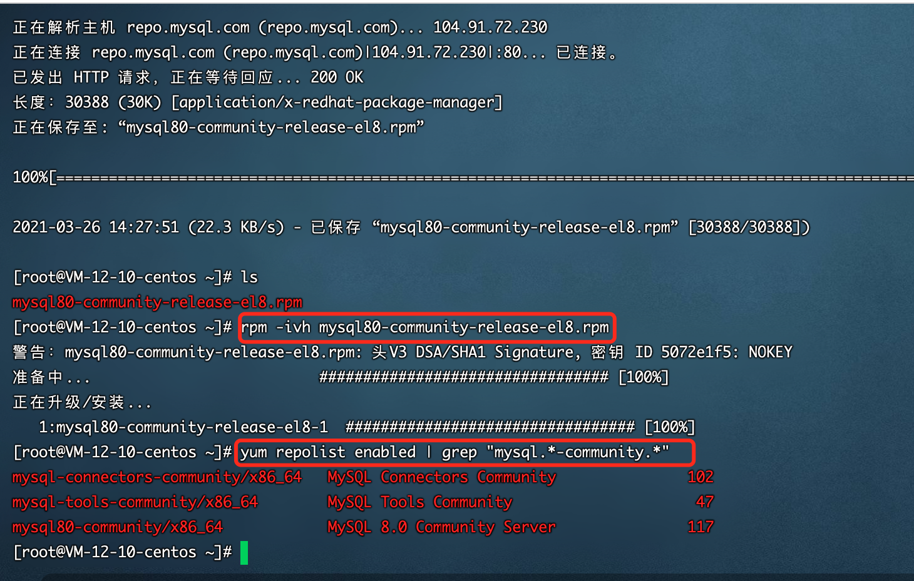

3、安装 MySQL

> 注意，默认安装源之后自动开启 5.7 系列的安装。如果你要安装的 MySQL 低于 5.7 需要改源。。

```shell
# 安装社区版
yum install mysql-community-server
```

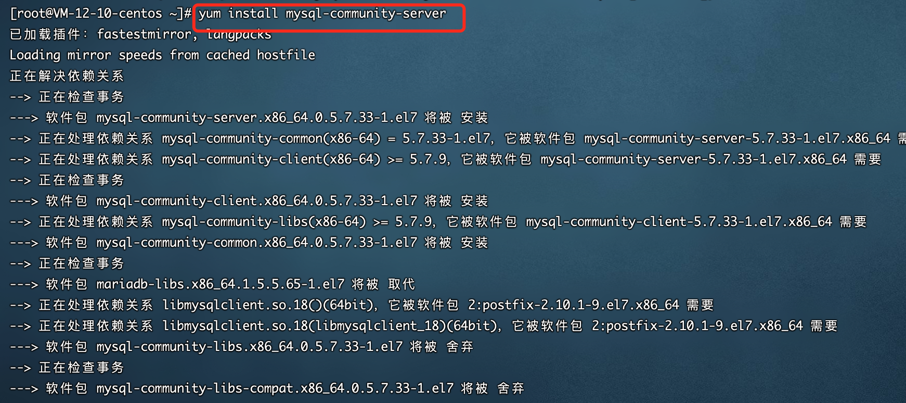

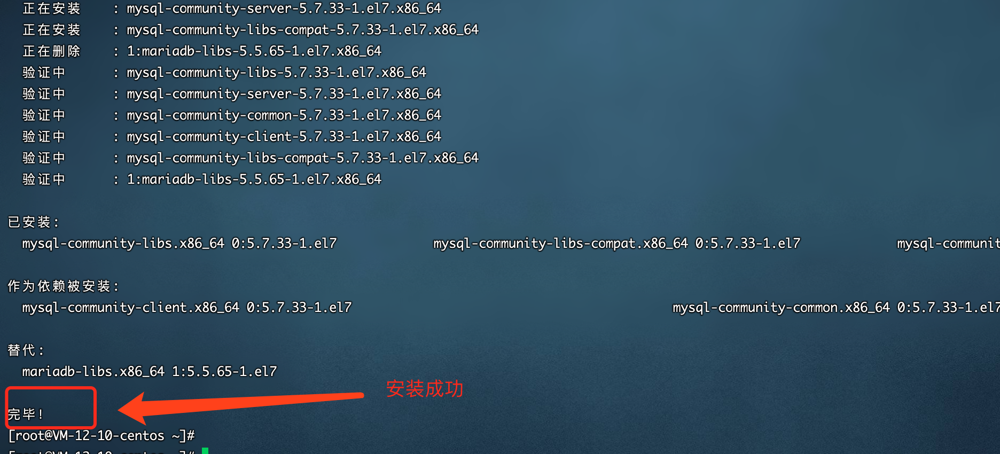

# 启动 MySQL

## 执行启动命令

```shell
# 启动mysql
service mysqld start
```


## 其他命令

```shell
# 查看启动状态
service mysqld status
# 重启
service mysqld restart
# 停止
service mysqld stop
```

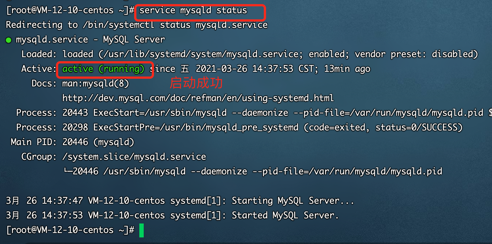

# 权限配置

## 进入数据库

MySQL 首次启动会，会生成一个临时密码，通过命令来查看。

```shell
grep 'temporary password' /var/log/mysqld.log
```

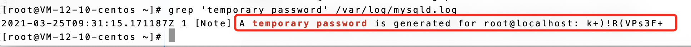

可以看到，临时密码是“k+)!R(VPs3F+”。

使用临时密码进入数据库如下。

```shell
# root账户登录
mysql -uroot -p
# 输入密码
************
```

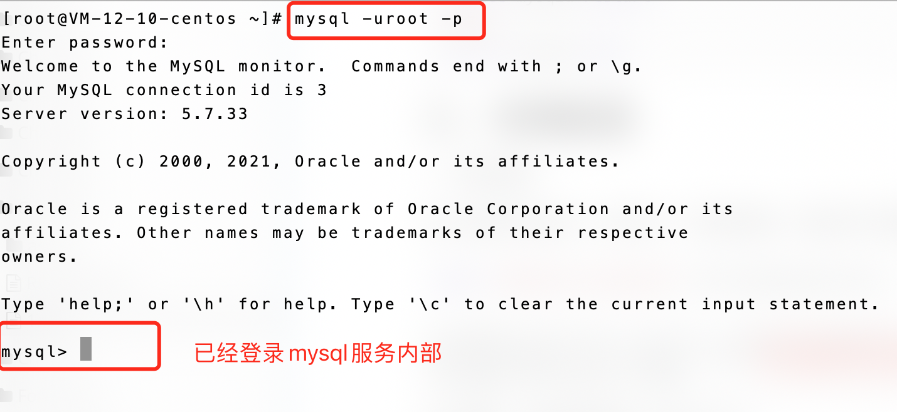

## 修改密码

进入数据库后，在执行操作前，必须重置密码。

```shell
# 查看数据库
show databases;
```

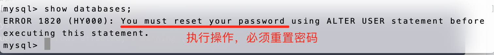

设置密码。

```shell
# 设置密码
set password = password('8位密码，包括大写、小写、数字和特殊符号');
```

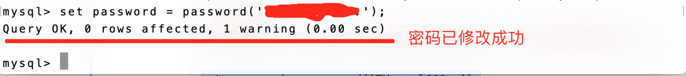

## 查看用户

```shell
# 切换到mysql数据库
use mysql;
# 查看user表信息
select host,user from mysql.user;
```

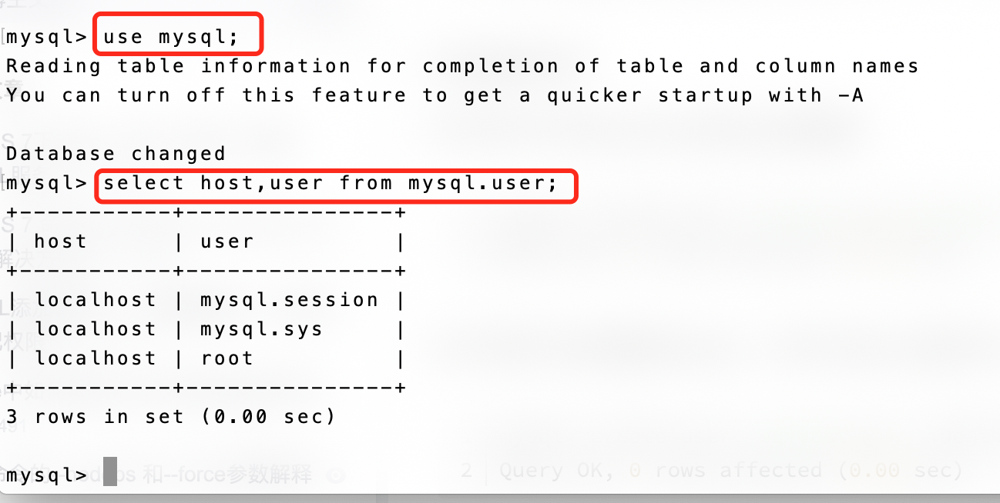

## 添加新用户和数据库

```shell
# 添加新用户，允许外网访问
create user 'aquaman'@'%' identified by '密码';

create user 'blog'@'%' identified by '********';

# 添加成功后，刷新授权
flush privileges;
# 创建数据库
create database aquaman DEFAULT CHARSET utf8 COLLATE utf8_general_ci;
# 将改用户赋权给数据库，并刷新授权
grant all privileges on aquaman.* to 'aquaman'@'%' identified by '密码' with grant option;

# 刷新授权
flush privileges;
# 更改用户名
update user set user ='aquaman' where user ='nodejs';
```

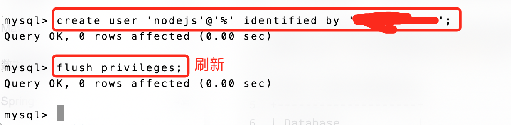

本地即可连接 MySQL 数据库，连接成功后，只能够有权限管理 nodejs 库，其他库无法查看。

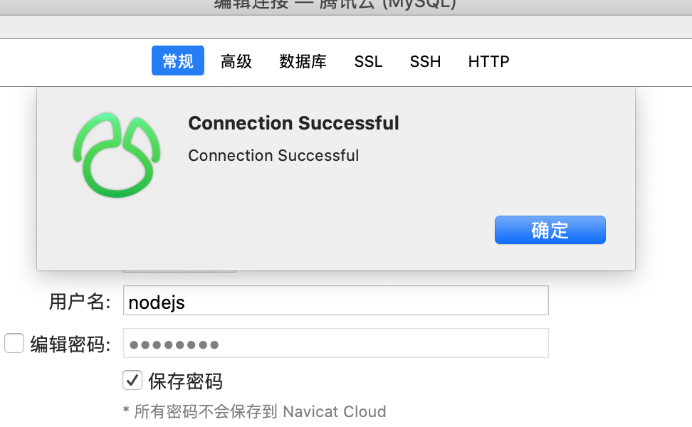

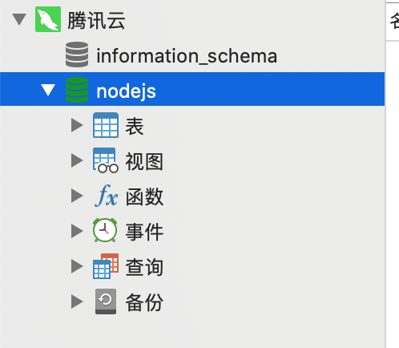

# 拓展

rpm 是一种用于互联网下载包的打包及安装工具，它包含在某些 Linux 分发版中。

```shell
# 配置源
rpm -i xxx.rpm
# 删除配置
rpm -e mysql80-community-release-el8-1.noarch
```
