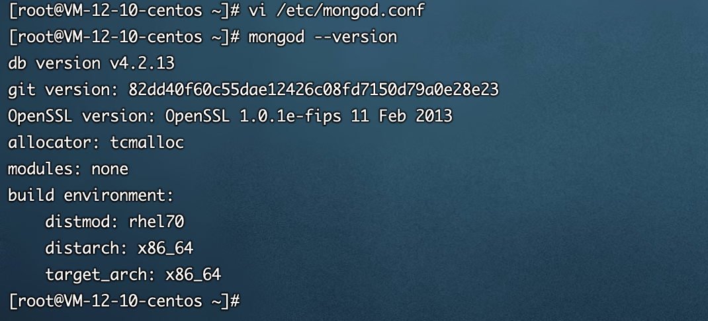

<h1 class="article-title no-number">安装配置</h1>

# 安装 MongoDB

在这个[MongoDB](https://cloud.tencent.com/product/mongodb?from=10680)教程中，我们将解释如何在 CentOS 7 上安装数据库，然后提供一些基本特性和功能的简短指南。

1、添加 MongoDB 源

CentOS7 不包括 MongoDB 源，所以需要自行添加。

```shell
# 创建文件
vi /etc/yum.repos.d/mongodb-org-4.2.repo
```

2、复制下面内容到文件中

```
[mongodb-org-4.2]
name=MongoDB Repository
baseurl=https://repo.mongodb.org/yum/redhat/$releasever/mongodb-org/4.2/x86_64/
gpgcheck=1
enabled=1
gpgkey=https://www.mongodb.org/static/pgp/server-4.2.asc
```

3、执行安装

```shell
# yum安装
yum install -y mongodb-org
```

# 配置

1、修改配置文件的 `bind_ip,` 默认是 `127.0.0.1 只限于本机连接`。

```shell
# 编辑配置文件
vi /etc/mongod.conf
# 更改bind_ip
bind_ip 0.0.0.0;	# 0.0.0.0任何IP均可访问（为方便开发，生产环境勿用！！！）
# 查看版本号
mongod --version
```



# 权限

mongodb 操作前，先`use 数据库名`，选择对应的数据库，然后 `db.auth("admin", "密码")`才能够进行操作。

```shell
# 进入mongo
mongo
# 切换到admin库
use admin
# 创建用户（role角色很多种）
db.createUser({ user: "admin", pwd: "密码", roles: [{ role: "dbOwner", db: "admin" }] })
# 验证
db.auth("admin", "密码")
# 给用户赋予角色
db.grantRolesToUser("admin", [ { role:"dbAdminAnyDatabase", db:"admin"} ]);
# 回收用户角色
db.revokeRolesFromUser("admin", [ { role:"dbAdminAnyDatabase", db:"admin"} ]);
# 更改用户密码
db.changeUserPassword('admin','aD0aG1aA1eB2fA2l');
```

# 常用命令

```shell
# 启动
service mongod start
# Redirecting to /bin/systemctl start mongod.service
# 所以，可以直接用 systemctl 命令 mongod.service 格式来执行各种命令
# 停止
service mongod stop
# 重启
service mongod restart
# 设置开机启动
chkconfig mongod on
# 查看日志（日志文件地址为config配置）
cat /var/log/mongodb/mongod.log
# 开启外网访问权限
mongod --bind_ip_all

# 进入mongo数据库
mongo
# 查看数据库
show dbs;
# 查看数据库版本
db.version();
# 常用命令帮助
db.help();
# 查看数据库转台
db.stats();
```
