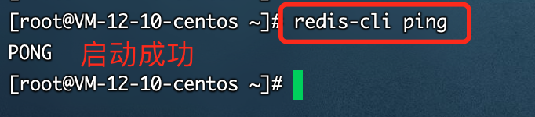
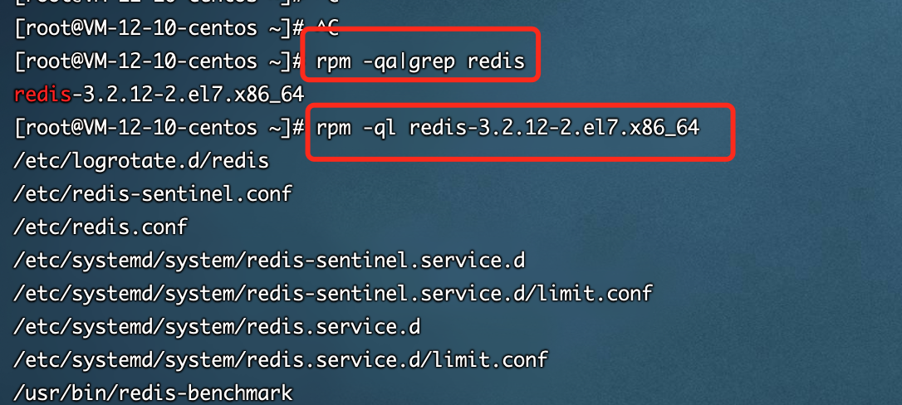

# Redis 存储

## 一、安装 Redis

在本节中，您将添加[EPEL](https://fedoraproject.org/wiki/EPEL)存储库，然后使用它来安装 Redis。

1、添加 EPEL 存储库，并更新 YUM 以确认您的更改

```shell
# 安装EPEL存储库
yum install epel-release
# 安装redis
yum install redis
```

2、启动 redis

```shell
# 启动服务
systemctl start redis
# 验证redis是否启动，返回PONG表示启动
redis-cli ping
# 重启服务
systemctl restart redis
```



## 二、配置 Redis

Redis 的配置文件位于 Redis 安装目录下，文件名为 **redis.conf**。

```shell
# 查看redis安装包
rpm -qa|grep redis
# 找redis安装位置
rpm -ql redis-3.2.10-2.el7.x86_64
```



发现，redis.conf 文件在/etc 目录下。

```shell
# 查看所有配置
CONFIG GET *
# 查看某一配置
CONFIG GET 配置名
# 编辑配置
CONFIG set 配置名 配置值
```

## 三、Redis 命令

```shell
# 启动redis客户端
redis-cli
# 授权
auth 密码
# 检查是否启动
PING
# 存值
set foo bar
# 取值
get foo
```
