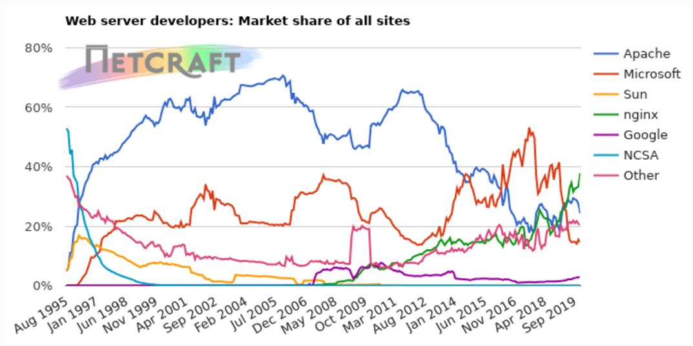
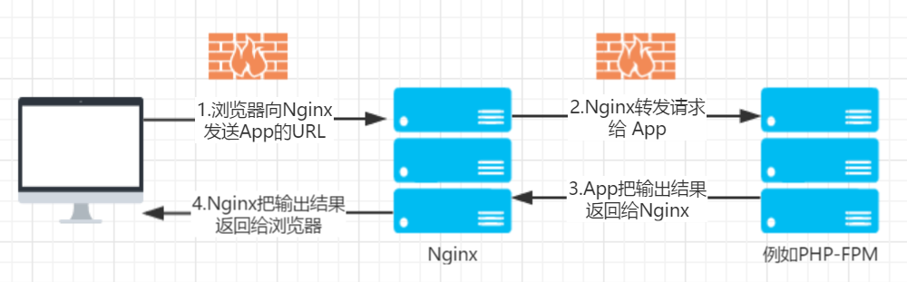
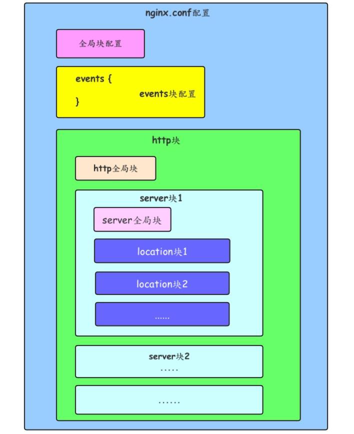

<h1 class="article-title no-number">基础知识</h1>

# 概述

Nginx是俄罗斯人Igor Sysoev编写的轻量级Web服务器，它的发音为 [ˈendʒɪnks] ，它不仅是一个高性能的HTTP和反向代理服务器，同时也是一个IMAP/POP3/SMTP 代理服务器。

截至2019年12月，差不多世界上每3个网站中就有1个使用Nginx。

# 功能

Nginx静态资源服务器和后端代理服务器，主要功能如下：

- Web服务器
- 正向代理
- 反向代理
- 负载均衡
- 动静分离

# 特点

得益于其采用异步、非阻塞、事件驱动的方式处理请求。相比于Apache，其在高并发情况下，依然可以保持低资源消耗和高性能。

- **高并发**
- **高性能**
- **轻量**

Nginx以事件驱动的方式编写，所以有非常好的性能，同时也是一个非常高效的反向代理、负载平衡服务器。在性能上，Nginx占用很少的系统资源，能支持更多的并发连接，达到更高的访问效率；在功能上，Nginx是优秀的代理服务器和负载均衡服务器；在安装配置上，Nginx安装简单、配置灵活。

Nginx支持热部署，启动速度特别快，还可以在不间断服务的情况下对软件版本或配置进行升级，即使运行数月也无需重新启动。

在微服务的体系之下，Nginx正在被越来越多的项目采用作为网关来使用，配合Lua做限流、熔断等控制。

对于Nginx的初学者可能不太容易理解web服务器究竟能做什么，特别是之前用过Apache服务器的，以为Nginx可以直接处理php、java，实际上并不能。对于大多数使用者来说，Nginx只是一个静态文件服务器或者http请求转发器，它可以把静态文件的请求直接返回静态文件资源，把动态文件的请求转发给后台的处理程序，例如php-fpm、apache、tomcat、jetty等，这些后台服务，即使没有nginx的情况下也是可以直接访问的（有些时候这些服务器是放在防火墙的面，不是直接对外暴露，通过nginx做了转换）。

# 模块化

Nginx 最大的特点是模块化，所以在配置文件中，都是通过不同的模块来进行配置的。

## 全局主模块

该部分配置主要影响 Nginx 全局，通常包括下面几个部分：

- 配置运行 Nginx 服务器用户（组）
- worker process 数
- Nginx 进程 PID 存放路径
- 错误日志的存放路径
- 配置文件的引入

[参考链接](https://www.nginx.cn/doc/core/mainmodule.html)

## events 事件模块

该部分配置主要影响 Nginx 服务器与用户的网络连接，主要包括：

- 设置网络连接的序列化
- 是否允许同时接收多个网络连接
- 事件驱动模型的选择
- 最大连接数的配置

[参考链接](https://www.nginx.cn/doc/core/events.html)

## http 模块

定义了请求相关配置，主要包括：

- 定义 MIME-Type
- 自定义服务日志
- 允许 sendfile 方式传输文件
- 连接超时时间
- 单连接请求数上限

[参考链接](http://nginx.org/en/docs/http/ngx_http_core_module.html#http)

## server 模块 

一个 server 就相当于一个虚拟主机。配置虚拟主机的相关参数，主要包括：

- 服务名 server_name
- 监听端口 listen

[参考链接](http://nginx.org/en/docs/http/ngx_http_core_module.html#server)

## location 模块

配置请求的路由，以及各种页面的处理情况，主要包括：

- 路径
- index 主页面