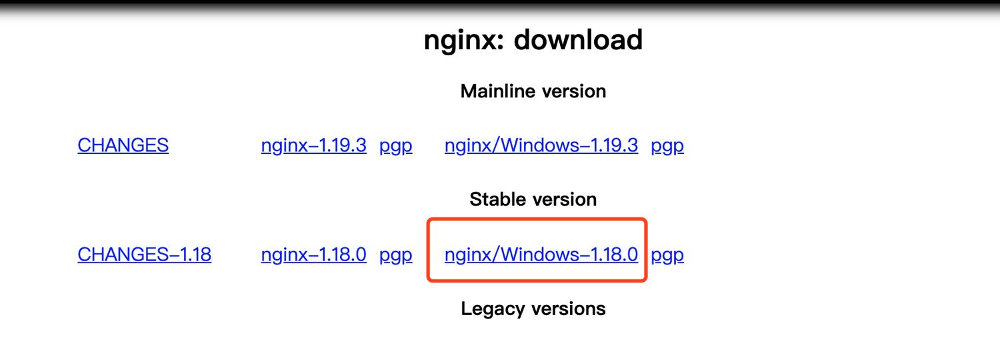
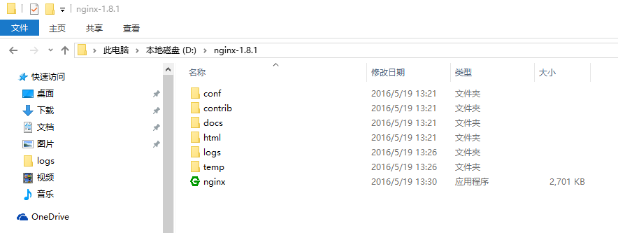

<h1 class="article-title no-number">安装卸载</h1>

# 卸载

```shell
# yum 卸载
yum remove nginx

# 查看进程
ps -ef | grep nginx

# 查看所有相关文件夹
find / -name nginx

# 删除所有文件
rm -rf xxx
```

# 安装

## macOS

```shell
# 安装
brew install nginx

# 启动
nginx

# 停止
nginx -s stop

# 重启
nginx -s reload

# 查看版本
nginx -v

# 测试
访问http://localhost:8080/
```

## Linux

```shell
# nginx 添加到 yum 源
sudo rpm -Uvh http://nginx.org/packages/centos/7/noarch/RPMS/nginx-release-centos-7-0.el7.ngx.noarch.rpm

# 安装
sudo yum install -y nginx

# 启动
sudo systemctl start nginx.service

# 设置开机自启动
sudo systemctl enable nginx.service
```

## windows

1. 到 [Nginx官网](http://nginx.org/en/download.html) 上下载相应的安装包。

   

2. 解压压缩文件，将解压后的文件放到合适的目录下，我的解压文件放在了D盘根目录下，如下图所示。

   Nginx目录所在的路径中不要有中文字符，也不建议有空格。

   

3. 启动 Nginx。使用CMD命令start命令启动nginx。

   ```shell
   # 进入Nginx的安装目录
   d: && cd nginx-1.8.1
   
   # start命令启动 nginx.exe 可执行文件
   start nginx
   ```

4. 测试。访问 http://localhost，即可看到Nginx 欢迎页。（*如果启动启动失败，可能是IIS占用了80端口。去掉IIS监听的80端口即可*。）

# 常用命令

```shell
# 启动
service nginx start

# 停止
service nginx stop

# 重启
service nginx reload
```

