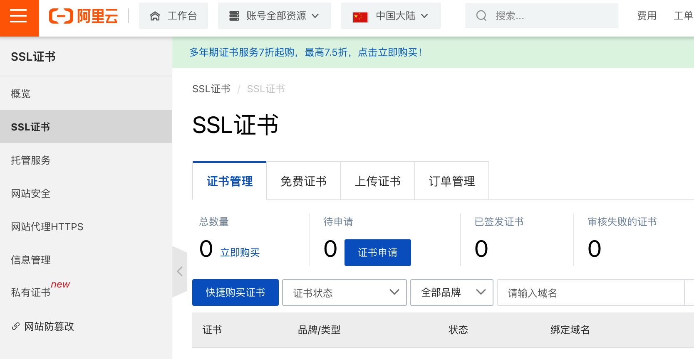
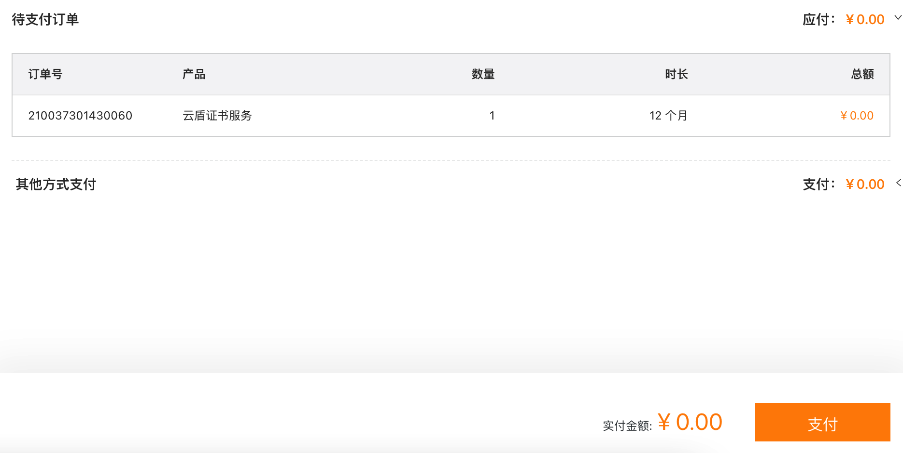
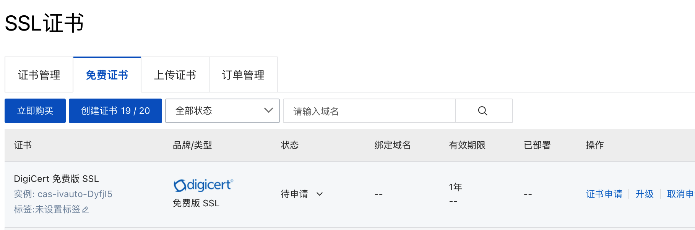
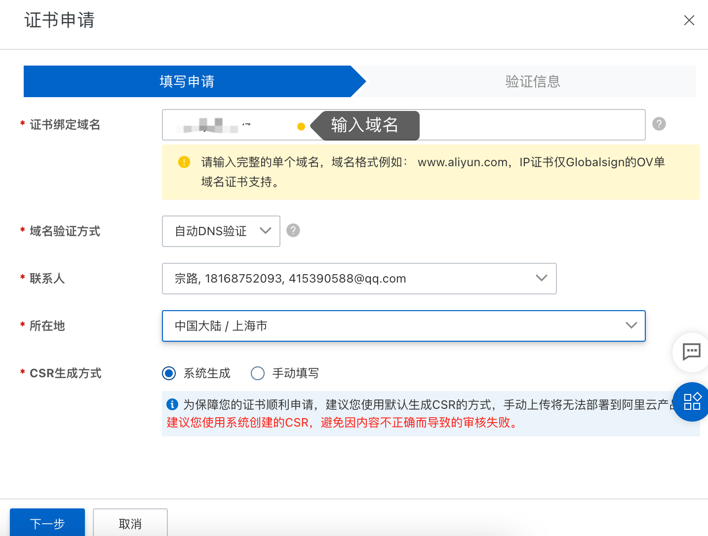
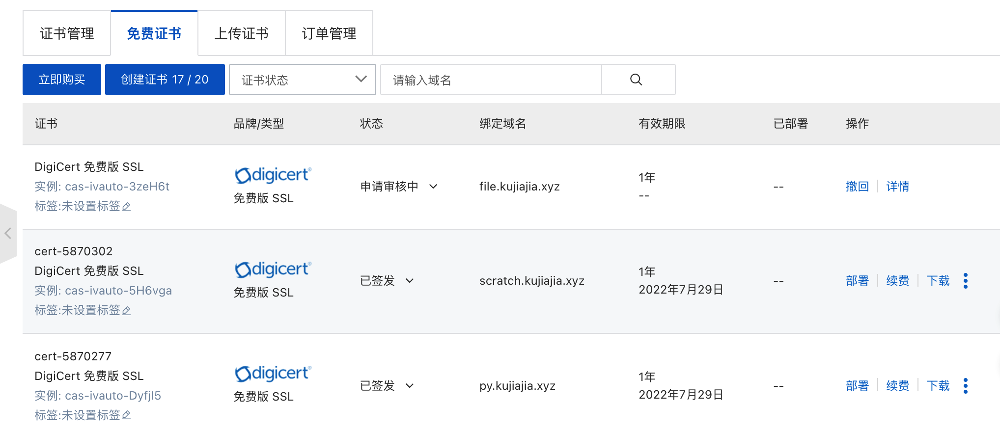
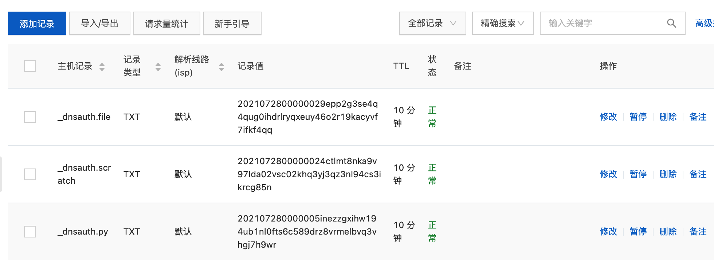
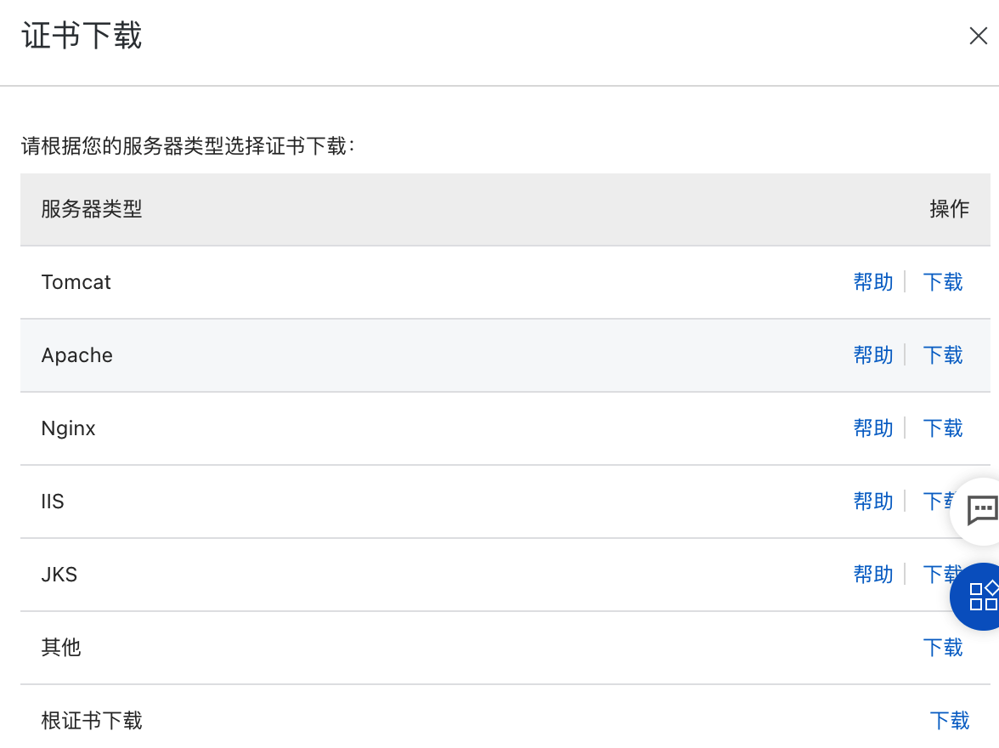
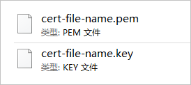

<h1 class="article-title no-number">SSL证书</h1>

网站发布用HTTPS协议已经是主流。比如微信小程序，强制要求使用HTTPS协议。

接入HTTPS协议，必须要有SSL证书，常见的有三种方法可以获取：

- Linux自带的OPENSSL模块生成自签证书。
- 使用云平台提供的证书服务（阿里云）。
- **Let’s Encrypt免费证书**

# 阿里云证书服务

## 申请证书

1. 登录阿里云，进入证书服务，选择**免费证书**购买。

   

2. 申请DV单域名证书。

   

3. 申请证书。

   

   

   

4. DNS添加解析，打开DNS，可以看到会自动添加解析记录。

   

5. 下载证书。

   

## PEM证书和KEY文件

下载的证书有两个，分别是`.pem`证书和`.key`证书密钥文件。



PEM格式的证书文件是采用Base64编码的文本文件，您可以根据需要将证书文件修改成其他格式。

KEY格式的证书密钥文件。

>[!note]
>
>如果您在申请证书时将**CSR生成方式**设置为**手动填写**，则下载的证书文件压缩包中不会包含KEY文件，您需要手动创建证书密钥文件。

## Nginx安装证书

1. 下载的证书放到服务器的合适位置。建议保存在nginx目录下。

   ```sh
   scp 证书文件.pem aquaman:/etc/nginx/cert
   ```

2. nginx配置文件配置如下。

   ```sh
   server {
       listen       80;
       server_name  你的域名;
       # 将所有HTTP请求通过rewrite指令重定向到HTTPS
       rewrite ^(.*)$ https://$host$1;
   
       location / {
           charset utf-8;
           root  /静态文件目录/;
           index  index.html index.htm;
       }
   }
   
   #以下属性中，以ssl开头的属性表示与证书配置有关。
   server {
       listen 443 ssl;
       server_name 你的域名;
       
       ssl_certificate cert/6032964_scratch.kujiajia.xyz.pem;
       ssl_certificate_key cert/6032964_scratch.kujiajia.xyz.key;
       ssl_session_timeout 5m;
       ssl_ciphers ECDHE-RSA-AES128-GCM-SHA256:ECDHE:ECDH:AES:HIGH:!NULL:!aNULL:!MD5:!ADH:!RC4;
       ssl_protocols TLSv1 TLSv1.1 TLSv1.2; #表示使用的TLS协议的类型。
       ssl_prefer_server_ciphers on;
       
       location / {
           charset utf-8;
           root  /root/静态文件目录/;
           index  index.html index.htm;
       }
   }
   ```

   

