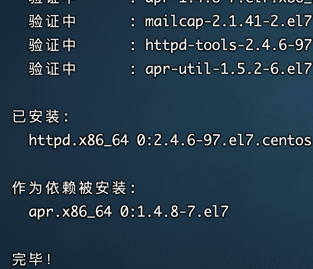
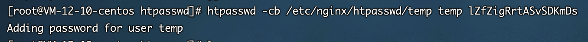

<h1 class="article-title no-number">授权访问</h1>

安全永远是第一位的，nginx 可以添加权限验证。nginx默认提供了`ngx_http_auth_basic_module`模块，该模块功能实现让用户只有输入正确的账号密码才能访问web。需要使用第三方工具设置用户名及密码即可。

# 生成密码文件

1. 安装httpd。

   ```sh
   yum -y install httpd
   ```

   

2. 查看是否安装成功。

   ```sh
   # 检查 htpasswd
   rpm -qf /usr/bin/htpasswd
   ```

3. 生成密码文件。

   ```sh
   # 进入nginx安装目录，创建目录
   cd /etc/nginx/
   mkdir htpasswd
   
   # 生成密码文件
   htpasswd -cb /etc/nginx/htpasswd/账户 账户 密码
   ```

   

4. 设置文件权限。

   ```sh
   # 为了安全设置文件权限
   # 400表示只读
   chmod 400 /etc/nginx/htpasswd/temp
   ```

# Nginx配置

```sh
server {
	location / {
		auth_basic "Please Input Password";    #这个是提示信息
		auth_basic_user_file /etc/nginx/conf/htpasswd;  #存放密码文件的路径
	}
}
```

