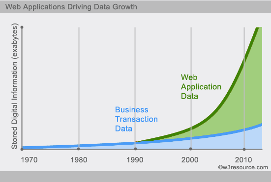
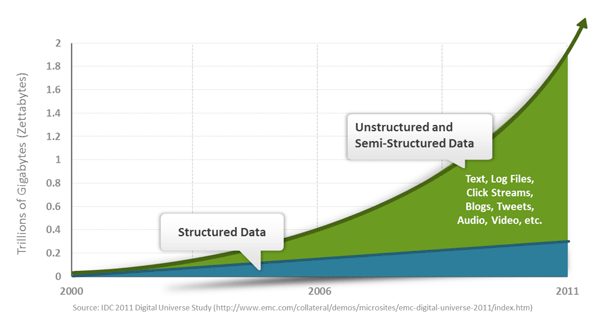

<h1 class="article-title no-number">基础知识</h1>

# MongoDB

MongoDB 是一个基于分布式文件存储的数据库。由 C++ 语言编写。在高负载的情况下，添加更多的节点，可以保证服务器性能。MongoDB 旨在为 WEB 应用提供可扩展的高性能数据存储解决方案。

MongoDB 是一个介于关系数据库和非关系数据库之间的产品，是非关系数据库当中功能最丰富，最像关系数据库的。

MongoDB 将数据存储为一个文档，数据结构由键值(key=>value)对组成。MongoDB 文档类似于 JSON 对象。字段值可以包含其他文档，数组及文档数组。

# 事务和 ACID 特性

事务在英文中是 transaction，和现实世界中的交易很类似，它有如下四个特性：

## A (Atomicity) 原子性

原子性很容易理解，也就是说事务里的所有操作**要么全部做完，要么都不做**，事务成功的条件是事务里的所有操作都成功，**只要有一个操作失败，整个事务就失败，需要回滚**。

比如银行转账，从 A 账户转 100 元至 B 账户，分为两个步骤：1）从 A 账户取 100 元；2）存入 100 元至 B 账户。这两步要么一起完成，要么一起不完成，如果只完成第一步，第二步失败，钱会莫名其妙少了 100 元。

## C (Consistency) 一致性

一致性也比较容易理解，也就是说数据库要一直处于一致的状态，事务的运行不会改变数据库原本的一致性约束。**几个并行事务的执行结果，与其串行执行的结果一致。**

例如现有完整性约束 a+b=10，如果一个事务改变了 a，那么必须得改变 b，使得事务结束后依然满足 a+b=10，否则事务失败。

## I (Isolation) 隔离性

所谓的隔离性是指并发的事务之间不会互相影响，如果一个事务要访问的数据正在被另外一个事务修改，只要另外一个事务未提交，它所访问的数据就不受未提交事务的影响。

比如现在有个交易是从 A 账户转 100 元至 B 账户，在这个交易还未完成的情况下，如果此时 B 查询自己的账户，是看不到新增加的 100 元的。

## D (Durability) 持久性

持久性是指一旦事务提交后，它所做的修改将会永久的保存在数据库上，即使出现宕机也不会丢失。

> [!note]
>
> 事务的 ACID 特性是由关系数据库系统(RDBMS)来实现的，RDBMS 采用日志来保证事务的原子性、一致性和持久性。
>
> 日志记录了事务对数据库所作的更新，如果某个事务在执行过程中发生错误，就可以根据日志撤销事务对数据库已做的更新，使得数据库回滚到执行事务前的初始状态。

# No-SQL

## 什么是 No-SQL

NoSQL(NoSQL = Not Only SQL )，意即"不仅仅是 SQL"。

在现代的计算系统上每天网络上都会产生庞大的数据量。

这些数据有很大一部分是由关系数据库管理系统（RDBMS）来处理。 1970 年 E.F.Codd's 提出的关系模型的论文 "A relational model of data for large shared data banks"，这使得数据建模和应用程序编程更加简单。

通过应用实践证明，关系模型是非常适合于客户服务器编程，远远超出预期的利益，今天它是结构化数据存储在网络和商务应用的主导技术。

NoSQL 是一项全新的数据库革命性运动，早期就有人提出，发展至 2009 年趋势越发高涨。NoSQL 的拥护者们提倡运用非关系型的数据存储，相对于铺天盖地的关系型数据库运用，这一概念无疑是一种全新的思维的注入。

## 为什么用 No-SQL

今天我们可以通过第三方平台（如：Google,Facebook 等）可以很容易的访问和抓取数据。用户的个人信息，社交网络，地理位置，用户生成的数据和用户操作日志已经成倍的增加。我们如果要对这些用户数据进行挖掘，那 SQL 数据库已经不适合这些应用了，NoSQL 数据库的发展却能很好的处理这些大的数据。

## NoSQL 简史

NoSQL 一词最早出现于 1998 年，是 Carlo Strozzi 开发的一个轻量、开源、不提供 SQL 功能的关系数据库。

2009 年，Last.fm 的 Johan Oskarsson 发起了一次关于分布式开源数据库的讨论[2]，来自 Rackspace 的 Eric Evans 再次提出了 NoSQL 的概念，这时的 NoSQL 主要指非关系型、分布式、不提供 ACID 的数据库设计模式。

2009 年在亚特兰大举行的"no:sql(east)"讨论会是一个里程碑，其口号是"select fun, profit from real_world where relational=false;"。因此，对 NoSQL 最普遍的解释是"非关联型的"，强调 Key-Value Stores 和文档数据库的优点，而不是单纯的反对 RDBMS。

## RDBMS & NoSQL

| RDBMS                                                                                                                                                      | NoSQL                                                                                                                                                                                                                               |
| ---------------------------------------------------------------------------------------------------------------------------------------------------------- | ----------------------------------------------------------------------------------------------------------------------------------------------------------------------------------------------------------------------------------- |
| ● 高度组织化结构化数据 ● 结构化查询语言（SQL） ● 数据和关系都存储在单独的表中。 ● 数据操纵语言，数据定义语言 ● 严格的一致性 ● 基础事务 | ● 代表着不仅仅是 SQL ● 没有声明性查询语言 ● 没有预定义的模式 ● 键值对存储，列存储，文档存储，图形数据库 ● 最终一致性，而非 ACID 属性 ● 非结构化和不可预知的数据 ● CAP 定理 ● 高性能，高可用性和可伸缩性 |

## CAP 定理（CAP theorem）

在计算机科学中, CAP 定理（CAP theorem）, 又被称作 布鲁尔定理（Brewer's theorem）, 它指出对于一个分布式计算系统来说，不可能同时满足以下三点:

- **一致性(Consistency)** (所有节点在同一时间具有相同的数据)
- **可用性(Availability)** (保证每个请求不管成功或者失败都有响应)
- **分隔容忍(Partition tolerance)** (系统中任意信息的丢失或失败不会影响系统的继续运作)

CAP 理论的核心是：一个分布式系统不可能同时很好的满足一致性，可用性和分区容错性这三个需求，最多只能同时较好的满足两个。

因此，根据 CAP 原理将 NoSQL 数据库分成了满足 CA 原则、满足 CP 原则和满足 AP 原则三 大类：

- CA - 单点集群，满足一致性，可用性的系统，通常在可扩展性上不太强大。
- CP - 满足一致性，分区容忍性的系统，通常性能不是特别高。
- AP - 满足可用性，分区容忍性的系统，通常可能对一致性要求低一些。

## BASE

BASE：Basically Available, Soft-state, Eventually Consistent。 由 Eric Brewer 定义。

CAP 理论的核心是：一个分布式系统不可能同时很好的满足一致性，可用性和分区容错性这三个需求，最多只能同时较好的满足两个。

BASE 是 NoSQL 数据库通常对可用性及一致性的弱要求原则:

- Basically Available --基本可用
- Soft-state --软状态/柔性事务。 "Soft state" 可以理解为"无连接"的, 而 "Hard state" 是"面向连接"的
- Eventually Consistency -- 最终一致性， 也是 ACID 的最终目的。

## ACID & BASE

| ACID                    | BASE                                  |
| :---------------------- | :------------------------------------ |
| 原子性(**A**tomicity)   | 基本可用(**B**asically **A**vailable) |
| 一致性(**C**onsistency) | 软状态/柔性事务(**S**oft state)       |
| 隔离性(**I**solation)   | 最终一致性 (**E**ventual consistency) |
| 持久性 (**D**urable)    | -                                     |

## NoSQL 的优缺点

**优点**

- 高可扩展性
- 分布式计算
- 低成本
- 架构的灵活性，半结构化数据
- 没有复杂的关系

**缺点**

- 没有标准化
- 有限的查询功能（到目前为止）
- 最终一致是不直观的程序

## NoSQL 数据库分类

| 类型       | 部分代表                                         | 特点                                                                                                                                   |
| ---------- | ------------------------------------------------ | -------------------------------------------------------------------------------------------------------------------------------------- |
| 列存储     | HbaseCassandraHypertable                         | 顾名思义，是按列存储数据的。最大的特点是方便存储结构化和半结构化数据，方便做数据压缩，对针对某一列或者某几列的查询有非常大的 IO 优势。 |
| 文档存储   | MongoDBCouchDB                                   | 文档存储一般用类似 json 的格式存储，存储的内容是文档型的。这样也就有机会对某些字段建立索引，实现关系数据库的某些功能。                 |
| K-V 存储   | Tokyo Cabinet / TyrantBerkeley DBMemcacheDBRedis | 可以通过 key 快速查询到其 value。一般来说，存储不管 value 的格式，照单全收。（Redis 包含了其他功能）                                   |
| 图存储     | Neo4JFlockDB                                     | 图形关系的最佳存储。使用传统关系数据库来解决的话性能低下，而且设计使用不方便。                                                         |
| 对象存储   | db4oVersant                                      | 通过类似面向对象语言的语法操作数据库，通过对象的方式存取数据。                                                                         |
| XML 数据库 | Berkeley DB XMLBaseX                             | 高效的存储 XML 数据，并支持 XML 的内部查询语法，比如 XQuery,Xpath。                                                                    |
